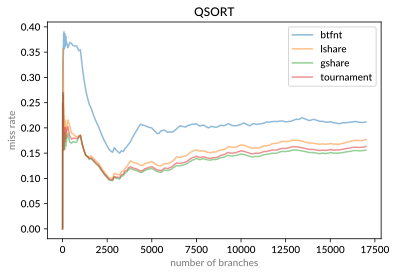
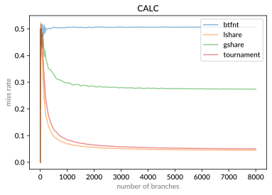
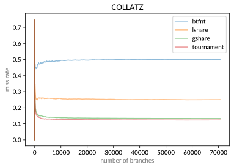

# 分支预测实验报告
## 薛振梁　18307130172

<br>

ICS Assignment 3 (II) 实验报告。

### 概况

实现了一个双层结构的 tournament predictor [^quantitative]，其中两个子预测器分别使用全局历史信息和局部历史信息（gshare 和 lshare），并且采取索引共享 [^superscalar] 机制。此外使用 BTFNT 策略 [^superscalar] 作为备用的静态分支预测器。

代码仓库位于 [^repo]。

### 架构与行为

分支预测部分实现在 `FrontendPredict.sv` 内。其具体行为与代码仓库中 `include/reference_predictor.h` 这份 C\+\+ 代码的描述保持一致。

<st>BTFNT</st>对应文件 `BTFNT.sv`。因为动态预测需要一个训练阶段，因此一开始该静态预测器作为动态预测的备用预测器。BTFNT 采用低地址跳转而高地址不跳转的策略，分别对应于循环和一般的条件判断两个情况。然而，在 TA 下发的 testbench 中，单独使用 BTFNT 比全部预测跳转效果要差很多（前者 CPI 为 1.64，后者只有 1.59）。

<st>GHT</st>全局历史记录（**G**lobal **H**istory **T**racker），对应文件 `GHT.sv`。是一个位移寄存器，用于记录最近几次分支的计算结果。具体记录数量由 `bpb.vh` 中的 `BPB_H` 指定。

<st>BHT</st>局部历史记录（**B**ranch **H**istory **T**racker），对应文件 `BHT.sv`。由一系列直接索引的位移寄存器构成。索引使用分支指令的 PC 地址的低位（除最后两个被内存对齐的全 0 位），具体使用的位数由 `bpb.vh` 中的 `BPB_T` 指定。BHT 中每个 entry 记录的历史信息数量与 GHT 相同。

<st>PHT</st>模式记录表（**P**attern **H**istory **T**able），动态预测器的主体部分，对应文件 `PHT.sv`。其由一系列直接索引的 saturating counter [^superscalar] 构成。支持两种操作：

* 查询（lookup）：用于 CPU 中的 Fetch 阶段，查询给定索引的计数器。如果 PHT 尚不存在指定索引的寄存器，则返回给定的备用值 `fallback`，并且将在下一个始终周期上升沿时将 `fallback` 写入对应的计数器。
* 更新（update）：用于 CPU 中的 Decode 阶段。可以让某个指定计数器加 `1` 或者减 `1`。为了减少索引的计算，这里只允许修改上一个周期指定的索引。因此每个周期 PHT 都会保存当前的索引至 `last_index` 中，用于下一个周期的更新。

<st>gshare 预测器</st>利用全局历史记录信息的预测器，是一个 PHT。该预测器使用了地址共享策略，即从指令 PC 地址抽取的低位和 GHT 中的记录值的异或后的结果作为索引。这样做是因为，在实际程序中，跳转指令分布比较稀疏，通过异或可以尽可能减少直接索引带来的空间浪费。分支预测后，下一个周期会根据实际结果来更新对应的计数器。

<st>lshare 预测器</st>与 gshare 预测器类似，只不过是使用从 BHT 中查询到的历史记录代替 GHT 中的记录。

<st>地址 hash</st>gshare 预测器和 lshare 预测器的地址共享机制虽然提高了空间利用率，但是也增加了重名冲突的几率。特别是由多个连续的分支跳转指令的时候，共享低位地址将会带来严重的冲突问题。为了缓解该问题，我们使用一个 hash 函数来尽可能均匀分布所有的 entry。具体而言，hash 主要处理了 PC 地址的低 16 位（最后两个内存对齐的位忽略，即处理第 3 至 18 位），将它们视为一个 $\mathbb{Z}_2^{16}$ 中的向量 $\bm x = (x_1,x_2,...,x_{16})^\intercal$，与下面这个矩阵 $\mathbf{M}_{16×16}$ 相乘得到 hash 结果：

$$
\left[
\begin{matrix}
1 & 0 & 1 & 0 & 1 & 0 & 1 & 0 & 1 & 0 & 1 & 0 & 1 & 0 & 1 & 0 \\
0 & 1 & 0 & 1 & 0 & 1 & 0 & 1 & 0 & 1 & 0 & 1 & 0 & 1 & 0 & 1 \\
0 & 0 & 1 & 1 & 0 & 0 & 1 & 1 & 1 & 0 & 1 & 1 & 0 & 0 & 1 & 1 \\
1 & 1 & 0 & 0 & 1 & 0 & 0 & 0 & 0 & 1 & 0 & 1 & 1 & 1 & 1 & 1 \\
0 & 0 & 1 & 1 & 0 & 1 & 0 & 0 & 1 & 1 & 1 & 0 & 0 & 1 & 1 & 1 \\
1 & 1 & 0 & 1 & 0 & 1 & 1 & 0 & 1 & 0 & 1 & 0 & 0 & 0 & 1 & 1 \\
1 & 0 & 1 & 1 & 1 & 1 & 1 & 1 & 1 & 0 & 1 & 0 & 1 & 0 & 1 & 0 \\
1 & 1 & 1 & 1 & 1 & 0 & 1 & 1 & 0 & 1 & 0 & 0 & 1 & 1 & 1 & 0 \\
0 & 1 & 1 & 1 & 1 & 1 & 0 & 1 & 1 & 1 & 0 & 0 & 1 & 0 & 0 & 1 \\
0 & 1 & 0 & 0 & 0 & 0 & 1 & 1 & 1 & 1 & 1 & 1 & 0 & 1 & 1 & 1 \\
1 & 0 & 0 & 0 & 1 & 0 & 0 & 1 & 1 & 0 & 1 & 1 & 0 & 1 & 1 & 1 \\
1 & 0 & 1 & 0 & 0 & 0 & 0 & 1 & 0 & 0 & 1 & 0 & 0 & 1 & 0 & 0 \\
0 & 1 & 1 & 1 & 0 & 1 & 0 & 1 & 1 & 0 & 1 & 0 & 0 & 0 & 0 & 1 \\
0 & 0 & 0 & 1 & 0 & 0 & 0 & 1 & 1 & 0 & 1 & 1 & 1 & 1 & 0 & 0 \\
1 & 1 & 0 & 1 & 1 & 0 & 1 & 1 & 0 & 0 & 0 & 1 & 0 & 0 & 1 & 0 \\
0 & 0 & 1 & 1 & 1 & 0 & 0 & 0 & 1 & 1 & 1 & 1 & 1 & 1 & 1 & 1
\end{matrix}
\right]
$$

这个矩阵在 `include/reference_predictor.h` 中也有定义：

```
constexpr u32 M_hash[16] = {
    0xaaaa, 0x5555, 0x33b3,
    51295, 13543, 54947, 49066, 64334, 32201,
    17399, 35255, 41252, 30113, 4540, 56082, 14591
};
```

$\mathbf{M}$ 前三行是人为构造的。尽可能让这三行之间减少交集，因而低 3 位的小变化会给整个 hash 结果造成较大的变化。之后的 13 行是随机生成的，并且保证 $\mathbf{M}$ 是满秩的，确保 16 位的信息中每一位都是有用的。因为当 $\mathbf{M}$ 满秩时，$\mathbf{M}\bm{x}$ 相当于是对 $\mathbb{Z}_2^{16}$ 的所有向量的重排列。

上述 hash 的计算代价是比较昂贵的。原则上 BHT 的索引不使用 hash 后的 PC 地址，以期望减少计算 hash 而带来的延时的影响。

<st>选择器</st>是一个 PHT。其以 PC 地址的低位作为索引，不使用历史信息。对于第一次处理的分支指令，优先使用 gshare 预测器（因为在 TA 的 testbench 中，单独的 gshare 预测器的表现略优于单独的 lshare 预测器）。选择器的更新是基于 gshare 预测器和 lshare 预测器以及 Decode 阶段反馈的跳转结果综合决定的。具体而言，当 gshare 预测结果和 lshare 相同时，不做更新；否则，根据上一个周期选择的结果（`last_mux`）和 `miss` 来决定，即使用 `last_mux ^ miss` 对 PHT 进行更新。

<st>FrontendPredict</st>对应文件 `FrontendPredict.sv`。除了前文所述的部件外，`FrontendPredict` 还要负责判断 Fetch 和 Decode 两个阶段是否是跳转指令、指令解析、翻译预测结果到对应的 PC 地址，以及保存当前时钟周期的预测结果（用于下一个时钟周期的更新）。对于更新操作，在 Fetch 阶段预测完后，Decode 阶段将得到分支跳转的实际结果，并且将反馈给前端。前端需要负责判断 Fetch 阶段时 `FrontendPredict` 给出的预测是否正确，如果不正确，则设置 `miss = 1`，否则设置 `miss = 0`。`FrontendPredict` 用 `miss` 和上一个周期的预测结果 `last_pred` 做异或得到实际是否跳转的布尔值 `real_taken`，之后将被用于各个 PHT 中做更新。

### 参数控制

`bpb.vh` 包含了一些控制参数：

* `BPB_E`：未使用。因为使用的是直接索引，所以每个 BHT/PHT 包含的 entry 数量均为 2<sup>`BPB_T`</sup> 个。
* `BPB_T`：抽取 PC 地址的低位作为索引。
* `BPB_H`：历史记录信息的数量上限。

`bpb.vh` 可以指定 `FrontendPredict` 使用的预测器。以下四个宏只允许定义一个：

* `USE_BTFNT`：只使用静态的 BTFNT 预测。
* `USE_GSHARE`：使用 gshare 预测器，BTFNT 作为备用。
* `USE_LSHARE`：使用 lshare 预测器，BTFNT 作为备用。
* `USE_ALL`：使用 tournament predictor。使用所有的预测策略。

### 测试与分析

代码仓库中的 `testbench.cpp` 最后三个测试 `qsort`、`calc` 和 `collatz` 用于测试一般情况下各个预测器的表现情况。`qsort` 是对 500 个随机整数进行快速排序。`calc` 包含一些条件判断，这些条件判断具有各自的重复模式，以期望 lshare 预测器能有较好的性能。`collatz` 是 Collatz 猜想 [^collatz] 的验证程序，其中循环部分的条件判断做了一些拆分，使得它们之间具有一定的相互关联，以期望 gshare 预测器能有较好的表现。

下面展示的曲线图中，横轴表示程序运行中累计遇到的条件判断数量，纵轴表示累计条件判断预测失误的比例。

<st>QSORT 测试</st>



在对随机数列的快速排序中，因为其数据本身的随机性，因此不太容易预测条件判断的行为，但是由于存在循环，所以总体的倾向性还是存在的。这应该是 BTFNT 能够达到可观的准确率的原因。动态分支预测可以达到更好的效果，是因为排序中元素之间的比较判断随着排序的进行，也会呈现一定的倾向性，因此动态预测可以利用这一点达到更高的准确率。实际上动态预测中应该是没有利用到历史信息，而是单靠每个条件判断 take 的几率来做预测的。在上图中，可以看到三个动态预测的方式性能差距不大。tournament predictor 的性能介于另外两个动态分支预测之间。


<st>CALC 测试</st>



在这个测试中，BTFNT 几乎和瞎猜无异，因此需要利用历史信息才能给出更好的预测。正如之前所期望的，lshare 预测器比 gshare 预测器获得了更好的结果。值得注意的是 tournament predictor 正确地选择了 lshare 预测器，从而避免了 gshare 预测器的劣势。从总体结果来看，tournament predictor 比单纯的 lshare 预测器略差一点，可能是因为一开始训练选择器的额外开销导致的。

<st>COLLATZ 测试</st>



与 `CALC` 测试相同，静态预测很难在这里发挥作用，而动态预测可以利用历史信息从而作出更好的预测。这里 gshare 预测器比 lshare 预测器表现更加优秀符合预期的判断。同时可以看到，由于选择器默认选择的是 gshare 预测器，因此训练阶段对于适合 gshare 的条件判断应该不存在训练选择器的额外开销，而对于适合 lshare 的条件判断，tournament predictor 可以学习到这一点从而避免 gshare 的缺陷。因此，总体上 tournament predictor 表现最优。

<st>CPI 测试</st>TA 提供的 testbench 测试得到的 CPI 如下：

* `USE_BTFNT`：1.643358
* `USE_GSHARE`：1.573845
* `USE_LSHARE`：1.582508
* `USE_ALL`：1.573432

可见动态分支预测明显优于静态分支预测，并且 tournament predictor 略微优于单独的 gshare 预测器和 lshare 预测器。

<st>总结</st>从上面的测试可以看出，动态预测相比于静态预测具有明显的优势。此外，tournament predictor 可以充分利用全局历史信息和局部历史信息，以较小的额外开销，给出更好的预测，避免了单独使用 gshare 策略或者 lshare 策略的极端情况。值得注意的是，动态预测需要有一个预训练的过程，并且这个过程随着预测策略的复杂度的上升而加长，因此在程序一开始运行的时候表现都非常糟糕。可以考虑使用多级的备用预测器来缓解这个问题。

### 外部引用

[^quantitative]: Hennessy, John L., et al. "Computer Architecture: A Quantitative Approach". 5th ed, Morgan Kaufmann/Elsevier, 2012.
[^superscalar]: Paul Shen, John, and Mikko Lipasti. "Modern Processor Design: Fundementals of Superscalar Processors". 2005. Waveland Press, Inc.
[^repo]: "toys/mips/branch-predict at master," GitHub, <https://github.com/riteme/toys/tree/master/mips/branch-predict>.
[^collatz]: "Collatz conjecture," Wikipedia, <https://en.wikipedia.org/wiki/Collatz_conjecture>.