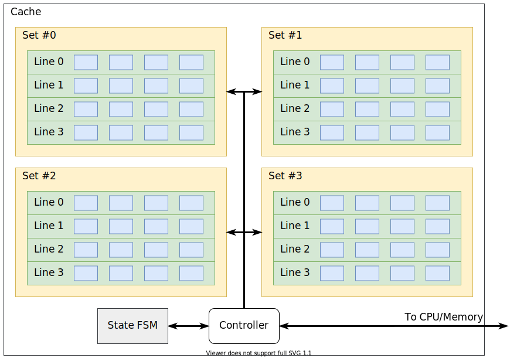

# MIPS Cache 实验报告
## 薛振梁　18307130172

<br>

ICS Assignment 3 (I) 实验报告。

### 概况

实现了一个 4 路全关联 256 bytes 的 cache（具体参数可以在 `cache.vh` 中修改）。采用 writeback / write-allocate 机制和 LRU 替换策略。

代码仓库位于 <https://github.com/riteme/toys/tree/master/mips/cache> [^repo]。

### Cache 结构



***

<st>Cache</st>对应于 `Cache.sv`。其包含 4 个 Set，以及一个 Controller。该层的主要负责分发输入到每个 Set 和收集所有 Set 的输出，然后将控制权全部转交给 Controller。Controller 可以认为自己每时每刻只在操作一个 Set。这个 Set 是由 CPU 给出的地址唯一确定的。

<st>Set</st>对应于 `CacheSet.sv`。其包含 4 个 Line，以及一个控制替换策略的组合逻辑模块 `LRUStrategy`。Set 有两种索引 Line 的方法，一种是指定 `tag`，一般用于正常的 Cache 读取；另一种是指定 Line 的下标编号 `key`，一般用于处理替换 Line 的过程。索引机制依赖于 Line 自身的匹配机制，即 Set 会将索引相关的信号下传给所有 Line，由 Line 自行判断是否匹配，然后 Set 根据这些信息选择正确的输出。

<st>Line</st>对应于 `CacheLine.sv`。其包含 16 bytes 的存储（4 个 word），以及自己的 `tag`。此外还包括 `dirty` 和 `valid` 寄存器，分别用于标记是否被修改过和是否有效。为了能够进行替换策略，每个 Line 还包括一个 `tick` 信息，即最后一次读写 Line 的时刻。所有读写 Line 的地址最后都会被对齐到 4 字节，即默认地址最后两个 bit 为 0。Line 支持三种操作：

* 写入：将数据写入到对应的位置上，并且将 Line 的 `dirty` 置为 1。
* 更新：设置新的 `tag`，并且将 `dirty` 置为 0，`valid` 置为 1。
* 记录：将 `tick` 设置为最新的时刻。

以上三个操作可以同时进行，并由 `ctrl` 信号控制。

<st>Controller</st>对应于 `CacheController.sv`。其包含两个计数器 `now` 和 `count`，分别表示当前的时刻（用于 LRU 替换策略）和位移（用于抓取/回写 Line）。Controller 主要负责处理与 CPU 和 Memory 之间的交互，会和状态机相互配合，根据状态机现在的状态和位移计数确定如何与内外部模块交互。

<st>状态机</st>对应于 `CacheControllerFSM.sv`。Cache 的状态机一共包含三个状态：`Normal`、`Write` 和 `Fetch`。`Normal` 状态表示不需要和 Memory 有交互，CPU 的所有读写都可以直接在 Cache 中完成。而 `Write` 和 `Fetch` 两个状态分别用于回写某条 dirty 的 Line，或者从内存中抓取一条 Line。这两个状态都需要 `count` 计数器。状态机的转移如下：


当 Cache 读写未命中时，会根据替换策略选择的 Line 是否 dirty 决定是进入 `Write` 状态还是直接进入 `Fetch` 状态。在 `Write` 状态会将被修改的 Line 写回内存，然后进入 `Fetch` 状态。`Fetch` 状态会将需要的数据从内存中读取，并写入到对应的 Line 中。完成上述操作后返回 Normal 状态，相当于重新执行之前未命中的读写操作，此时就可以命中了。

上述过程最坏情况下会长达 10 个周期。实际上，通过更细粒度的控制，我们可以将 `Normal` 与 `Write` 的第一个阶段以及与 `Fetch` 的最后一个阶段合并，从而在最坏情况下只用 8 个周期。代码中一开始设计的时候没有考虑到这点，Line 的控制不能满足上述优化的要求，因此没有实现。如果要实现优化的转移，需要对 Line 进行更加细粒度的控制。

<st>替换策略</st>对应于 `LRUStrategy.sv`。目前实现的策略是始终选择上次访问时间最早的 Line，不考虑其是否 dirty，即选择 `tick` 记录最小者。如果有多条 Line 的 `tick` 相同（例如初始时每条 Line 的 `tick` 都为 0），则选择 Line 下标编号最小者。因此 `LRUStrategy` 模块实际上只是选出 `tick` 最小的 Line 的下标编号的组合逻辑，其结构如下：


这里每个 `Comparer` 输入两个 `tick` 以及它们的下标，输出其中较小者的下标和对应的 `tick`。所有的 `Comparer` 按照 tournament tree [^tournament] 的方式连接，因此最多只有 $\log$ 级别的层数。

***

### 测试

<st>Verilator 仿真</st>这一次实验主要使用 Verilator 进行仿真。Verilator 可以将 Verilog 描述的硬件翻译成 C\+\+ 的模型（verilated model），从而可以方便地使用 C\+\+ 进行测试。我使用 C\+\+ 编写了一个标准的 LRU Cache 的实现，然后将 Verilator 生成的模型与标准实现进行对照，用于检查 cache 在每一步操作结束后的状态是否正确。标准实现的代码可以参见 [^repo] 的 `include/reference_cache.h` 文件。

仿真时的测试位于 [^repo] 的 `testbench.cpp` 文件中。每个测试是形如下面的代码块：

```
WITH {
    for (int i = 0; i < TEST_LOAD; i++) {
        int op = randi(0, 1);
        u32 addr = randi(0, ADDR_MAX);
        if (op == 0)
            dev->read(addr);
        else
            dev->write(addr, randi());
    }
} AS("random read/write")
```

测试代码用 `WITH { ... }` 包含，`AS` 后的字符串是测试点的名称。上面展示的测试代码是随机向 cache 中读写的测试。我测试了该 LRU cache 在 `std::sort`、`std::stable_sort` 和 `std::sort_heap` 三个算法中的表现情况（排序 10000 个随机生成的 32 bit 无符号整数），测试得到的数据如下：

| | 运行周期数 | 读命中率 | 写命中率 | 总命中率 |
|:-:|:-:|:-:|:-:|:-:|
|`std::sort`|1,301,806|94.13%|84.90%|91.50%|
|`std::stable_sort`|1,690,204|94.07%|76.92%|88.09%|
|`std::heap_sort`|2,731,141|73.76%|85.54%|77.96%|

可见对于一般的排序算法，cache 的存在可以极大的减少 CPU 和内存之间的数据传输，从而提升程序性能。

<st>Vivado 仿真</st>我的 cache 当 `stall` 信号为 1 时会停止更新，期望用于做 icache 与 dcache 之间的同步。在使用 `cpu_tb.sv` 进行仿真测试时，由于两个 cache 使用的是同一个 `stall` 信号，导致一开始的时候 icache 的不命中使 `stall` 变为 1，然后两个 cache 都被停用，产生死锁现象。因此我稍微修改了一下 `cpu_tb.sv` 中 `stall` 信号的处理：使用两个信号 `istall` 和 `dstall` 分别表示 icache 和 dcache 是否需要关闭。它们的定义如下：

```
assign istall = dcen && !dhit;
assign dstall = !istall && !ihit;
```

即当 dcache 需要读写且访问不命中时，将 icache 关闭。而当 dcache 没有操作或访问命中，并且 icache 不命中时，将 dcache 关闭。这样避免当任意一个 cache 不命中而 stall 住整个 CPU 时，另一个 cache 不会反复做同样的操作，避免对替换策略产生影响。在单内存的情形中，这种互锁可以确保每个时刻只有一个 cache 读写内存。

此外，上述逻辑实际上是认为 dcache 比 icache 的优先级更高。首先，优先级的设置是为了避免死锁现象。其次，dcache 优先的策略是考虑到 Fetch 阶段的不确定性。例如，当 Memory 阶段的 `lw` 指令将读取 `$ra` 寄存器的新值，但是访问没有命中。这个值期望是通过 data forwarding 传到 Decode 阶段的 `jr` 指令处，那么在 Fetch 阶段正确的 PC 值必须等到 `lw` 完成读取后才能得知。如果此时 icache 也不命中，那么先做 icache 的工作就是无用功。

### 外部引用

[^repo]: "riteme/toys/mips/cache at master", GitHub, <https://github.com/riteme/toys/tree/master/mips/cache>.

[^tournament]: "*k*-way merge algorithm", section "Tournament Tree", Wikipedia, <https://en.wikipedia.org/wiki/K-way_merge_algorithm#Tournament_Tree>.