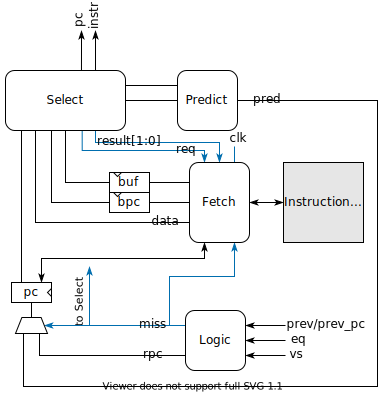

# Pipelined MIPS32 CPU

## 薛振梁　18307130172

<br>

ICS 课程 Assignment 2 实验报告。

### 概况

实现了一个四级流水线 MIPS 指令集 CPU。流水线内部支持 data forwarding，并且可以处理 `lw` 指令的 hazard。Fetch 阶段独立出一个 `Frontend` 前端模块用于抓取指令。前端在特定情况下可以调整相邻两条指令的运行顺序，用于优化流水线的执行过程，具有一定的乱序执行能力。

实现的指令集如下所列 [^mips]：

```
lw		rt, imm(rs)
sw		rt, imm(rs)
add		rd, rs, rt
sub		rd, rs, rt
and		rd, rs, rt
or      rd, rs, rt
xor		rd, rs, rt
nor		rd, rs, rt
slt		rd, rs, rt
addi    rt, rs, imm
andi    rt, rs, imm
ori		rt, rs, imm
xori    rt, rs, imm
slti    rt, rs, imm
j		addr
beq		rs, rt, imm
bne		rs, rt, imm
jr		rs
sll		rd, rt, shamt
srl		rd, rt, shamt
sra		rd, rt, shamt
jal		addr
```

***

### 数据路径


***

### 流水线

流水线一共有四个阶段：Fetch、Decode、Execute 和 Memory。经典的五级流水线中的 Memory 阶段和 Writeback 被合并为一个阶段。因此对于 `lw` 指令，当其 Memory 阶段读取完后，下一个时钟周期上升沿就会开始写入寄存器。

除了四个流水线阶段外，还有 `PipelineController` 负责流水线的控制信号，以及 `HazardController` 负责处理流水线中的 hazard 和 data forwarding。

<st>Fetch 阶段</st>该阶段主要与指令内存 `imem` 进行交互，由  `Frontend` 模块负责指令的抓取和发射。对于跳转指令（如 `jr`、`beq`、`bne`），`Frontend` 需要 Decode 阶段反馈一部分信息：

* `prev`：Decode 阶段执行的指令。
* `prev_pc`：Decode 阶段执行的指令的 PC。
* `eq`：寄存器文件输出端口 `v1` 和 `v2` 的值是否相等。用于条件跳转指令。
* `vs`：寄存器文件输出 `v1`。用于 `jr` 指令。

当时钟上升沿到达时，前端发射的指令 `instr` 将进入 Decode 阶段的寄存器。

<st>Decode 阶段</st>该阶段主要负责指令数据的基本处理，包括读取寄存器文件、处理立即数、决定寄存器写入位置 `rd`，并且将当前执行的指令提交给 `PipelineController`，生成当前和接下来的控制信号。

对于寄存器的写入，寄存器文件模块 `RegisterFile` 的 `$0` 寄存器是硬编码为 $0$ 的，对该寄存器写入没有效果，因此设定 `rd` 为 `$0` 表示禁止写入。Decode 阶段 `rd` 的选择一共有四种：

* `instr[20:16]`：以 `rt` 作为目标位置。这是对于大部分非 R-type 指令。
* `instr[15:11]`：以 `rd` 作为目标位置。这是对于 R-type 指令。
* `$ra`：以 `$ra` 为目标地址。仅针对 `jal` 指令。
* `$0`：禁止写入寄存器文件。

同时立即数 `imm` 可以选择 `pc + 4`，用于提供 `jal` 指令写入的数据。

<st>Execute 阶段</st>该阶段负责做指令指定的 ALU 操作。ALU 的计算结果 `out` 既可能是运算结果，也可能是下一阶段的内存读写的地址。ALU 前两个控制信号的组合可以产生以下四种运算模式（下面用 `¤` 表示具体的运算符）：

* `rs ¤ rt`：R-type 指令。
* `rs ¤ imm`：R-type 指令的立即数版本。
* `rt ¤ sht`：位移指令。
* `imm ¤ sht`：未使用。

<st>Memory 阶段</st>该阶段只有 `lw` 和 `sw` 指令使用。上一阶段计算出的 `out` 将作为地址使用。之后内存中读取出的数据或者是 ALU 的计算结果将被送至寄存器文件，在下一个时钟周期上升沿到达时写入寄存器文件。

<st>`PipelineController` 模块</st>相当于一个 ROM，里面包含每种指令的所有控制信号。每个阶段完成时，会将之后使用的信号存至下一个阶段的寄存器中。

<st>`HazardController` 模块</st>主要负责处理 `lw` 指令产生的阻塞和 data forwarding。

如果 Execute 阶段正在执行 `lw` 指令（由控制信号 `is_load` 给出），并且 Decode 阶段需要读取 `lw` 指令 `rt` 寄存器（流水线内是 `rd`）的值，那么这里需要暂时阻塞 Decode 阶段的执行，因为 `rt` 寄存器的值需要 `lw` 在 Memory 阶段才能获得。这里只需要检查 Decode 阶段的指令读取的 `rs` 和 `rt` 寄存器是否和 Execute 阶段的 `rd` 相同即可。此外，由于读写 `$0` 寄存器不会产生依赖，因此当 `rd` 为 `$0` 时也不会阻塞。阻塞时，当下一个时钟周期上升沿来临，Execute 阶段寄存器将被清空，而 Decode 阶段和 Fetch 阶段的时钟会被暂停，从而不触发它们的时钟上升沿。

除去 `lw` 产生的阻塞外，其余的流水线 hazard 都可以由 data forwarding 解决。data forwarding 需要 Execute 阶段和 Memory 阶段提供自己的 `rd` 和运行结果。`HazardController` 按照先 Execute 阶段后 Memory 阶段的优先级，将 `rd` 和 Decode 阶段的 `rs` 和 `rt` 分别进行比较，决定是否后传 Execute 和 Memory 阶段的运行结果。在 Decode 阶段，寄存器文件的两个输出端口 `v1`、`v2` 各有一个复用器来负责 data forwarding。同样的，同时读写 `$0` 寄存器不会触发 data forwarding。

### 前端



前端是负责抓取和发射指令的模块。其逻辑主要包含四个部分：`FrontendFetch`、`FrontendSelect`、`FrontendPredict` 和 `FrontendLogic`。前端支持同时检查相邻两条指令，由 `FrontendSelect` 决定发射顺序。

<st>`FrontendFetch` 模块</st>该模块专门负责抓取指令。支持最多维持两条指令，使用 `buf`/`bpc` 寄存器存储先抓取的指令，使用内存的 `data` 输出和 `pc` 寄存器表示后抓取的指令。抓取过程受时钟周期控制。该模块支持三种抓取模式：

* 正常模式：将上一个周期的 `data`/`pc` 存入 `buf`/`bpc`，然后更新 `pc`。一般用于 `FrontendSelect` 发射了 `buf` 中的指令后。
* 提前发射模式：只更新 `pc`，`buf` 中内容保持不变。一般用于 `FrontendSelect` 发射了 `data` 中的指令后。
* 异常模式：在时钟上升沿时更新 `pc`，然后在时钟下降沿时将 `data`/`pc` 写入 `buf`/`bpc`，然后更新 `pc` 为 `pc + 4`，从而实现一个周期抓取两条指令。

前两种模式由 `FrontendSelect` 模块的反馈 `result` 决定。异常模式可以由 `FrontendSelect` 的 `req` 信号或者是 `FrontendLogic` 的 `miss` 信号（表示分支预测失败）来请求。

提供异常模式的主要目的是保证即便分支预测失败或其他原因导致之前抓取的指令无效，也可以及时抓取足够多的指令来填满流水线。

<st>`FrontendSelect` 模块</st>这一部分旨在模拟真实 MIPS 架构中的 delayed branches 和 delayed loads 假设 [^tips][^no-delay]。这两个假设使得真实 MIPS 五级流水线架构中无需考虑 `lw` 阻塞和跳转 hazard 的情况，从而实现满流水线的运行。实际上，这是将优化流水线的权力交给了编译器。这里我们通过考虑相邻的两个指令，通过适时交换指令运行顺序实现一些简单的优化。

进行的优化分为两类。第一类时针对跳转指令的。一个典型例子就是经常用于函数返回的 `jr` 指令：

```
...
lw      $s0, 0($sp)     // saved-registers
addi    $sp, $sp, 48    // restore stack pointer
jr      $ra             // return
```

由于 `jr` 一般难以进行分支预测，所以在普通的流水线实现中，`jr` 后通常要进行一次 flush。但实际上 `jr` 指令和前面的 `addi` 指令在功能上可以交换执行顺序，因此完全可以把 `jr` 指令提前发射，再发射 `addi` 指令。这样在发射 `addi` 指令时，我们同时也能获得正确的 PC，因此可以避免一次 flush。这个策略对于 `beq`/`bne` 也是一样的。对于条件跳转指令，如果采取提前发射，无论之后分支预测是否成功，都不会触发 flush。这类优化对于函数返回比较容易成功。

另一类情况时针对 `lw` 的阻塞的优化。`FrontendSelect` 会尝试将 `lw` 前面和自己没有数据依赖的指令交换，从而减少可能的阻塞。

上述优化都有一个前提就是要保证交换顺序的两条指令之间没有数据依赖。所谓数据依赖，就是两条指令交换顺序后运行和交换顺序前运行最终效果一致。那么这要求两条指令不会同时写入同一个寄存器，或者是一个写入而另一个读取同一个寄存器。实现中使用一个 `RWMask` 模块用于生成某个指令会读写的寄存器的 $31$ 位的 bitmask（这里没有包括 `$0` 寄存器），从而可以使用简单的位运算来判断是否存在数据依赖。

当条件跳转指令没有提前发射时，这时候需要插入一条 `nop` 指令预防分支预测失败。具体操作就是请求 `FrontendFetch` 清空 `buf`。但插入 `nop` 会导致分支预测变得没有意义。这里采用在正常模式下忽略 `nop` 的策略，即正常情况下发现 `buf` 是 `nop` 时只发射 `data`，并且请求下个周期采取异常抓取模式（通过 `req` 信号），从而忽略 `buf` 中的 `nop`。而当分支预测失败时，`FrontendSelect` 会收到从 `FrontendLogic` 处给出的 `miss` 信号，此时选择发射之前 `buf` 中动态插入的 `nop`。

<st>`FrontendPredict` 模块</st>`FrontendSelect` 模块在决策发射哪条指令的同时也会选择一条指令作为计算下一个周期的 PC 的基础。一般情况下，`FrontendSelect` 会发射 `buf` 中的指令，同时将 `data` 中的指令送给 `FrontendPredict` 来计算下一个 PC。而在发射跳转指令时，则直接以跳转指令为基础计算 PC。特别的，对于条件跳转指令，`FrontendPredict` 总是猜测为其跳转的地址而不是 `pc + 4`，该策略对一般的循环比较友好。

这一部分的功能与 `Frontend` 的其它部分相对独立。可以换成其它更加有效的预测策略。

<st>`FrontendLogic` 模块</st>该模块负责根据 Decode 阶段的反馈信息判断上一个周期发射的条件跳转指令是否预测成功。如果预测失败，会通过 `miss` 信号告知 `FrontendFetch` 和 `FrontendSelect`，并且会将正确的 PC 地址 `rpc`（**R**eal **PC**）写入 PC 寄存器。`miss` 为 $1$ 时会使 `FrontendFetch` 下个周期以异常模式抓取指令。

<st>不足之处</st>上述策略一定程度上可以优化流水线的运作过程，但因为其只考虑相邻的两条指令，存在非常大的局限性。一是能优化的情形不多，除了 `jr` 指令，`beq`/`bne` 因为经常和 `slt` 指令配合使用，容易造成数据依赖而无法优化；二是对于 `lw` 的交换反而容易因为短视造成性能的退化。在实际实现中的策略非常保守。

一个类似于 `memcpy` 的例子：

```
lw  $t0, 0($a0)
lw  $t1, 4($a0)
sw  $t0, 0($a1)
sw  $t1, 4($a1)
lw  $t0, 8($a0)
lw  $t1, 12($a0)
sw  $t0, 8($a1)
sw  $t1, 12($a1)
...
```

上述代码在正常实现的流水线中不会出现阻塞的情况。然而前两个 `lw` 之间没有数据依赖，如果这里交换顺序，会导致第一个 `lw` 和第一个 `sw` 之间产生阻塞，反而降低性能。另外还可能产生内存读取和写入之间的冲突，如：

```
sw  $t0, 64($0)
lw  $t1, 64($0)
```

二者虽然在寄存器上没有数据依赖，但是会同时读写同一个位置，交换顺序会导致错误的结果。这种冲突检查起来并不简单。故 `FrontendSelect` 不会尝试打乱 `lw`/`sw` 之间的顺序。

### 测试

采用 verilator [^verilator][^zipcpu] 和 Vivado [^vivado] 仿真进行测试。verilator 测试的相关代码可以查看 [^repo]。

利用提前发射机制的架构在 Vivado 仿真的 benchtest 中报告的 CPI 为 $1.19324$。删去 `FrontendSelect` 中用于提前发射的逻辑后，benchtest 报告的 CPI 为 $1.20896$。

***

### 参考资料

[^verilator]: "Verilator", <https://www.veripool.org/wiki/verilator>.

[^vivado]: "Vivado Design Suite", <https://www.xilinx.com/products/design-tools/vivado.html>.

[^zipcpu]: "Verilog, Formal Verification and Verilator Beginner's Tutorial", The ZipCPU by Gisselquist Technology, <https://zipcpu.com/tutorial/>.

[^mips]: "MIPS32® Instruction Set Quick Reference", <https://s3-eu-west-1.amazonaws.com/downloads-mips/documents/MD00565-2B-MIPS32-QRC-01.01.pdf>.

[^tips]: "C to MIPS compiler", <http://reliant.colab.duke.edu/c2mips/>.

[^no-delay]: "How to turn off MIPS-GCC automatic instruction reordering?", Stack Overflow, <https://stackoverflow.com/questions/4042517/how-to-turn-off-mips-gcc-automatic-instruction-reordering>.

[^repo]: "toys/mips/pipeline at riteme/toys/master", GitHub, <https://github.com/riteme/toys/tree/master/mips/pipeline>.