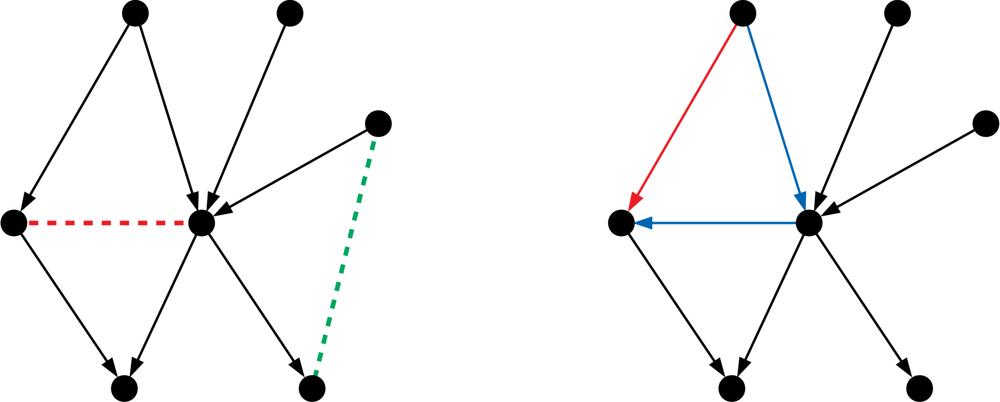
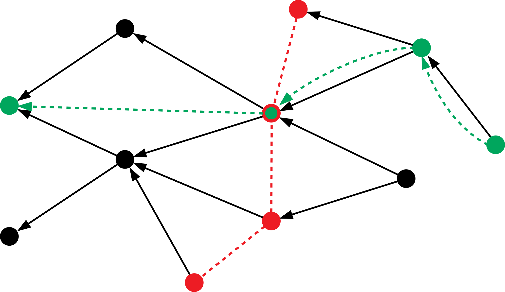
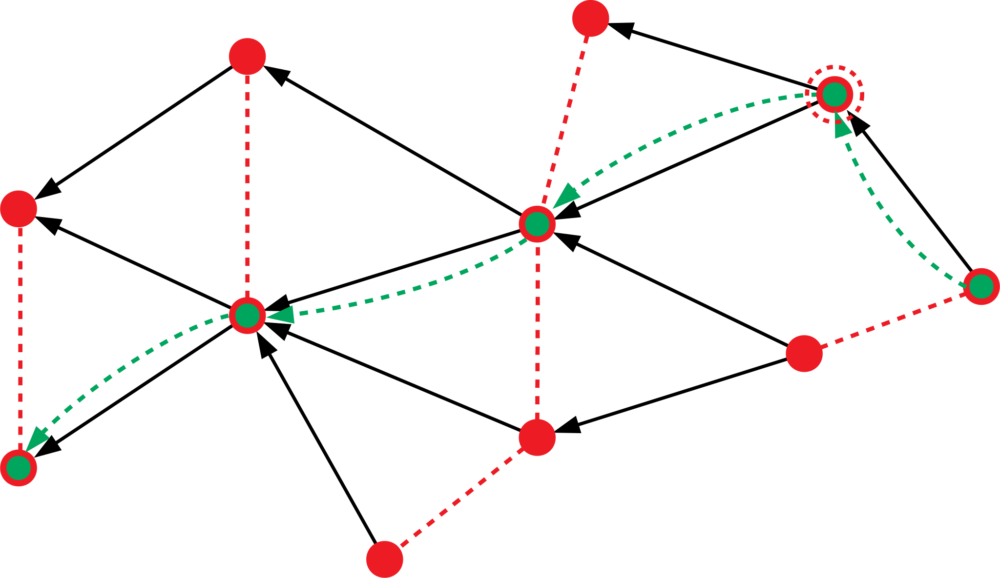
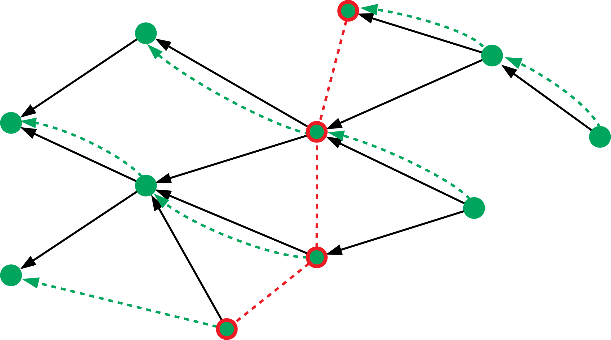
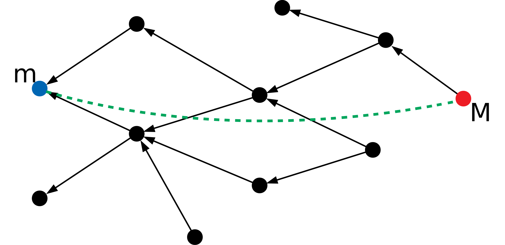
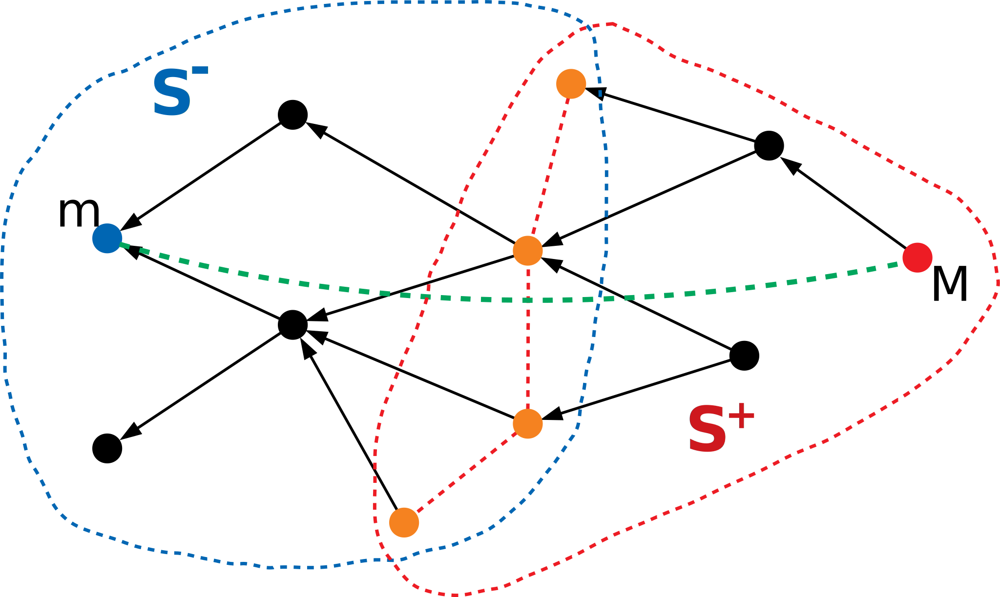
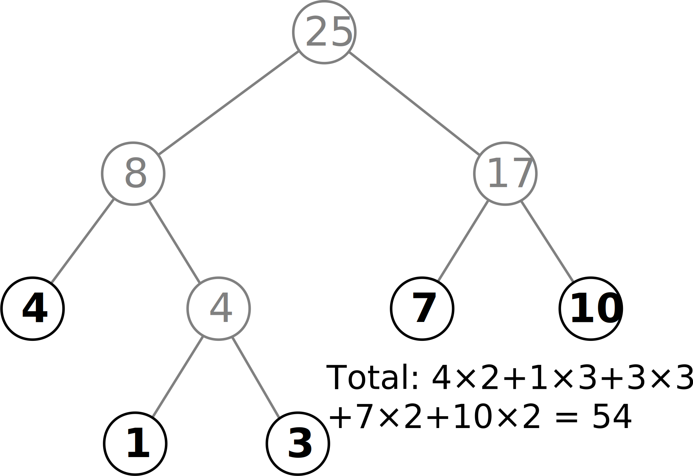
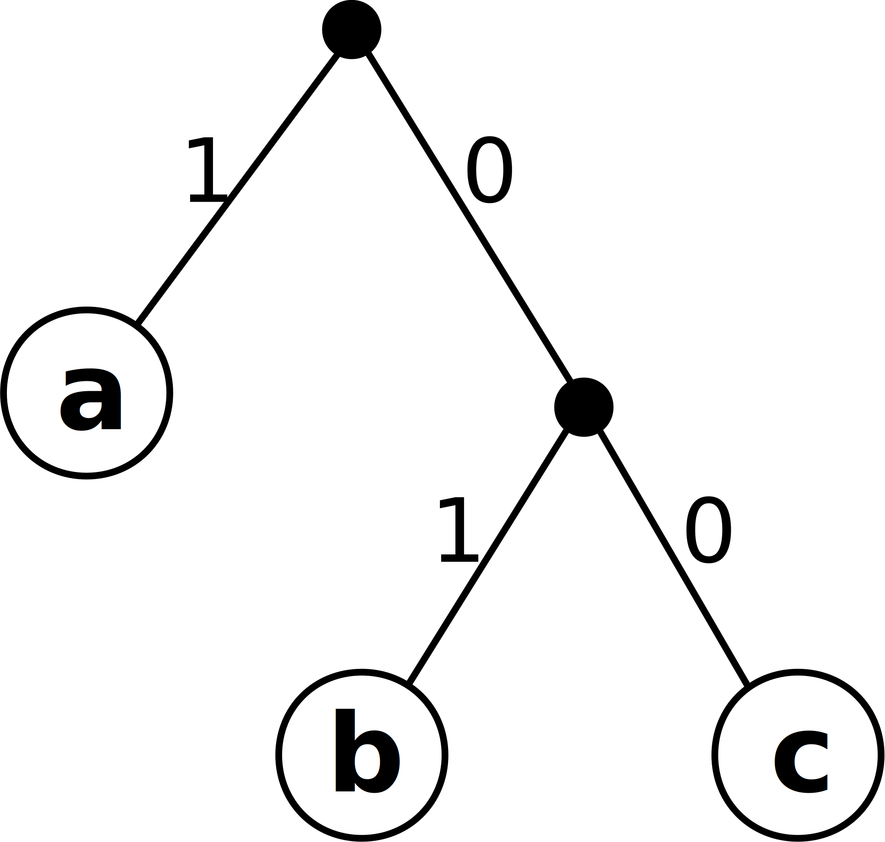
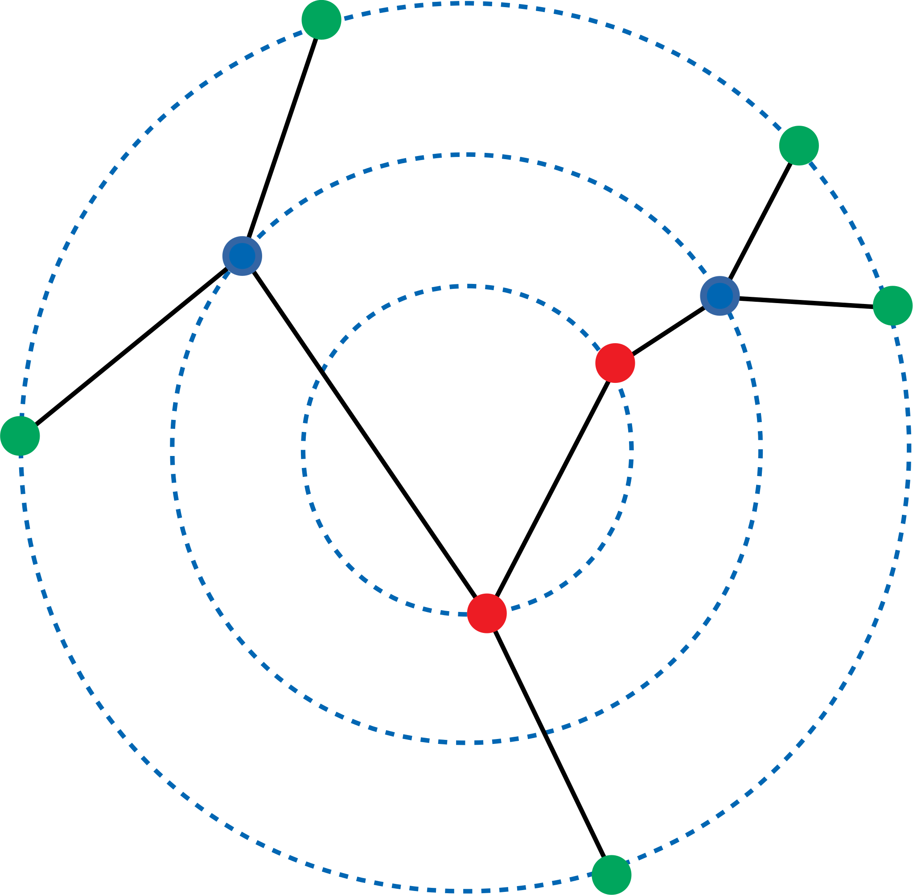
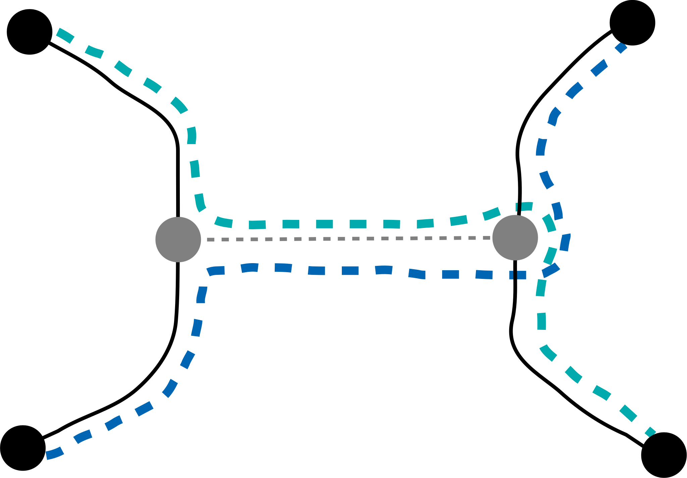

# 贪心问题选讲

## July 19, 2018, riteme

***

###### 贪心问题选讲

这节课主要是讲题吧。

---

~~有些东西可能跟贪心没什么关系~~

***

###### 热身题

一根长木棍上不同位置站着许多蚂蚁，初始时它们可能面向左边或者右边，然后以相同的速度开始移动。当两只蚂蚁相遇时，这两只蚂蚁立即调转方向继续移动。如果蚂蚁走到了木棍的两头~~就会掉下去~~。求多久后所有蚂蚁将掉下木棍。

---

相遇时调转方向视为直接穿过。

---

向左和向右的蚂蚁分开处理，取最大值。

***

###### [【LG P1094】](https://www.luogu.org/problemnew/show/P1094)纪念品分组

实际上是过河问题。

---

有 $n$ 个人在河的一边，想到河对岸。现有一条最大载重为 $w$ 的船，并且每次最多载两个人。已知每个人的体重，求最少要多少趟。

$n \leqslant 10^5$

---

贪心策略：最重的和最轻的能上一条船就上。如果不能上的话，说明最重的只能单独一条船了。

---

正确性：设最重的人为 $M$，最轻的为 $m$，并且 $M + m \leqslant w$。如果最优方案中 $M$ 和 $m$ 没有坐一条船，考虑下面两种情况：

---

1. 如果 $M$（或 $m$）单独坐一条船，而 $m$（或 $M$）与 $m'$ 同船。那么让 $m'$ 单独坐船不会影响答案。
---
2. 如果 $M$ 与 $M'$ 同船，$m$ 与 $m'$ 同船，因为 $M$ 是最重的，所以 $M' + m' \leqslant M' + M \leqslant w$，因此可以交换 $M'$ 和 $m$。

---

具体实现：将所有人的体重排序，从两头开始向中间逐个配对。

***

###### [【NOIP 1999 / LG P1020】](https://www.luogu.org/problemnew/show/P1020)导弹拦截

某国为了防御敌国的导弹，研发出一套导弹拦截系统。不过这套系统有一个缺陷：虽然第一发炮弹能够达到任意高度，但是之后每一发炮弹的高度不能超过前一发炮弹的高度。某天，敌国的导弹突然来袭，一共有 $n$ 颗，依次飞来。雷达侦测出了每一颗导弹的高度，问：

1. 如果只有一套系统，最多能拦截多少颗导弹？
2. 至少要多少套系统才能将所有导弹拦截？

$n \leqslant 10^5$

---

问题 1：最长不上升子序列的长度。

---

问题 2：最长单调递增子序列的长度。

---

Why?

***

###### 偏序集 (Posets)

**偏序集** $P = (S,\,\le)$ 由集合 $S$ 和二元偏序关系 $\le$（这不特指小于等于，只是一个形象表示）组成，并且满足以下条件：

---

1. **自反性**：对于任意 $a \in S$，满足 $a \le a$。
---
2. **反对称性**：对于任意 $a,\,b \in S$，如果 $a \le b$ 并且 $b \le a$，那么 $a = b$。
---
3. **传递性**：对于任意 $a,\,b,\,c \in S$，如果 $a \le b$ 并且 $b \le c$，那么 $a \le c$。

---

如果 $a \le b$ 并且 $a \neq b$，可以记作 $a < b$。

---

如果 $a \le b$ 或者 $b \le a$，那么称 $a$ 与 $b$ 是**可比较的**。否则是**不可比的**。

---

举个例子，$P = (\mathbf{Z},\,\leqslant)$ 就是一个偏序集，这里 $\leqslant$ 就是小于等于，不难验证其满足上面三个条件。

---

再举个例子，令 $S$ 为 $36$ 的所有因子，即 $S = \{1,2,3,4,6,9,12,18,36\}$，如果将 $\le$ 换成整除符号 $|$，$P = (S,\,\mid\,)$ 也是一个偏序集。

***

###### Hasse 图

不得不承认的是，偏序集这个概念相当抽象。

---

为了简单明了地表示偏序集，Hasse 首先使用拓扑图来表示偏序集中的比较关系。

---

在 Hasse 图中，集合 $S$ 中每个元素代表图中一个点。如果 $a \le b$ 并且不存在第三个点 $c$ 满足 $a \le c \le b$，那么 Hasse 图中就有一条 $b \rightarrow a$ 的边。

---

---

左图是一个 Hasse 图，其中红色虚线两端的元素不可比，而绿色虚线两端的元素可比。

---

右图是不正确的 Hasse 图，因为红色边应该被删去。

---

Hasse 图中是不存在环的。假设存在环 $a \rightarrow b \rightarrow \cdots \rightarrow a$，根据 Hasse 图的定义，得到 $b \le a$；根据传递性，$a \le \cdots \le b \Longrightarrow a \le b$；再根据反对称性，得到 $a = b$。同理可以推出整个环是一个点。所以 Hasse 图是拓扑图。

---

小测试：令 $S$ 为 $36$ 的所有因子，画出偏序集 $P=(S,\,\mid\,)$ 的 Hasse 图。

***

###### 链、反链

对于偏序集 $P = (S,\,\le)$，**链** (chain) $\mathcal{C} = [c_1,\,c_2,\,\,\dots,\,c_k]$ 是一个序列，满足 $c_1 < c_2 < \cdots < c_k$。链 $\mathcal{C}$ 中任意两个元素都是可比的。

---

**反链** (antichain) $\mathcal{A} = [a_1,\,a_2,\,\dots,\,a_k]$ 也是一个序列，但是反链中任意两个元素均不可比。

---

上图中绿色的是一条链，红色的是一条反链。

---

用许多条不相交的链覆盖所有节点称为**链覆盖**。同理，使用不相交的反链覆盖所有节点称为**反链覆盖**。

---

五条反链的覆盖。右上角红色虚线圈中单独一个点作为一条反链。

***

###### 所以这些东西根导弹拦截有什么关系？

可以采用偏序集的方式，来描述单调子序列。

---

对于一个序列 $A[1..n]$，将每个位置的下标和元素值关联起来得到二元组 $(k,\,A[k])$。定义二元关系 $(i,\,A[i]) \le (j,\,A[j])$ 成立当且仅当 $i \leqslant j$ 并且 $A[i] \leqslant A[j]$。之所以这么定义，是因为不下降子序列中相邻两个元素刚好满足这种关系。

---

定义 $(i,\,A[i]) \ge (j,\,A[j]) \iff i \leqslant j \text{ and } A[i] \geqslant A[j]$。如果两个二元组不相同，也可以记成 $(i,\,A[i]) < (j,\,A[j])$（$>$ 类似）。

---

令 $S = \{(k,\,A[k]): 1 \leqslant k \leqslant n\}$ 表示序列中所有元素，构造偏序集 $P = (S,\,<)$，不难发现**每个单调递增子序列对应偏序集中一条链**。

---

进一步验证可以发现，**每个不上升子序列对应偏序集中一条反链**。

---

~~所以有什么用......~~

----

**Mirsky 定理**　偏序集的最小反链覆盖中反链条数等于最长链的长度。

---

---

回到导弹拦截问题，一套系统能拦截的导弹是一个不上升子序列，也就是一条反链。现在要用最少的系统拦截所有导弹，相当于一个最小反链覆盖。根据 Mirsky 定理，最小反链覆盖的大小等于最长链的长度——最长的单调递增子序列的长度。

***

###### Mirsky 定理：证明

设偏序集 $P$ 为 $(S,\,\le)$，对于 $x \in S$，令 $f(x)$ 表示从 $x$ 开始的最长链的长度。

---

因为偏序集 $P$ 的 Hasse 图是一张拓扑图，所以可以采用 DP 的方式算出 $f(x)$。记 $f(x)$ 的最大值（即最长链长度）为 $d$，以及最小反链覆盖中反链条数 $m$。

---

考虑两个不同的起点 $x$ 和 $y$，如果 $f(x) = f(y)$，那么说明 $x$ 和 $y$ 不可比，否则 DP 过程中其中一个可以更新另外一个。

---

记 $F(n)$ 为 $f(x)$ 的 “反” 函数，即 $F(n) = \{x: f(x) = n,\, \forall x \in S\}$。根据这个性质，我们知道如果 $F(n)$ 不为空，则 $F(n)$ 构成一条反链。

---

因此 $F(1),\,F(2),\,\dots,\,F(d)$ 是偏序集 $P$ 的一个反链覆盖。注意 $F(1)$ 到 $F(d)$ 中可能有空集，所以这里只能得出 $m \leqslant d$。

---

另一方面，根据链和反链的定义，一条链上任意两个点不可能同时处在同一条反链中。所以在一个反链覆盖中，最长链上每一个点必定分属不同的反链，这里可以推出 $m \geqslant d$。

---

综上，可以得出 $m = d$。$\blacksquare$

***

###### Dilworth 定理

**Dilworth 定理**　最小链覆盖中链的条数等于最长反链的长度。

---

~~这和 Mirsky 定理有什么区别~~

----

~~这两个定理不是对偶的吗~~

----

对于偏序集 $P_1 = (S,\,\le)$ 和偏序集 $P_2 = (S,\,>)$ 而言，这两个定理几乎是等价的，因为 $P_1$ 中的一条链就是 $P_2$ 中的一条反链，反之亦然。

---

但是对于所有的偏序集都可以找到这样的对偶吗？并非如此。还是整除的老例子，考虑偏序集 $P = (\{1,\,2,\,\dots,\,n\},\,\mid\,)$，该如何对应呢？

---

之所以 $\le$ 可以对应，是因为 $\nleq$ 就是 $>$，并且两者都满足偏序集的三个要求。而现在 $\nmid$ 根本不满足传递性：
$$
2 \nmid 3 \text{ and } 3 \nmid 4 \overset{?}\Longrightarrow 2 \nmid 4
$$

---

但是不管怎么样，它依然是个定理。不过证明方法有些不同。

---

---

注意这张图也是两个定理不对偶的一个反例。

***

###### Dilworth 定理：证明

---

~~凡事证不出来了就动用数学归纳法~~

----

设偏序集 $P = (S,\,\le)$，最长反链长度为 $d$，以及最少需要 $c$ 条链才能覆盖偏序集。类似之前的证法：由于反链中任意两个元素不可能出现在同一条链里面，所以对于一个链覆盖，反链中每个元素必定处于不同的链中，所以 $c \geqslant d$。

---

接下来尝试证明我们可以构造出 $d$ 条链的覆盖。如果 $P$ 中没有比较关系（即其 Hasse 图中没有边），那么显然结论成立。此外当 $|S| = 0$ 和 $1$ 时均成立。假设对于 $|S| = 0, \,1, \,\dots, \,n - 1$ 均成立，考虑当 $|S| = n$ 的情况：

---

选取一个极大值 $M$（即不存在 $x \in S$ 满足 $M \le x$）和一个极小值 $m$，并且 $m \le M$（如上图所示）。注意到 $[m,\,M]$ 构成了一条链。

---

将 $m$ 和 $M$ 从偏序集中删去，得到 $P'$。由于它们构成了一条链，所以 $m$ 和 $M$ 不可能同时在最长反链中，所以最长反链的长度最多减 $1$。

---

考虑第一种情况，如果 $P'$ 的最长反链长度为 $d - 1$，根据归纳假设， $P'$ 有一个大小为 $d - 1$ 的链覆盖。将 $[m,\,M]$ 加入到这个链覆盖中，就得到了一个大小为 $d$ 的链覆盖。归纳假设成立。

***

###### Dilworth 定理：证明

当然最长反链的长度可能不会减少。尝试用这条最长反链 $\mathcal{A}$ 将偏序集切开。定义：

---

$$
\begin{aligned}
S^+ &= \{x: a \le x,\,\exists a \in \mathcal{A}\} \\
S^- &= \{x: x \le a,\,\exists a \in \mathcal{A}\}
\end{aligned}
$$

---

$S^-$ 是 Hasse 图的下半截，$S^+$ 是上半截。现在先要来确认几个事情：

---

* $S^- {\,\large\cup\,} S^+ = S$，即上述划分确实包含了 $S$ 的所有元素。
---
    * 如果存在一个 $x \notin S^- {\,\large\cup\,} S^+$，则说明 $x$ 与 $\mathcal{A}$ 中所有元素均不可比。
---
    * 此时反链 $\mathcal{A}$ 还可以加入 $x$，不是最长反链，矛盾。
------
* $S^- {\,\large\cap\,} S^+ = \mathcal{A}$。
---
    * 如果不是这样，则存在一个 $x$，与反链 $\mathcal{A}$ 中某两个元素 $a_1$、$a_2$（可能相同）满足 $a_1 \le x \le a_2$。
---
    * 根据传递性，$a_1 \le a_2$，与反链的定义矛盾。
------
* $m \notin S^+$，$M \notin S^-$。
---
    * ~~显然~~

-----

注意到偏序集 $S^+$ 和 $S^-$ 都有最长反链 $\mathcal{A}$，并且根据上面第三条性质，这两个集合缺少 $m$ 或者 $M$，即大小比 $|S|$ 小，因此可以利用归纳假设分别得到 $S^+$ 和 $S^-$ 的大小为 $d$ 的最小链覆盖。

---

对于 $S^+$ 的链覆盖中的 $d$ 条链，不难证明链的底端一定是 $\mathcal{A}$ 的元素，而 $M$ 处于其中某条链的顶端。对于 $S^-$ 也是类似的。因此可以用 $\mathcal{A}$ 中的元素作为中介，将 $S^-$ 和 $S^+$ 的两个链覆盖连接起来，得到一个大小为 $d$ 的链覆盖。$\blacksquare$

***

###### 回归正题

---

~~刚才课件好像鬼畜了一下~~

----

~~一起来打怪兽吧！~~

---

[【PA 2014 / BZOJ P3709】](https://www.lydsy.com/JudgeOnline/problem.php?id=3709)Bohater

现在你需要击败 $n$ 个怪物。杀死第 $k$ 个怪物你会掉 $\mathrm{d}[k]$ 的生命值，但随后怪物会掉落血药，可以恢复 $\mathrm{a}[k]$ 的生命值。任何时候你都必须保证生命值**大于** $0$。已知初始时有 $z$ 点生命值，请给出一种能保证自己不死的打怪顺序。如果没有方案就输出 `no`。

$n \leqslant 10^5$

---

怪物主要分两种，一种是打完后可以加生命值的（$\mathrm{a}[k] > \mathrm{d}[k]$），另一种是会扣生命值的。

---

显然我们需要先打加血的，再打扣血的。

---

由于顺序是先扣血再加血，所以即便是加血的怪也不能随便乱打。

---

打加血的怪的时候自己的生命值一直在上升，所以按 $\mathrm{d}[k]$ 从小到大的顺序来打。

---

另外一部分扣血的怪就有点脑筋急转弯了：正着打是掉血，反着想就是加血！相当于每次掉出来的是 $\mathrm{d}[k]$ 的血药。模仿之前的策略，自然是按照 $\mathrm{a}[k]$ 的倒序来打。

---

当然还要模拟一下确认可行。

***

###### [【NOI 2014 / LG P2354】](https://www.luogu.org/problemnew/show/P2354)随机数生成器

题目首先手把手教你如何生成排列，然后顺便唆使你按照给定的参数生成一个 $n \times m$ 的矩阵。**矩阵中没有重复的数字**。

一开始站在矩阵左上角，每次可以**向右**和**向下**走，最后走到矩阵的右下角。总共会走 $n + m - 1$ 步。将所途径的数字从小到大排序，构成所谓的 “路径序列”。你需要找出路径序列**字典序最小**的一种走法。

$n,\,m \leqslant 5000$

---

$$
\begin{matrix}
\color{blue}12 & \color{blue}9 & \color{blue}1 & 7 \\ 
5 & 11 & \color{blue}6 & \color{blue}2 \\
4 & 10 & 3 & \color{blue}8 \\
\end{matrix}
$$

---

字典序最小......所以肯定要经过 $1$ 啊！

---

按这么推，自然还需要经过 $2$、$3$ 之类的，但是可能由于需要经过 $1$，有些地方就没办法再经过了。例如在样例中，如果要求经过 $6$，因为不能向左和向上走，所以路径不能再经过 $4$、$10$ 和 $7$ 了。

---

按照数字从小到大的顺序依次选择可以走的格子，每次选择完之后将不能走的地方标记上，最后留下的就是最优路径。

***

###### [【LG P1090】](https://www.luogu.org/problemnew/show/P1090)合并果子

有 $n$ 堆果子，现在想把它们合成一堆，每次可以选取两堆来合并。合并两堆果子所需要消耗的体力值是这两堆果子的重量之和。问最少消耗多少体力值。

$n \leqslant 10^5$

---

这个题想必大家都做过。

---

考虑一棵有 $n$ 个叶子的合并树：每个非叶子节点表示将儿子处的两堆果子合并到自己这里。

---

---

合并树表示一种合并的策略，它所花费的总体力值为所有非叶节点的权值总和。

-----

---

另外一种计算总体力消耗的方法：叶节点的权值乘上叶节点的深度的总和。

---

可以想象成叶节点一步一步往根节点走，每走一步要花费与自身体重相同的体力值。

---

在这种模型下，对于某个特定的策略，每个叶节点的深度是确定的，所以我们只用安排每堆果子应该被放到哪个叶节点上即可。

***

###### 排序不等式

---

**排序不等式：**正序和 > 乱序和 > 倒序和。

----

**排序不等式：**对于两个等长且按升序排序的非负整数序列 $A = [a_1,\,a_2,\,\dots,\,a_n]$ 和 $B = [b_1,\,b_2,\,\dots,\,b_n]$ 以及任意排列 $P$：
$$
\sum_{k = 1}^n a_kb_k \geqslant \sum_{k = 1}^n a_kb_{P(k)} \geqslant \sum_{k = 1}^n a_kb_{n - k + 1}
$$

---

证明基本思想：贪心调整法。

---

将正序的数列打乱会使结果变小吗？

---

$$
\begin{matrix}
a \leqslant b \\
c \leqslant d
\end{matrix}
\Longrightarrow
\begin{matrix}
a \leqslant b \\
d \geqslant c
\end{matrix}
$$

原乘积和：$ac + bd$；新乘积和：$ad + bc$。前者减后者得到 $(a - b)(c - d) \geqslant 0$，所以打乱后总和不会变大。

---

根据排序不等式，深度大的节点要放重量小的果子。

***

###### [【LG P1090】](https://www.luogu.org/problemnew/show/P1090)合并果子

这样一来，无论是什么策略，最轻的两堆果子一定会待在最深的叶节点处。

---

所以可以优先将它们合并，这样做不会影响答案的最优性。

---

**合并果子++：**将每次合并两堆果子改为：每次合并 $k$ 堆果子（$k \geqslant 2$），又该如何处理？

---

每次合并果子时总堆数会减少 $k - 1$，最后 $n$ 堆果子会合并为 $1$ 堆果子，一共减少了 $n - 1$ 堆。还是尝试使用合并树这个模型，但是如果 $n - 1$ 不是 $k - 1$ 的倍数，合并树上就可能出现空缺的叶子节点。

---

当然，可以加入一些没有重量的果堆，将 $n - 1$ 补成 $k - 1$ 的倍数，这样既不影响答案，又可以使合并树上每个非叶子节点的儿子是满的。

---

再次根据排序不等式，不难推出优先合并最小的 $k$ 堆果子的贪心策略。

***

###### 合并果子：实现

直接实现合并果子需要一个堆，用于维护当前剩余果堆中重量最轻的。

---

不知道你们还记不记得 Day1 的 NOIP 选做题：采用三个队列代替一个堆。

---

这里也是一样的：考虑相邻两次合并操作：首先从堆中抽出 $a \leqslant b$，合并成 $a + b$ 后又放回堆。如果接下来的合并中又抽出了 $a  + b$，则这次合并出来的堆不会小于 $a + b$。否则将抽出 $c$ 和 $d$，满足 $b \leqslant c \leqslant d$，显然 $c + d$ 依然不小于 $a + b$。所以每次新合并的堆的重量是递增的。

***

###### 哈夫曼树 (Haffman Trees)

哈夫曼编码的出现：用于压缩文本。

---

举个例子，一篇文章中只出现了 $3$ 个英文字母 `a`、`b` 和 `c`，存储的时候使用二进制。为了充分利用空间，每个字母编码的长度可能是不一样的。为了避免二义性，使用一棵树结构来表示编码的方式：

---

---

从根节点开始，如果当前读到的二进制位为 $1$，就往左边走，否则往右边走。走到叶节点时说明解码出了一个字符。这里可以看到上图是用 $1$ 来编码 `a`，$01$ 编码 `b`，$00$ 来编码 `c`。

---

现实中，每个字母出现的频率并不相同。对于出现频率高的字母，可能需要一个短一点的编码；而对于频率低的字符，给它一个长一点的编码对压缩效果没有什么影响。

---

在已知频率的情况下，哈夫曼树的目标是给出最优编码，即频率乘以编码长度之和最小。

---

不难发现这和合并果子实际上是一个模型。

---

例题：[【NOI 2015 / LG P2168】](https://www.luogu.org/problemnew/show/P2168)荷马史诗

***

###### [【POI 2006 / LG P3441】](https://www.luogu.org/problemnew/show/P3441)Subway

给定一个 $n$ 个节点的树，以及整数 $m$。可以任意选择树上 $m$ 条**简单路径**，使得这些路径覆盖到的节点尽可能多。输出最多能覆盖到多少个节点即可。

$n \leqslant 10^6$

---

存在最优方案，里面的路径都是从叶节点到叶节点的。

---

最优方案最多占用 $2m$ 个叶节点。如果叶节点不足 $2m$ 个，那么其中一些路径的端点就会重合。

---

仿照这样的思路，将一圈叶节点全部删掉。对于剩下的树上的新的 “叶节点”，它们当中也最多只能选择 $2m$ 个。如果新的 “叶节点” 不足 $2m$ ，就会有路径在某些地方交汇。

------

将树进行分层，每一层都是某个状态下的叶节点。

---

使用一个队列来进行分层。记录每个节点的度数 `deg`，每次将所有 `deg` 为 $1$ 的节点分为一层，因为它们都是叶节点，然后删去与它们相关的边，并更新 `deg`。更新的时候注意是否有新的节点的 `deg` 变为了 $1$，如果有就加入队列，方便后续处理。

---

然后统计每一层的节点个数 `cnt`。设有 $l$ 层，则答案为 $\sum_{k = 1}^l \min\{2m,\,\mathrm{cnt}[k]\}$。

***

###### [【POI 2006 / LG P3441】](https://www.luogu.org/problemnew/show/P3441)Subway

正确性？

---

首先可以证明，存在最优方案，任意两条路径均有交集。

---

如果没有交集，通过交换一边的端点就可以调整为有交集的状态，并且答案不会变小。

---

因此可以假设选出来的路径的交集至少有一个点。在交路径的一边，如果有重合的端点，那么这些重合的端点可以任意移动到其它地方而不影响答案。

---

按照分层从内至外归纳证明：考虑任意 $k - 1$ 层以内的树的最优路径覆盖方案。首先，在第 $k$ 层能够选择的节点数不会小于第 $k - 1$ 层。此外，无论第 $k$ 层如何选择，原来的路径覆盖方案总可以与新选择的节点连接。

---

只要将必要数量的端点移到第 $k - 1$ 层对应节点上，就可以向外 “生长”。

***

###### 活动安排问题

有 $n$ 个活动，第 $k$ 个活动的开始时间为 $s_k$，结束时间为 $t_k$。两个活动 $i$ 和 $j$ 有冲突当且仅当区间 $[s_i,\,t_i]$ 与区间 $[s_j,\,t_j]$ 有重叠。问最多能安排多少个互不冲突的活动。

$n \leqslant 10^5$

---

按照活动的结束时间从小到大排序，依次选取即可。

---

因为结束时间早的可以为后面的活动留下更多的时间。

***

###### [【JSOI 2007 / LG P4053】](https://www.luogu.org/problemnew/show/P4053)建筑抢修

有 $n$ 个受损坏的建筑，每个建筑修复需要花费 $s_i$ 分钟，但是如果 $t_i$ 分钟前没修完或者是根本没修，那么这个房子就报废了。问最后最多能修复多少个房子。

$n \leqslant 10^5$

---

仿照上一题的做法，将所有任务按 deadline 从小到大排序，依次考虑。

---

但是这一题更为机智：如果当前修房任务无法安排进去，那至少也要看看有没有比自己更耗时间的任务。如果有的话，就用自己将之前安排的最耗时的任务替换掉。

---

同样也是为了给后面的任务留下充足的时间。

---

实现时需要一个堆来维护当前选择的任务中耗时最大者。