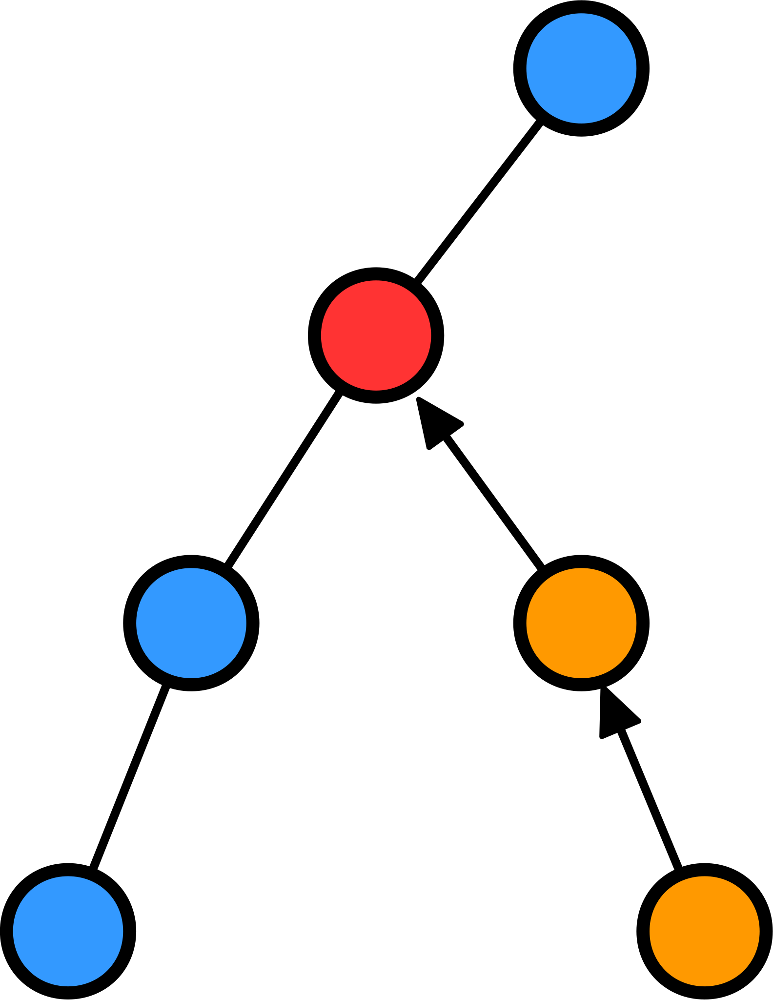
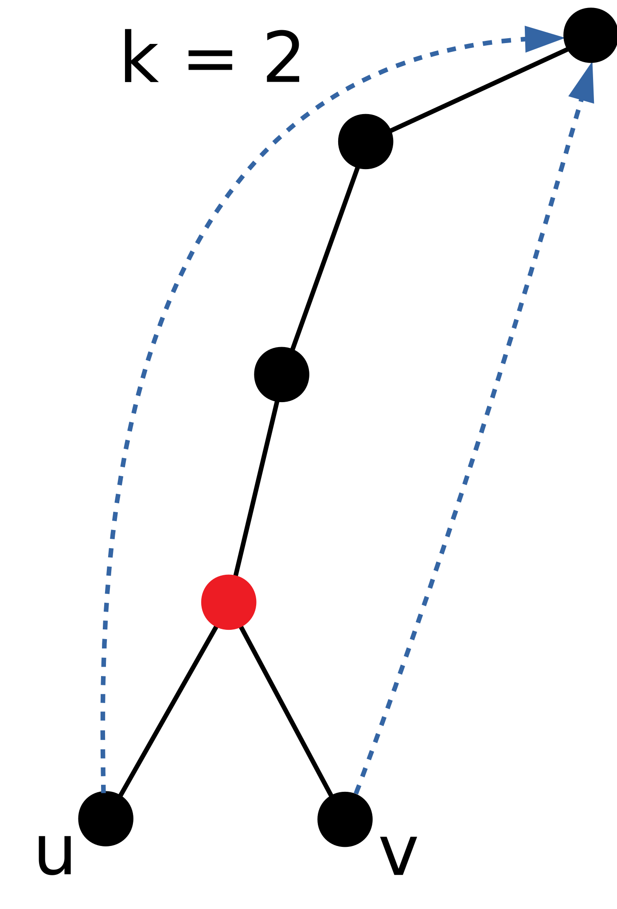
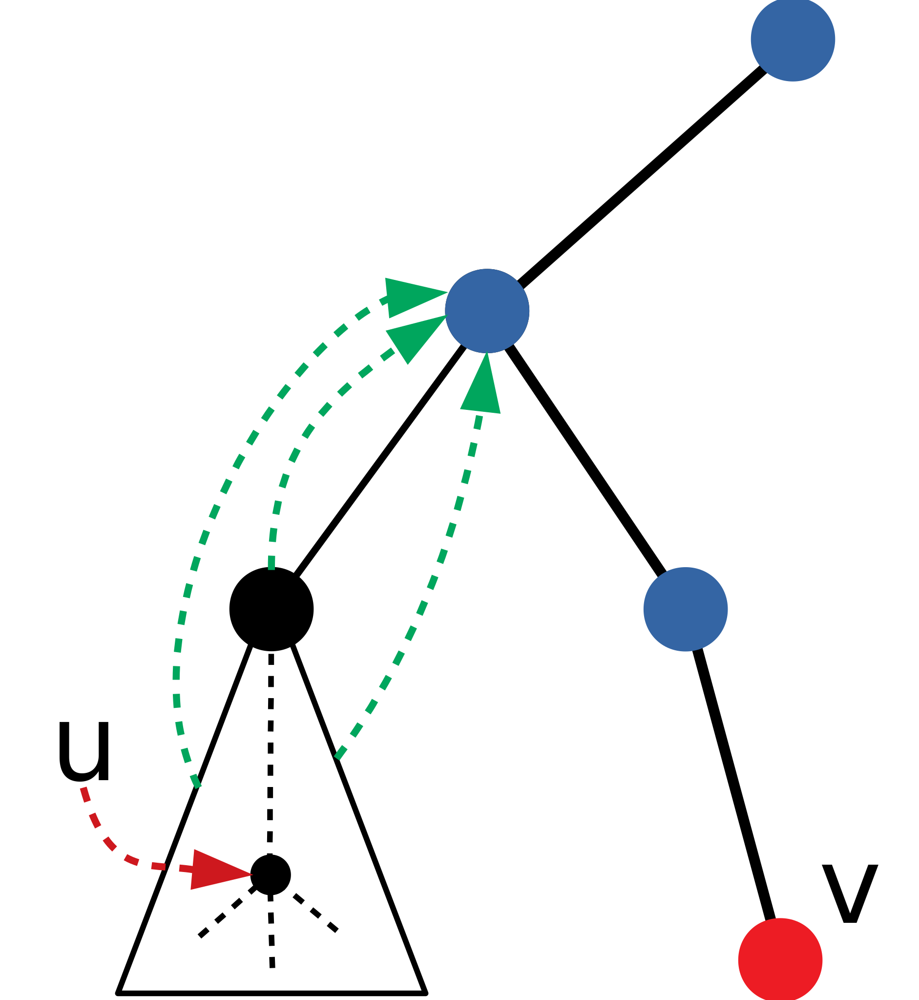
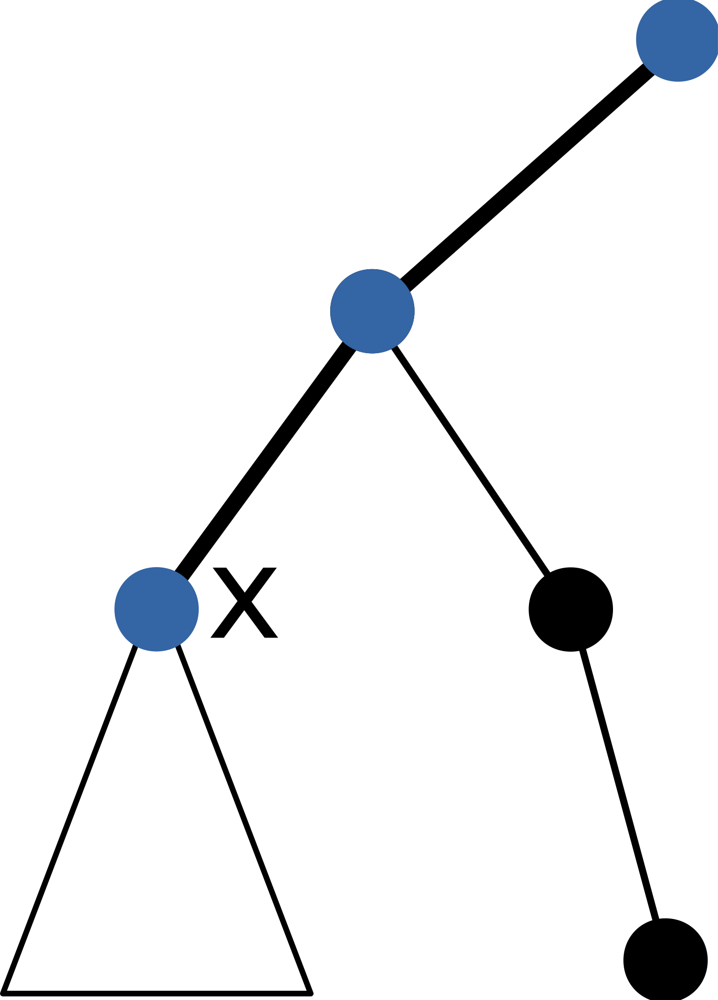
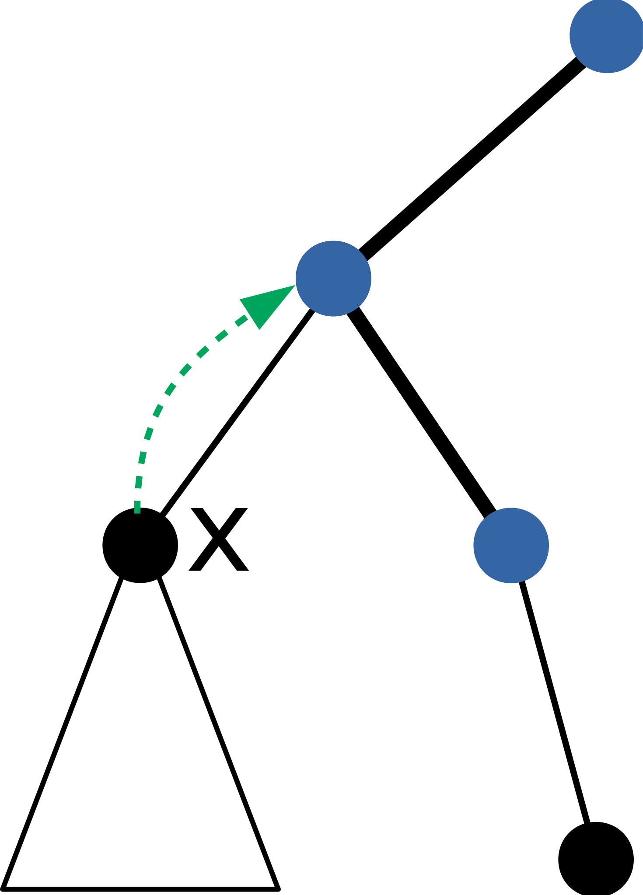
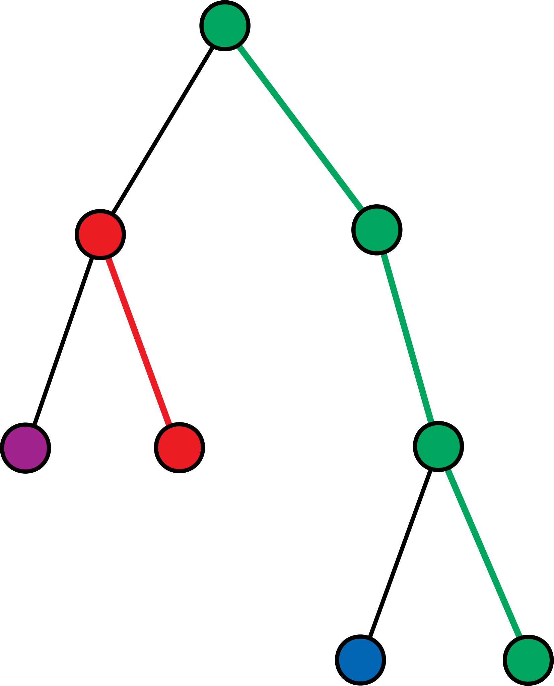
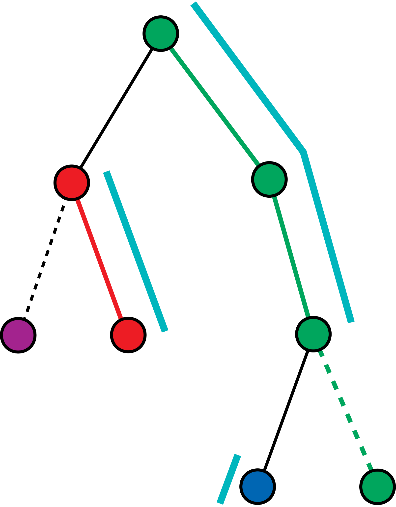
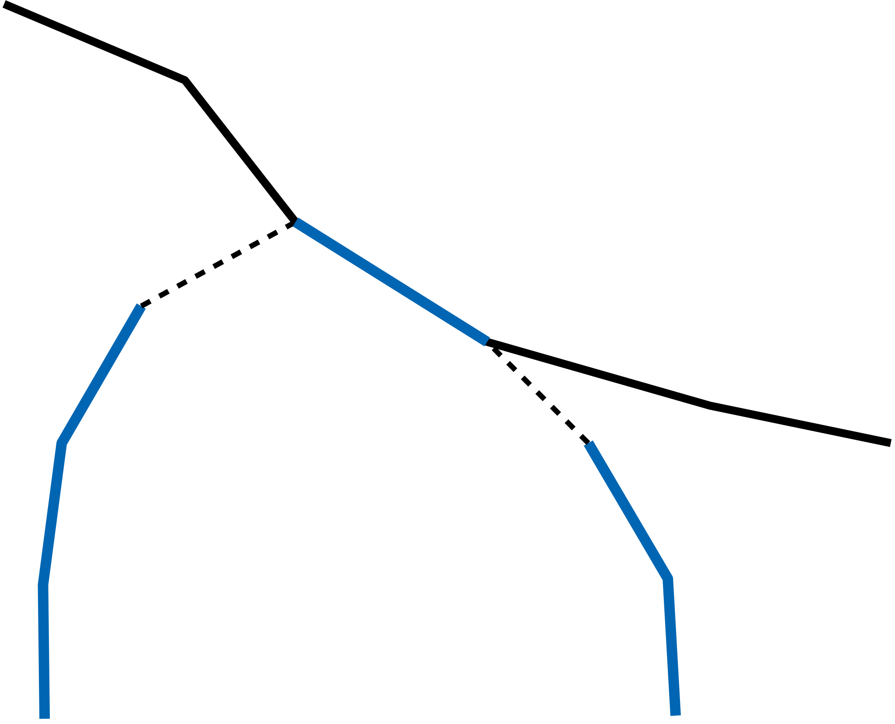

# 树上算法选讲

## July 22, 2018, riteme

***

###### Overview

今天的课主要讲三个内容：

---

* DFS 序
* 最近公共祖先 (LCA)
    * 倍增算法
    * Tarjan 离线算法
* 树链剖分

---

这三个东西是处理与静态树有关的问题中常用的工具。

***

###### DFS 序

“DFS 序” 就是 DFS 的顺序。

---

从树根开始 DFS，对于每棵子树，DFS 总是要先遍历完子树内部才会从子树根节点走出去。

---

DFS 访问一棵子树内的所有节点的时间是连续的。

---

记录全局变量 `cur` 表示时间，每当访问一个新节点时 `cur` 加 $1$。

---

对每个节点记录 `in` 和 `out` 两个值，分别表示 DFS 首次进入的时间和 DFS 离开的时间。`in` 和强连通分量算法里面的 `dfn` 实际上是一个东西。

---

子树 $x$ 内所有节点的 DFS 序都在区间 $[\mathrm{in}[x],\,\mathrm{out}[x]]$ 中。每棵子树对应一个区间。

---


***

###### [【POJ 3321】](http://poj.org/problem?id=3321)Apple Tree

给定一棵 $n$ 个节点的苹果树，进行 $q$ 次操作：

1. 在某个节点上摘下或者放上一个苹果。
2. 询问某个子树中苹果总数。

$n,\,q \leqslant 10^5$

---

利用 DFS 序，将子树与区间相对应。然后使用线性数据结构（线段树、树状数组）来维护。

***

###### 最近公共祖先

两个节点的公共祖先中深度最大者被称为最近公共祖先 (**L**east **C**ommon **A**ncestor)。

---

假设在询问节点 $u$ 和节点 $v$ 的 LCA，将一个节点的所有祖先（包括自己）标记，然后另一个节点向上走，遇到的第一个被标记的节点就是 LCA。

---



---

显然这个暴力算法是 $O(h)$ 的，$h$ 是树的高度。

***

###### 另外一种暴力

如果 $u$ 和 $v$ 深度相同，那么 $u$ 和 $v$ 同时向上走，走到同一个节点时就是 LCA。

---

如果深度不相同，那就让深度大的先独自走一段，直到深度相同为止。

---

这种算法减少了空间消耗。

---

```
// depth 表示节点深度，father 是树上节点的父亲
function LCA(int u, int v):
    if depth[u] < depth[v]:  // 方便处理，令 u 为深度较大者
        swap(u, v)
    while depth[u] != depth[v]:
        u = father[u]
    if u == v:  // 如果 v 是 u 的父亲，那么 LCA(u, v) 就是 v
    	return v
    while u != v:
    	u = father[u]
    	v = father[v]
    return u
```

***

###### 倍增优化

上一页的暴力算法中，大部分时间花费在节点上跳这个步骤。确实一步一步地走相当慢。

---

毕竟现在只有一个 `father` 数组，每次只能走一步。倍增表尝试打破这个限制：计算出 $\mathrm{jmp}[x][k]$，表示从节点 $x$ 开始往上走 $2^k$ 步的节点。$\mathrm{father}[x]$ 实际上就是 $\mathrm{jmp}[x][0]$。

---

计算出 $\mathrm{jmp}$ 并不难，因为走两个 $2^{k - 1}$ 步就是走一个 $2^k$ 步，也就是 $\mathrm{jmp}$ 有这样的 DP 转移：

---

$$
\mathrm{jmp}[x][k] = \mathrm{jmp}[\,\mathrm{jmp}[x][k - 1]\,][k - 1]
$$

---

显然倍增表的大小是 $O(n \log h)$ 的。

---

现在来尝试使用倍增表来优化上跳过程。令 $u$ 为深度较大者，第一个步骤是调整 $u$ 和 $v$ 的深度，从最高的幂次 $2^M$ 开始，如果 $\mathrm{jmp}[u][M]$ 的深度没超过 $v$，那么 $u$ 就可以先跳到那里。然后尝试 $2^{M - 1}$、$2^{M - 2}$......

---

这个过程相当于二进制试位，测试的是两点之间深度差的二进制。

***

###### 倍增优化

接下来的步骤是同时上跳。由于上跳的步伐很大，所以经常会有 “跳过头” 的情况。



---

这种情况不好判断两点重合是否就是 LCA，所以换一个策略：只跳过不重合的部分。

---

从 $2^M$ 步开始枚举，如果上跳后两个节点不重合，则执行。这样最后 $u$ 和 $v$ 会停在 LCA 下面。同样是二进制试位的原理。

---

预处理出 $\mathrm{jmp}$ 的时空复杂度是 $O(n \log h)$，之后每次 LCA 询问都是两次上跳，复杂度均为 $O(\log h)$。

***

###### 倍增优化：实现

```
function LCA(int u, int v):
	if depth[u] < depth[v]:
		swap(u, v)
	for k from M to 0:
		if depth[jmp[x][k]] <= depth[v]:
			u = jmp[x][k]
	if u == v: return u
	for k from M to 0:
		if jmp[u][k] != jmp[v][k]:
			u = jmp[u][k]
			v = jmp[v][k]
	return father[u]
```

***

###### 离线算法

如果允许不即时回答询问，在已知所有询问的情况下，最后统一给出答案，称为**离线处理**。

---

Tarjan 老爷爷首先提出使用 DFS + 并查集来离线计算 LCA。

***

###### 再探 DFS

DFS 本身的实现依赖于一个栈。在一棵树上 DFS 到 $x$ 的时候，栈中的元素从栈顶到栈底，恰好就是 $x$ 的所有祖先（包括 $x$ 在内），按照深度顺序排列。

---

回想第一个暴力 LCA 算法，假设现在 DFS 到 $v$，如果知道 $u$ 在栈中的第一个祖先，那么这个祖先就是 $u$ 和 $v$ 的 LCA。

---



---

现在的任务就是要维护指向栈内元素的指针（上图绿色箭头）。

***

###### Tarjan 最近公共祖先算法

当 DFS 在不同的儿子间切换时，需要更新指针。

---



----



---

之前 $x$ 还在栈中，所以子树 $x$ 中的所有指针都是指向 $x$ 的。当 DFS 离开 $x$ 后，$x$ 从栈顶被弹出，此时整个子树 $x$ 在栈中的祖先是 $x$ 的父亲。这样可以维护所有已经被访问的节点的祖先指针。

---

如果要求 LCA，DFS 访问 $v$ 的时候只需要节点 $u$ 被访问过即可。

---

每次修改都是一整棵子树修改，因此使用并查集把整棵子树连起来，然后在代表元素处设置祖先指针。

---

每当一个儿子 DFS 完毕，就把自己和儿子相连，然后重新设置祖先指针。

---

在每个节点处挂个链表，对于询问 $\mathrm{LCA}(u,\,v)$，$u$ 和 $v$ 处的链表都加入这个询问，方便快速查找。

***

###### Tarjan 最近公共祖先算法：实现

```
function dfs(int x):  // ancestor 表示祖先指针，marked 数组表示 DFS 是否遍历过
	ancestor[find(x)] = x
	for v in G[x]:  // 遍历 x 的所有儿子 v
		dfs(v)
		union(x, v)  // 连接 x 和 v
		ancestor[find(x)] = x
	marked[x] = true
	for each query LCA(u, x):
		if marked[u]:
			LCA(u, x) = ancestor[find(u)]
```

---

时间复杂度为 $O((n + q)\alpha(n))$，其中 $q$ 为 LCA 的询问总数。

***

###### 求树上两点路径长度

给出一棵 $n$ 个点的带权树，$q$ 次询问。每次询问某两点间的距离。

$n,\,q \leqslant 2 \times 10^5$

---

首先一遍 DFS 求出每个点到根节点的距离 `dist`。

---

对于点 `u` 和点 `v`，求出其 LCA 点 `p`，那么距离就是 `dist[u] + dist[v] - 2 * dist[p]`。

***

###### [【JLOI 2014 / LG P3258】](https://www.luogu.org/problemnew/show/P3258)松鼠的新家

给定一棵 $n$ 个节点的树，按照一定顺序依次访问树上的节点。在两个不同节点间是沿着两点间唯一的简单路径移动的。求最后每个节点被经过了多少次。

$n \leqslant 3 \times 10^5$

---

每次转移位置相当于将一条路径上所有节点的权值加 $1$。

---

利用差分的思想，假设是 $u$ 和 $v$ 两个点，两点处均 $+1$，令 $p$ 为 $u$ 和 $v$ 的 LCA，如果用 DFS 求出每个节点的子树和，发现 $p$ 以及 $p$ 的祖先的权值都是 $2$，所以 $p$ 和 $p$ 的父亲处均还需要 $-1$。这样求子树和后，简单路径 $u - v$ 上的点权都为 $1$。

---

除了差分求和外就只剩求 LCA 了。

***

###### 树链剖分

树链剖分是用于处理树上路径操作的利器。

---

顾名思义，将树分解成一条一条的链，从而可以使用线性数据结构来处理树上路径问题。

---



----

为了方便处理，这些链都没有转折的地方，都是沿着向上的方向。某些链可能只有一个点。

---

此时树上的边分为两种：一类是链内部的边，称为**重边**；另一类则是链外部的边，称为**轻边**。轻重边的概念在讲并查集的时候提到过。

---

处理一条树上路径的时候，通过这些链将路径切分成许多区间。

---



***

###### 树链剖分

每个节点下面只能有一条重边。通常选择这条重边的策略是根据儿子子树的大小，选择其中大小最大的儿子，这个儿子也称为**重儿子**。

---

为什么要这么选择呢？设当前节点为 $x$，重儿子为 $u$，显然子树大小超过 $\frac12\mathrm{size}[x]$ 的儿子只能有一个，因此除了 $u$ 之外，其它的子树大小不超过 $\frac12 \mathrm{size}[x]$。

---

这样轻边的定义和并查集时间复杂度分析里面的定义是一样的啦。轻边的性质非常好：从任意一个节点到根节点的路径上至多经过 $\lceil \log n \rceil$ 条轻边。

---



---

除了最顶上的链，其余链上的区间都是因为轻边的原因而被截断的。因此轻边的数量决定了将树上路径拆分成线性区间的数量。根据轻边的性质，每条树上路径最多被拆分成 $2\lceil \log n \rceil$ 个区间。

---

如果是树上路径加的数据结构题，再利用线段树或者树状数组就可以以单次操作 $O(\log^2 n)$ 的时间复杂度解决了。

***

###### 树链剖分：实现

一般树链剖分都是两遍 DFS：第一遍算出一些重要的信息，如子树大小 `size`、每个节点的父亲 `father`、节点的深度 `depth` 等。

---

第二遍则正式进行树链剖分。为了方便寻找区间，对每个点记录 `top` 表示自己所处的链的顶端的节点。为了能拆分区间，同一条链上的节点按照顺序依次编号，得到 `id`，这样一条链在序列上就是连续的。

---

DFS 的时候先找出重儿子并且优先进入。这样 `id` 实际上也是 DFS 序。

---

拆分简单路径 $u - v$ 时，如果 $u$ 和 $v$ 在同一条链上，那么区间的端点就是 $\mathrm{id}[u]$ 和 $\mathrm{id}[v]$。

---

如果不在同一条链上，就需要尝试跳到同一条链上。选取 $\mathrm{top}[u]$ 和 $\mathrm{top}[v]$ 中深度较大者，因为它不可能在另外一条深度小的链的上方。假设是 $\mathrm{top}[u]$，那么让 $u$ 跳到链的顶端，路径在链上拆分出一个区间（从 $u$ 到 $\mathrm{top}[u]$），然后 $u$ 走过一条轻边来到下一条链上。直到出现第一种情况为止。

---

此外，树链剖分也可以求解 LCA，时间复杂度为 $O(\log n)$。

---

模板题：[【ZJOI 2008 / LG P2590】](https://www.luogu.org/problemnew/show/P2590)树的统计

***

###### 树链剖分：实现

用树链剖分求 LCA：

---

```
int top[], father[], depth[]  // 链顶、父亲节点、深度
function LCA(int u, int v):
	while top[u] != top[v]:  // 如果 u 和 v 不在同一条链上
		if depth[top[u]] < depth[top[v]]:  // 令 top[u] 为深度较大者，这样 u 所在的链在 v 所在的链下方
			swap(u, v)
		u = father[top[u]]  // 上跳
	// 退出 while 循环后， u 和 v 在同一条链上，其中深度较小的就是 LCA
	if depth[u] < depth[v]: return u
	else: return v
```

***

###### [【HAOI 2015 / LG P3178】](https://www.luogu.org/problemnew/show/P3178)树上操作

给定一棵 $n$ 个节点的树，并执行 $q$ 次操作：

1. 把某个节点 $x$ 的权值增加 $a$。
2. 把以某个节点 $x$ 为根的子树内的所有节点的权值增加 $a$。
3. 查询某个节点 $x$ 到根的路径上所有节点的权值和。

$n,\,q \leqslant 10^5$

---

前面提到过，编号 `id` 实际上就是 DFS 序。

---

所以直接的做法就是用 DFS 序来维护子树加，用树链剖分来计算路径和。

---

有不使用树链剖分的方法吗？

------

**有！**注意到它询问的是某个点**到根节点**的路径和，这点十分可疑。

---

联想到之前 “再探 DFS” 的类容，可以考虑使用 DFS 的方式来离线处理。

---

给每个操作记录时间戳，对询问而言，只有时间戳小于自己的修改才是有效的。

---

能影响到一个关于节点 $x$ 的询问的修改只能在 $x$ 到根节点的路径上。换句话说，在 DFS 的栈里面。

---

按照时间顺序维护一个树状数组，将栈里面所有的修改都加到树状数组上。DFS 进入 / 离开节点的时候可以及时更新。询问时查询前缀和即可。这样就处理了单点修改。

--------

子树修改？当然也是可以的。假设是把子树 $x$ 内所有节点都加上 $v$，对于子树 $x$ 内的一个节点 $y$，查询 $y$ 到根节点的路径和的时候，这个修改操作对查询的贡献是 $(\mathrm{depth}[y] - \mathrm{depth}[x] + 1) \cdot v$。

---

这个贡献可以视为两部分，一部分是 $-\mathrm{depth}[x] \cdot v$，这一部分只与 $x$ 和 $v$ 有关；另外一部分是 $(\mathrm{depth}[y] + 1) \cdot v$，这一部分与 $y$ 和 $v$ 有关。所以还需要一个树状数组，记录到根节点的路径上所有子树修改的 $v$ 的和，用于计算第二个部分。第一个部分则直接加入之前的树状数组。

---

时间复杂度 $O(n + q \log n)$。

***

###### NOI 水题放送

模板题：[【NOI 2015 / LG P2146】](https://www.luogu.org/problemnew/show/P2146)软件包管理器