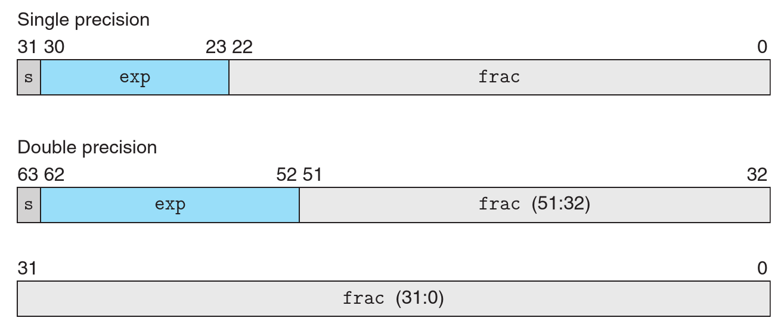
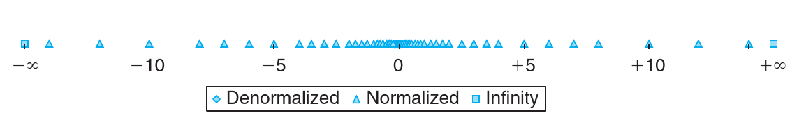

# 计算几何选讲

<br>

## riteme


***

### 浮点数

* `float`：$4$ 字节，$23$ 位精度。
* `double`：$8$ 字节，$52$ 位精度。
* `long double`：$16$ 字节。在 Intel 的 CPU 上只有最低的 $10$ 个字节（$80\mathrm{bits}$）是有用的，有 $64$ 位精度。

---

计算机中用 $(-1)^s \cdot 2^E \cdot M$ 的方式表示浮点数。

---



---

浮点数的存储分为三段：符号位 `s`（编码 $s$），指数位 `exp`（编码 $E$）以及有效位 `frac`（编码 $M$）。

***

### 编码方式

当 `exp` 非全 `0` 或者全 `1` 时，此时 $E = \mathtt{exp} - B$，其中 $B = 2^{k - 1} - 1$，因此 $E$ 的变化范围为 $2 - 2^{k - 1}$ 至 $2^{k - 1} - 1$（例如 `float` 就是 $-126$ 至 $127$）。`frac` 此时编码的是 $M$ 的小数部分。即认为 $1 \leqslant M < 2$，那么 $M$ 一定是 $1.m_0m_1m_2...$ 的形式，于是 `frac` 记录的就是 $m_0m_1m_2...$，最前面的 $1$ 忽略了。

---

当 `exp` 全 `0` 时，$E$ 设置为 $2 - 2^{k - 1}$。此时认为 $0 \leqslant M < 1$，此时 $M = 0.m_0m_1m_2...$，然后 `frac` 记录 $m_0m_1m_2...$。

---

当 `exp` 全 `1` 时，一般用于记录一些特殊值，如正负无穷、`NaN` 之类。

---



绝对值越小越精确。计算过程中尽可能避免出现过大的值，否则容易出现浮点数误差。

---

* `float`：一般 $7$~$8$ 位有效数字。
* `double`：一般 $15$~$17$ 位有效数字。
* `long double`：一般 $19$~$20$ 位有效数字。

***

### 浮点数误差

浮点数误差是不可避免的。因此一般情况下直接判断两个浮点数是否相同不太可靠。可以设定一个可以容忍的阈值 $ε$，当 $|x - y| < ε$ 时认为 $x = y$。

---

```c
#define EPS 1e-10
bool equal1(double x, double y) {
    return std::abs(x - y) < EPS;  // std::abs 来自 <algorithm>
}
bool equal2(double x, double y) {
    return x - EPS < y && y < x + EPS;
}
// x < y ⇒ x + EPS <= y, x > y ⇒ x - EPS >= y
```

实际上从汇编的角度来讲 `equal1` 比 `equal2` 要快（开 `O2` 的情况下），因为 `equal1` 少一次加减法和判断。

---

注意 C 语言中的 `abs` 函数的是给 `int` 的，不能给浮点数用，不是 C\+\+ 中的 `std::abs`。

---

由于有浮点数误差，因此浮点数的之间的运算严格上讲不满足结合率和分配率。所以编译器对于浮点数的计算的优化会非常谨慎。例如 `x * y + x * z` 理论上可以优化成 `x * (y + z)`，但是实际上编译器对于 `int` 会做这个事情，而对 `double` 不会做这个事情。

因此公式尽可能简洁，有利于程序的常数。

---

因为浮点数误差，如果答案为 $0$，某些时候是有可能输出 `-0` 的。

---

`cmath` 中的很多数学函数都是有定义域的（例如 `acos(x)`，要求 $x \in [-1,\ 1]$，以及 `sqrt`）。为了防止出现 `NaN`，可以写成 `acos(max(-1.0, min(1.0, x)))`。

***

### 向量

向量 $(x,\ y)$ 既可以用于表示一个点，也可以表示一个方向（从原点指向终点的方向）。

---

向量的长度（模长）：逆时针到向量的转角。


$$
|(x_1,\ y_1)| = \sqrt{x_1^2 + y_1^2}
$$

C++ 中可以使用 `hypot(x, y)` 来计算模长。

---

向量的极角：从 $x$ 正方向与向量之间的夹角。可以用 `atan2(y, x)` 计算，结果在 $[-\pi,\ \pi]$ 之间。

---

向量减法 $u - v$：是从 $v$ 的终点指向 $u$ 的终点的向量。

---

向量点积（内积）：

$$
u\cdot v = (x_1,\ y_1) \cdot (x_2,\ y_2) = x_1x_2 + y_1y_2 = |u||v| \cos θ
$$

$θ$ 是 $u$、$v$ 间夹角。

高维空间中是类似的。

---

如果要计算夹角，可以点积后用 `acos`。

---

其中 $|u|\cos θ$ 相当于是 $u$ 往 $v$ 上的投影长度。

+++

向量叉积：

$$
u × v = (x_1,\ y_1) × (x_2,\ y_2) = \left|\begin{matrix}
x_1 & y_1 \\
x_2 & y_2
\end{matrix}\right| = x_1y_2 - y_1x_2 = |u||v| \sin θ
$$

由于 $\sin x$ 在 $[0,\ \pi]$ 上不单调，一般不用叉积计算夹角。

---

叉积是分正负的，并且 $u×v = -v×u$。判断叉积的正负可以用右手定则：四指从 $u$ 转向 $v$，如果大拇指朝外则为正，否则为负。

---

三维空间的叉积 $u×v$ 定义为垂直于 $u$、$v$ 所处平面的法向量：

$$
\begin{aligned}
u×v &= (x_1,\ y_1,\ z_1) × (x_2,\ y_2,\ z_2) = \left|\begin{matrix}
\bm i & \bm j & \bm k \\
x_1 & y_1 & z_1 \\
x_2 & y_2 & z_2
\end{matrix}\right| \\
&= (y_1z_2 - z_1y_2)\bm i + (z_1x_2 - x_1z_2)\bm j + (x_1y_2 - y_1x_2)\bm k
\end{aligned}
$$

$\bm i$、$\bm j$、$\bm k$ 分别是 $x$ 轴、$y$ 轴、$z$ 轴三个方向的单位向量。

---

二维叉积的结果相当于是两个向量所夹平行四边形的**有向面积**。对于三维叉积，三个向量 $u$、$v$、$w$，$(u×v)\cdot w$ 是柱体的有向体积。

***

### 判断方向

$v$ 在 $u$ 的逆时针一侧：$u × v > 0$。可以表示一个半平面。

---

判断 $p$ 是否在 $u$、$v$ 所成夹角的中间：

* 如果三个向量等长，则可以判断 $p - u$ 是否在 $v - u$ 朝外的一侧。需要考虑 $u$、$v$ 之间的极角顺序。
---
* 如果不等长，可以先看夹角的是怎么夹的，然后用两个半平面来判断。

---

判断两个向量是否同向或者反向，可以检查点积的符号。

---

两个相连垂直则点积为 $0$。两个向量平行则叉积为 $0$。

---

极角排序：

* 一种是使用 `atan2` 直接计算极角。可能有精度误差。
---
* 另一种是利用叉积。但是叉积不能直接在 $[0,\ 2\pi]$ 内判断，需要提前先分象限。

***

### 旋转与对称

将向量顺时针旋转 $90^\circ$：

$$
(x,\ y) → (y,\ -x)
$$

---

将向量逆时针旋转 $90^\circ$：

$$
(x,\ y) → (-y,\ x)
$$

---

将向量 $p$ 关于 $u$ 对称（假设两向量共起点），则先利用投影长度求出垂线方向的差：

$$
v = p - {p \cdot u \over |u|^2}u
$$

然后对称向量就是：

$$
p' = p - 2v = 2{p \cdot u \over |u|^2}u - p
$$

---

一般角度的旋转：将向量 $u$ 以原点为中心逆时针旋转 $θ$ 个弧度：

$$
\left[\begin{matrix}
\cos θ & -\sin θ \\
\sin θ & \cos θ
\end{matrix}\right] u
$$

可以考虑一下分别把 $(1,\ 0)$ 和 $(0,\ 1)$ 旋转的结果。

***

### 直线

直线可以用两个点表示，也可以用一个点加一个方向向量来表示。

---

点 $u$ 到直线 $p,\ v$ 的最短距离就是平行四边形的高：$|v × (u - p)| / |v|$。

---

若两直线分别为 $p_1,\ v_1 = (x_1,\ y_1)$ 和 $p_2,\ v_2 = (x_2,\ y_2)$。考虑求直线交点：

$$
p_1 + t_1v_1 = p_2 + t_2v_2
$$

---

这是一个线性方程组：

$$
\left[\begin{matrix}
x_1 & -x_2 \\
y_1 & -y_2
\end{matrix}\right]
\left[\begin{matrix}
t_1 \\
t_2
\end{matrix}\right] =
\left[\begin{matrix}
Δx \\
Δy
\end{matrix}\right]
$$

其中 $p_2 - p_1 = (Δx,\ Δy)$。

---

解就是：

$$
\left[\begin{matrix}
t_1 \\
t_2
\end{matrix}\right] =
{1 \over v_1 × v_2}
\left[\begin{matrix}
y_2 & -x_2 \\
y_1 & -x_1
\end{matrix}\right]
\left[\begin{matrix}
Δx \\
Δy
\end{matrix}\right]
$$

因此 $t_1 = ((p_2 - p_1)×v_2) / (v_1×v_2)$。交点就是 $p_1 + t_1v_1$。

---

实际上就是 $v_1$ 到 $v_2$ 的高与 $p_2 - p_1$ 到 $v_2$ 的高之比。

***

### 线段

一般用两个端点表示线段。

---

点 $u$ 到线段 $ab$ 的最短距离先要判断垂足是否在线段上。其实就是判断 $u - a$ 和 $b - a$ 以及 $u - b$ 和 $a - b$ 是否同向，因此两个点积即可。之后要么是点到直线的距离，要么是点到某个端点的距离。

$$
\begin{array}{ll}
\textbf{if }(u - a)\cdot(b - a) < 0\colon \\
\quad \textbf{return }|u - a| \\
\textbf{else if }(u - b)\cdot(a - b) < 0\colon \\
\quad \textbf{return }|u - b| \\
\textbf{else}\colon \\
\quad \textbf{return }|(a - b)×(u - b)|/|a - b|
\end{array}
$$

---

判断线段 $p_1p_2$ 与线段 $p_3p_4$ 是否相交。首先检查 $p_1$、$p_2$ 是否分居 $p_3p_4$ 两侧，即设 $d_1 = (p_4 - p_3)×(p_1 - p_3)$，$d_2 = (p_4 - p_3)×(p_2 - p_3)$，检查 $d_1d_2$ 是否小于 $0$。如果不是则说明不相交。如果 $d_1$ 为 $0$，则说明 $p_1$ 在直线 $p_3p_4$ 上，此时只需检查是否在线段上，对 $d_2$ 同理。另外还需要检查 $p_3$、$p_4$ 是否跨立线段 $p_1p_2$。

---

$$
\begin{array}{ll}
d_1 := (p_4 - p_3)×(p_1 - p_3)\\
d_2 := (p_4 - p_3)×(p_2 - p_3)\\
d_3 := (p_2 - p_1)×(p_3 - p_1)\\
d_4 := (p_2 - p_1)×(p_4 - p_1)\\
\\
\textbf{if } d_1d_2 < 0 \textbf{ and } d_3d_4 < 0\colon\\
\quad \textbf{return true}\\
\textbf{else }\text{检查 }d_1,\ d_2,\ d_3,\ d_4\text{ 是否为 }0\text{，并检查对应点是否在线段上}
\end{array}
$$

---1

如果已经知道线段相交了，求线段交点可以直接用面积之比分点。设交点为 $p$，则：

$$
{|pp_1| \over |pp_2|} = {|(p_3 - p_1)×(p_4 - p_1)| \over |(p_3 - p_2)×(p_4 - p_2)|}
$$

***

### 简单多边形

简单多边形就是不自交并且没有洞的多边形。就是一堆线段的集合。一般多边形中的点按照逆时针顺序或者是顺时针顺序存储。

简单多边形分为凸多边形和凹多边形两种。

---

三角形 $abc$ 的面积：$\frac12|(a - b) × (c - b)|$。

---

多边形的面积：在平面上**任意选取**一个点 $u$（最方便的就是原点），然后按点的顺序枚举每条边 $p_ip_j$，则所有三角形 $p_ip_ju$ 的有向面积之和的绝对值就是多边形的面积。

$$
\frac12\left|\sum_{i,\ j} (p_i - u) × (p_j - u)\right|
$$

原因在于多边形外的面积会被有向面积一加一减后消去了。多边形外面的部分的贡献和多边形内部的贡献是相反的。

---

三角形 $abc$ 的重心：$(a + b + c) / 3$。

---

多边形的重心？

---1

可以将多边形三角剖分，每个三角形自己有一个重量（自己的面积）和重心位置，之后就变成是一堆质点求重心了。

非常奇妙的是，即使不是凸多边形，如果允许三角形拥有负质量，那么直接用有向面积也是正确的。

---

设第 $i$ 个质点的重量为 $w_i$，则质点组 $p_1,\ p_2,\ ...,\ p_n$ 的重心就是加权平均：

$$
{\sum_{i = 1}^n w_ip_i \over \sum_{i = 1}^n w_i}
$$

+++

判断点 $u$ 是否在多边形内部：从 $u$ 做一条向右的水平射线（其实任意方向均可），数一下有多条边与射线有交点。奇数个交点则说明在内部，否则在外部。

---

射线如果穿过多边形的顶点，则顶点处算两次（实际上就是允许射线与边在端点相交）。如果多边形有边与射线完全重合，则需要检查这条边前后的边的位置来决定是算 $1$ 次还是不算。如果有连续几条重合的边，它们需要视为一个整体。

***

### 圆

圆用圆心 $u$ 和半径 $R$ 表示。

判断直线、线段与圆相切、相交都很简单。计算距离即可。

---

直线与圆的交点：先算出圆心 $u$ 到直线 $p,\ v$ 的距离 $d$ 和垂足 $x$：

$$
\begin{aligned}
x &= p + {(u - p)\cdot v \over |v|^2}v \\
L &= \sqrt{R^2 - d^2}
\end{aligned}
$$

---

之后两个交点就是 $x + (L/|v|)v$ 和 $x - (L / |v|)v$。

---

圆与圆的交点：设两个圆的半径分别为 $R$ 和 $r$，交点到圆心连线的距离 $h$，以及两个圆心到中心线的距离 $L$ 和 $l$，圆心距离为 $d$，则需要解方程：

$$
\begin{cases}
R^2 = L^2 + h^2 \\
r^2 = l^2 + h^2 \\
L + l = d
\end{cases}
$$

---

令 $t = L - l = (R^2 - r^2)/d$，则 $L = (d + t) / 2$，$l = (d - t)/2$，以及 $h = \sqrt{R^2 - L^2}$。然后操作向量就可以得出两个交点了。

---

给定圆上两个点 $u$ 和 $v$，以及圆心 $p$ 和半径 $r$，求 $u$ 沿逆时针方向到 $v$ 的圆心角的话就是求 $u - p$ 和 $v - p$ 的夹角 $t$，但是要根据两者之间的左右顺序确定具体是 $t$ 还是 $2\pi - t$。

+++

圆与圆的切线：情况比较多。当两个圆相离时，有两条外公切线和两条内公切线。

---

设大圆的半径为 $R$，小圆的半径为 $r$，$d$ 为圆心距。对于一条切线，设 $H$ 是大圆上切点到轴线的距离，$L$ 是轴线上垂足到圆心的距离，对小圆设类似的 $h$ 和 $l$。则实际上 $h = Hr / R$，$l = Lr / R$。

---

求解 $H$ 和 $L$ 可以直接用相似三角形。

---

结论：记一个参数 $t$。对于外公切线令 $t = (R - r) / d$，对于内公切线令 $t = (R + r) / d$。然后：

$$
\begin{aligned}
H &= R\sqrt{1 - t^2} \\
L &= Rt
\end{aligned}
$$

---

特别的，如果 $r = 0$（此时就是点与圆的切线，这个公式也能正常工作。

---

模板题：【定向越野】<http://uoj.ac/problem/277>

***

### 圆面积并

给定一些平面上的圆，求这些圆的并的面积。

---

首先可以去除被其它圆包含的圆。

---

直观上这个面积是内部一个多边形和外面一圈弓形组成。弓形对应的弧没有被其它的圆所盖住，而被盖住的弧一律计入多边形的面积。因此需要求每个圆和其它的圆的交点，这样就变成是圆上有许多的区间，要求寻找没有被覆盖的弧的部分。

---

求交点后在每个圆上做极角排序，统计一下每一段被覆盖了多少次。

---

对于多边形的部分，直接累加所有边的有向面积。

---

这个算法奇妙的地方在于，最终的图形中，多边形可能是有洞的。但是由于洞上的边的方向和外圈多边形的方向是相反的，因此在累加有向面积时会自动消去。

时间复杂度 $\mathrm O(n^2 \log n)$。

***

### CIRUT

<https://www.spoj.com/problems/CIRUT/en/>

给定 $n$ 个不同的圆，问恰好被 $1$ 个圆、$2$ 个圆、$3$ 个圆......$n$ 个圆覆盖的面积。

$n \leqslant 1000$。

---

实际上之前的算法中，如果一段圆弧被其他圆覆盖了 $k$ 次，那么这段圆弧就对应于被至少 $k + 1$ 个圆覆盖的区域的一段边界。

---

所以每段圆弧都会参与计算。覆盖次数为 $k$ 的圆弧的贡献计入覆盖大于等于 $k + 1$ 次的答案中。最后做一个差分就得到了原答案。

***

### 凸包

包围平面上一些图形的面积最小的图形，称为凸包。$n$ 个点的凸包一定是一个凸多边形，并且顶点来自这 $n$ 个点。

---

求凸包的两种基本算法都需要先排序：

---

* Graham 算法：旋转扫描线。
    * 先选取横坐标最小（当有多个横坐标最小时，选取纵坐标最小的）的点 $o$，这个点一定在凸包上。
    * 然后以 $o$ 为原点对其它点做极角排序。注意这个地方由于其它点一定在一个半平面内，所以极角排序不需要分象限，可以直接叉积。对于共线的点，模长短的点优先。
    * 之后用一个栈维护凸包上的点。按极角序依次加入，每次加入时检查栈顶的点是否满足凸包的要求，根据实际情况将不在凸包上的点弹出。
---
* 竖直扫描线：
    * 将所有点按照横坐标排序。
    * 然后做两次扫描线，第一次算出上凸包，第二次算出下凸包。

---

如果只有加点，水平序和极角序都可以用于维护动态凸包。水平序分上下两个凸包来维护，一般要更直观一些。

模板题：<https://codeforces.com/problemset/problem/70/D>

***

### 平面最远点对

**问题**　给定平面上 $n$ 个点，求这 $n$ 个点中的最远点对。

---

首先最远点对一定在凸包上。凸包上做旋转卡壳是一种基本操作：枚举一条直线贴在凸包的一边，同时维护另外一边平行的直线，贴在凸包的另一边，这样用两个条直线夹住了整个凸包。此时只要用被直线夹住的点（或者边）之间的距离来更新最大点对即可。

---

旋转卡壳能求一堆东西吧，但都不是特别难（就是难调 QAQ）。

***

### 平面最近点对

这个可以用分治解决。

---

首先，如果有位置相同的点，则最近点对距离为 $0$。

---

之后将所有点按照 $x$ 坐标排序。然后每次选择最中间的点的横坐标 $x_m$ 将点集分为两半，分别分治下去，各自求得一个最小值 $δ_1$ 和 $δ_2$。令 $δ = \min\{δ_1,\ δ_2\}$。

---

然后只用考虑横跨分割线 $x_m$ 的点对。首先只有 $[x_m - δ,\ x_m + δ]$ 范围内的点是有用的。对于这些点，将其按照纵坐标排序，然后对于每边依次检查每个点 $(x,\ y)$，那么我们只用检查对面一个大小为 $δ×δ$ 的矩形内的其它点更新答案即可。

---

由于知道每边点与点之间的最短距离不小于 $δ$，那么这个小矩形内部最多只有 $4$ 个待选点，因此全部枚举一遍即可。

---

直接实现是 $\mathrm O(n \log^2 n)$ 的。如果在分治的过程中做纵坐标的归并排序，复杂度就是 $\mathrm O(n \log n)$。

***

### 信用卡凸包

<https://www.lydsy.com/JudgeOnline/show.php?id=2829>

平面上摆放了 $n$ 张信用卡，信用卡可以以任意角度摆放在任意位置。所有信用卡的规格都是一样的，长为 $a$，宽为 $b$，并且四角各有一个 $1/4$ 的圆角，圆角的半径为 $r$。问这些信用卡的凸包的周长。

$n \leqslant 10^4$。

---

相当于 $4n$ 个圆的凸包。由于圆的周长是一样的，因此就是圆心的凸包外加一圈圆弧。最后的答案就是圆心凸包的周长加上 $2\pi r$。

***

### 合金

<https://www.lydsy.com/JudgeOnline/problem.php?id=1027>

有 $n$ 种原材料合金由铁、铝、铜三种金属按一定比例混合而成，第 $i$ 种合金三种金属的百分比分为 $x_i$、$y_i$、$z_i$，并且满足 $x_i + y_i + z_i = 1$。现在顾客有 $m$ 种目标合金，并且每种目标合金的混合比例也已经给出。问最少使用多少种原材料合金才能够合成出所有的目标合金。

$n,\ m \leqslant 500$。

---

首先由于有 $x_i + y_i + z_i = 1$ 的限制，所以其实可以不用考虑 $z_i$。

---

实际上对于两种合金的合成，相当于是可以合成平面上两点间的线段上的所有品种。同理，对于三种合金的合成，就是能合成一个三角形内部的所有品种。因此，$n$ 种原材料能合成出的合金种类一定在它们的凸包内。

---

所以问题变成找 $n$ 个点中最少的点，使得它们的凸包包含 $m$ 个点。这个凸包有点像一个环。对于点 $u$ 和 $v$，如果 $m$ 个点都在线段 $uv$ 的某一侧，则 $u$ 和 $v$ 之间连一条边，边权为 $1$。之后在这张图上跑最小环即可。

***

### Angle Beats

<http://acm.hdu.edu.cn/showproblem.php?pid=6731>

平面上有 $n$ 个点 $P_i$。之后有 $q$ 次询问，每次询问给出一个点 $A$，问有多少对 $1 \leqslant i < j \leqslant n$ 满足 $A$、$P_i$、$P_j$ 构成一个非退化的直角三角形。

$n,\ q \leqslant 2000$。保证所有给定点和询问点均两两不同。

---

考虑离线所有询问。如果询问点是直角点，则只需要以询问点为中心做旋转扫描线，统计所有垂直方向上的前 $n$ 个点的对数即可。

---

如果询问点不是直角点，则枚举给定点做旋转扫描线。那么当扫描到一个询问点时，就把垂直方向上的给定点数量加给询问点即可。

---

时间复杂度 $\mathrm O((n + q)^2 \log (n + q))$。

***

### Fair Distribution

<https://codeforces.com/gym/102365/problem/F>

给定平面上 $n$ 个不同的点。现在随机一个加点的顺序，然后记录 $A_i$ 为加入点 $i$ 时凸包面积的增量（注意不是加入第 $i$ 个点时）。求 $A_1$ 到 $A_n$ 的期望值。

$n \leqslant 200$。

---

想象一下每加入一个点时，凸包是怎么变化的。相当于是要弹出一堆的边，每弹出一条边，凸包的面积就会增加对应的三角形的面积。因此可以直接枚举所有的三角形，然后考虑有多少个点会影响这个三角形不会贡献。那么这三个点一定要出现在有影响的点之前。之后就只用求有多少个满足要求的排列了。

时间复杂度 $\mathrm O(n^3)$。

***

# Thanks!