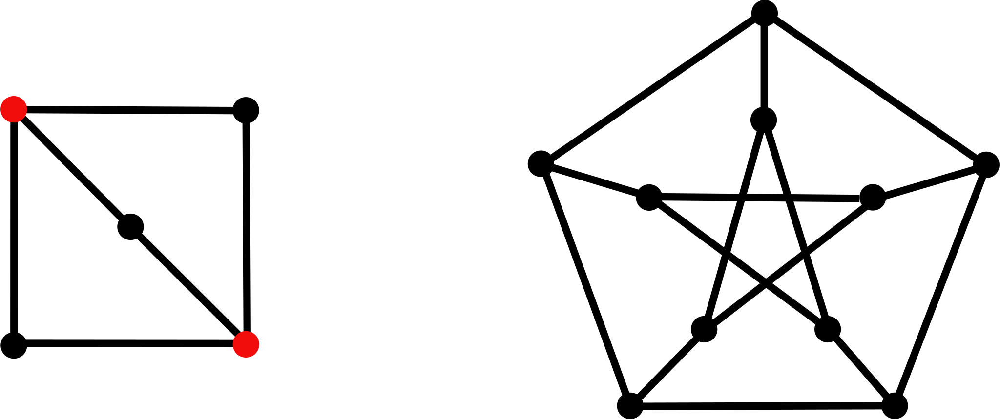
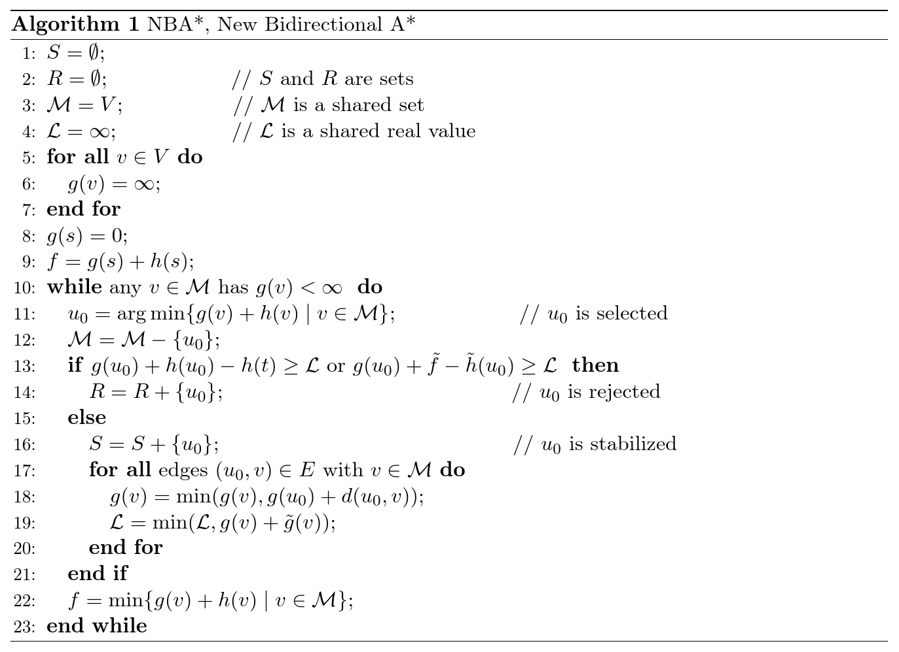
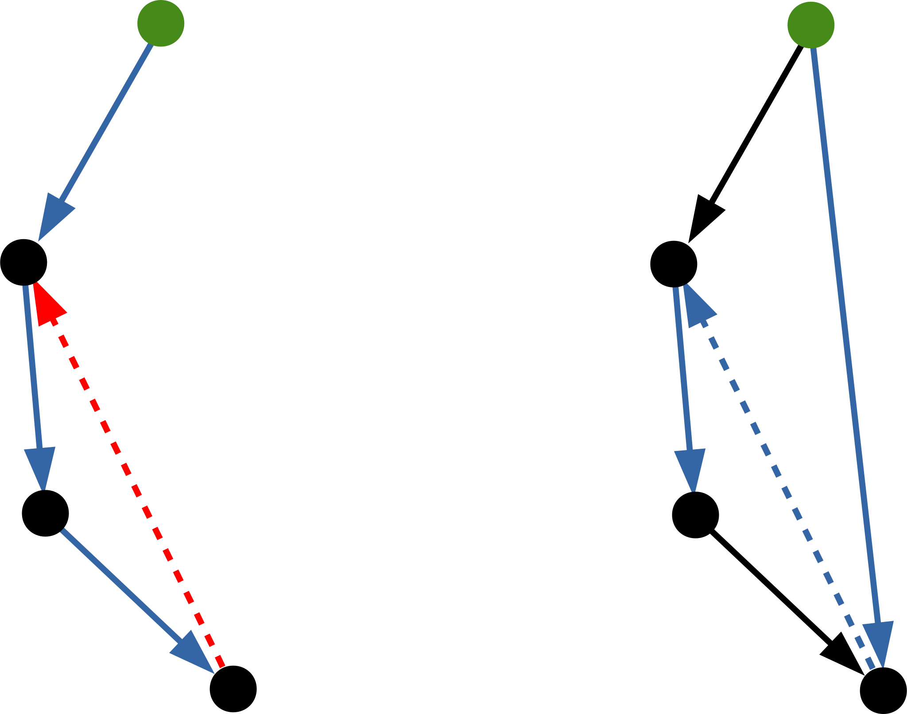
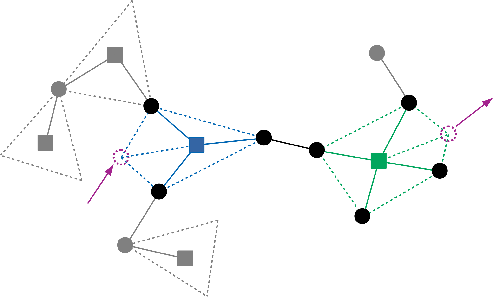
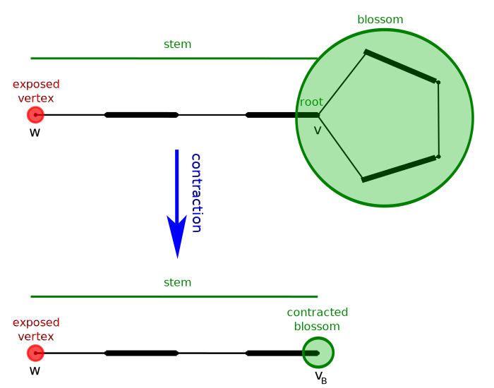
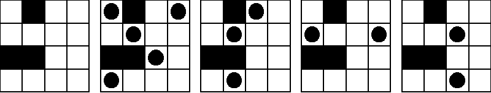

# 图论选讲

<br>

## riteme


***

### 目录

* 基础内容
    * 欧拉图
    * Hamilton 图
* 最短路
    * Floyd / Bellman-Ford / SPFA / Dijkstra
    * 差分约束
    * Johnson 最短路
    * A\*
* 最小生成树
    * Kruskal / Prim / Borůvka
* 连通性
    * 强连通分量
    * 双连通分量
* \* 网络流
* 图的匹配

***

# 基础内容

***

### 一些记号

* $V$ 表示顶点集，$n = |V|$ 表示顶点数。
* $E$ 表示边集，$m = |E|$ 表示边数。
* $uv$ 或者是 $u - v$ 表示一条无向边。
* $uv$ 或者是 $u → v$ 表示有向边。
* 伪代码中 $:=$ 表示赋值。

***

### 邻接表

常用的存图方式：

* 链表：每个节点的邻接表用一个边链表表示。每条边内部都有一个 `next` 表示链表中的下一条边。
    * 可以用一个边数组 `e[]` 来存所有的边，用一个 `head[]` 数组存链表的第一条边。
    * 反向边可以存在相邻的位置，这样 `e[i]` 和 `e[i^1]` 就是一对反向边。常用于网络流。
    * 缺点：非连续访问内存。稠密图上可能有性能问题。
---
* `vector` 存储：同一个节点相邻的所有的边在内存中是连续的。
    * 理论上在开 `O2`/`O3` 的环境下，访问 `vector` 内的元素会被编译器内联展开为直接访问数组。图的遍历的效率会比邻接链表高。
    * `push_back` 由于涉及到内存的动态分配，所以比较比较慢，无论开不开优化，尽管复杂度是均摊 $\mathrm O(1)$ 的。可以考虑使用 `reserve` 提前准备好空间。
    * 总结：**不开优化的情况慎用**。

---

有兴趣的可以了解一下 `vector` 的实现方式。

***

### 邻接矩阵

用 `G[u][v]` 来表示 $u$ 和 $v$ 之间是否有边相连。通常可以记录边的长度，或者是重边的数量。一般是给稠密图用的。

对于无向图应该有 `G[u][v] = G[v][u]`。

---

既然是个矩阵，考虑下矩阵乘法：$G \cdot G = G^2$：

$$
G^2_{u,\ v} = \sum_{z \in V} G_{u,\ z} \cdot G_{z,\ v}
$$

---

实际上是一个 DP 转移方程：枚举中间点 $z$，$u$ 到 $z$ 的路径条数乘上 $z$ 到 $v$ 的路径条数的值贡献给 $u$ 到 $v$ 的路径条数。因此 $G^2_{u,\ v}$ 是图中 $u$ 到 $v$ 长度为 $2$ 的路径数量。不难归纳出 $G^k_{u,\ v}$ 就是图中 $u$ 到 $v$ 长度为 $k$ 的路径条数。

---

矩阵乘法可以快速幂计算。

***

### 度数

度数 $d(u)$ 即与顶点 $u$ 相关联的边的条数。如果是自环，一般会认为对顶点度数有 $2$ 的贡献。对于有向图，则分别有出度和入度的概念。

---

**定理**　图的度数总和一定是偶数。

因为一条边对两个端点各有一次贡献。

---

**定理**　如果一张无向图中仅有两个点 $u$、$v$ 的度数为奇数，则 $u$ 和 $v$ 之间必有一条路径相连。

---

如果没有，则 $u$ 和 $v$ 分居在两个连通块内，则这两个连通块的各自的度数总和为奇数，矛盾。

---

**定理**　设简单无向图 $G$ 中的最小度数为 $δ(G)$，则 $G$ 中一定有一个包含 $δ(G) + 1$ 个点的简单回路。

---

首先，由于 $G$ 是简单图，所以 $G$ 至少有 $δ(G) + 1$ 个点。

---

之后，从 $G$ 中任意一个点出发做 DFS，每次选择与当前点相邻的 $δ(G)$ 个点中未访问过的点走过去，这样至少能走 $δ(G)$ 步，于是得到了一个长度为 $δ(G) + 1$ 的简单环。

***

### 欧拉图

存在一个边不重复的回路，经过图中每条边一次。点可以经过任意多次。这样的回路称为欧拉（Euler）回路。

---

如果存在欧拉回路，则环上每个点必定是进入几次就会出来几次，因此图中每个点的度数必须为偶数。

---

**定理**　对于无向连通图 $G$，$G$ 中存在欧拉回路当且仅当 $G$ 中每个点的度数为偶数。

---

**充分性：**注意图中每个点的度数都是偶数，所以 $G$ 一定不是一棵树，因此 $G$ 中必定存在一个环 $C$。

---

将环 $C$ 中的所有边删去，剩下的图 $G'$ 中每个点的度数依然为偶数。考虑对图的边数进行归纳法，则可假设 $G'$ 存在一个欧拉回路 $C'$，于是可以考虑将 $C$ 从某一点剪断后插入到 $C'$ 中，于是就得到了 $G$ 的一个欧拉回路。

---

同时由这个证明可以得出，一个欧拉图可以拆分成若干个环的并。

---3

如果是有向图，则对应的，图中每个点的入度应该等于出度。同样这个条件也是充分的。

---

**定理**　对于无向单连通图 $G$，$G$ 中存在欧拉回路当且仅当 $G$ 中每个点的入度等于出度。

证明方法和无向图是类似的。

---

欧拉回路中删去一条边就变为欧拉路径。不难推出图中存在欧拉路径的充要条件。

+++

如果要求出欧拉回路，首先要检查图是否满足上述定理的要求。之后，可以从图中任意一个点开始做 DFS，DFS 的过程中任意选择一条没有走过的边走下去。这样如果把所有边都走了一遍，那么我们就得到了一个欧拉回路。

---

不过这种无脑走法不一定就能把所有边都遍历到。例如：


如果从左上角的点出发，到达中间的点之后，可能会往左边走，最后回到原点。这样的话就会忽略了右边的三条边。

---

因此需要在 DFS 回溯的时候检查一下是否还有其它边没有走，如果有就需要继续走下去，并且需要将之前走出来的环和新出来的环合并一下。

---

写合并可以使用链表，但是比较麻烦。考虑到插入一个新环就是把之前的环的后半部分挪一下，然后在这中间把新环放进去，由于我们知道最终的欧拉回路里面一定有 $m$ 条边，因此不如在回溯的时候再一条一条地把边倒序放在一个大小为 $m$ 的数组内。

---

**当前弧优化：**由于在 DFS 的过程中会重复进入一个点多次，我们可以拿一个数组 `cur[]` 存下每个点当前已经考虑到哪条边了，避免邻接表中边的重复访问。

+++

伪代码：

$$
\begin{array}{ll}
1 & G[x][i]\colon x\text{ 的邻接表中的第 }i\text{ 条边} \\
2 & |G[x]|\colon \text{与 }x\text{ 相邻的边的条数} \\
3 & \text{cur}[x]\colon x\text{ 当前考虑到的边的下标} \\
4 & \text{pos}\colon \text{倒序添加边的下标} \\
5 & \text{seq}[i]\colon \text{保存欧拉回路上的边} \\
6 & \\
7 & \text{pos} := m \\
8 & \textbf{procedure }\text{DFS}(x)\colon \\
9 & \quad \textbf{while }\text{cur}[x] \leqslant |G[x]|\colon \\
10 & \quad \quad e\colon(x → v) := G[x][\text{cur}[x]] \\
11 & \quad \quad \text{cur}[x] := \text{cur}[x] + 1 \\
12 & \quad \quad \textbf{if }e\text{ 没有被访问过}\colon \\
13 & \quad \quad \quad \text{DFS}(v) \\
14 & \quad \quad \quad \text{seq}[\text{pos}] := e \\
15 & \quad \quad \quad \text{pos} := \text{pos} - 1
\end{array}
$$

---

C\+\+ 中常用引用来实现 `cur[]` 的更新：

```c++
for (int &i = cur[x]; i < G[x].size(); ) {
    Edge &e = G[x][i++];  // 注意此时的 i++ 也会修改 cur[x]
    // ...
}
```

---

模板题：<http://uoj.ac/problem/117>

***

### Loli, Yen-Jen, and a graph problem

<https://nanti.jisuanke.com/t/42549>

给定 $n$，要求在 $n$ 个点的完全图 $K_n$ 中找出长度分别为 $1$、$2$、...、$n - 1$ 的 $n - 1$ 条简单路径，使得 $K_n$ 中每条边有且仅在其中某一条路径中出现。

$n \leqslant 1000$。

---

当 $n$ 为奇数时，每个点度数为 $n - 1$，是一个偶数，此时只需要找出 $K_n$ 的一个欧拉回路，然后就可以切割出 $n - 1$ 条简单路径了。

当 $n$ 为偶数时就跟图论没什么关系了，需要构造一下。

---

将点编号为 $1$ 到 $n$。首先 $1$ 和 $2$ 连边得到一个长度为 $1$ 的路径。

之后考虑 $3 - 1 - 4 - 2 - 3 - 4$ 是一个长度为 $5$ 的路径，可以拆成长度为 $2$ 和 $3$ 的两条路径。

在之后考虑 $5$ 和 $6$，按照之前交错连边的方式得到 $5 - 1 - 6 - 2 - 5 - 3 - 6 - 4 - 5 - 6$ 是一个长度为 $9$ 的路径，可以拆成长度为 $4$ 和 $5$ 的两条路径。

之后就可以一直做下去。

---

$n$ 为奇数时也可以构造。类似于偶数时的情况，前 $n - 1$ 个点两两配对，最后一个点 $n$ 作为辅助点。

首先构造 $1 - 2 - n - 1$，长度为 $1 + 2 = 3$ 的环。

其次构造 $3 - 1 - 4 - 2 - 3 - 4 - n - 3$，长度为 $3 + 4 = 7$ 的环。

之后构造 $5 - 1 - 6 - 2 - 5 - 3 - 6 - 4 - 5 - 6 - n - 5$，长度为 $5 + 6 = 11$ 的环。

之后依次构造即可。

***

### Hamilton 图

与欧拉回路不同，Hamilton 回路要求是经过图中每个点有且仅有一次的回路。图中的边不一定需要经过。但是求解 Hamilton 回路十分困难，除非有特殊条件，否则无法在多项式时间内求解。一般图的 Hamilton 回路（包括更难的旅行商问题）可以用状压 DP 解决。

---

如果图中存在一个 Hamilton 回路，那么如果我们删掉图中 $k$ 个点，Hamilton 回路就会分为至多 $k$ 个部分，因此删点后的图中至多有 $k$ 个连通块。这是存在 Hamilton 回路的一个必要条件。

**定理**　对于无向图 $G$，若 $G$ 存在 Hamilton 回路，则对任意 $S \subseteq V$，$G - S$ 的连通块数量不超过 $|S|$。

---



左图中删去两个红色点后，图中有三个连通块，不满足定理的条件，因此左图没有 Hamilton 回路。

右图是著名的 Peterson 图。它虽然满足定理的条件，但是它也没有 Hamilton 回路（手动证明？）。

+++

介绍一个存在 Hamilton 回路的充分条件。

**定理**　$G$ 为无向图，若 $G$ 中存在两点 $u$ 和 $v$，满足 $u$、$v$ 间没有边相连，并且 $d(u) + d(v) \geqslant n$，则 $G$ 有 Hamilton 回路等价于 $G + uv$ 有 Hamilton 回路。

---

若 $G$ 有 Hamilton 回路，显然加上一条边的 $G + uv$ 也会有。

---

反过来，如果 $G$ 没有 Hamilton 回路，但是 $G + uv$ 有 Hamilton 回路 $C$，则边 $uv$ 一定在 $C$ 中。我们可以把 $C$ 中的点从 $u$ 开始依次写成 $u = v_1 → v_2 → v_3 → \cdots → v_n = v$。在图 $G$ 中，令：

$$
\begin{aligned}
U & = \{i - 1\colon uv_i \in E\} \\
V & = \{i\colon v_iv \in E\}
\end{aligned}
$$

---

注意 $U$、$V$ 实际上分别存的就是和 $u$、$v$ 相连的点的集合，因此 $|U| = d(u)$ 以及 $|V| = d(v)$。由于 $u$、$v$ 间没有边相连，因此 $U \subseteq \{1,\ 2,\ 3,\ ...,\ n - 2\}$，$V \subseteq \{2,\ 3,\ 4,\ ...,\ n - 1\}$，因此 $|U \cup V| \leqslant n - 1$，于是

$$
\begin{aligned}
|U \cap V| & = |U| + |V| - |U \cup V| \\
& \geqslant (d(u) + d(v)) - (n - 1) \\
& \geqslant n - (n - 1) = 1
\end{aligned}
$$

---2

换句话说，一定存在一个 $i$，满足 $u$ 和 $v_i$ 间有边，$v_{i - 1}$ 和 $v$ 之间有边。

于是考虑环 $u - v_i - v_{i + 1} - \cdots - v_{n - 1} - v - v_{i - 1} - v_{i - 2} - \cdots - u$，这是 $G$ 中的 Hamilton 回路，与之前假设 $G$ 中没有 Hamilton 回路矛盾。

---

<br>

从图 $G$ 开始，检查图中所有不相邻的点对 $u$、$v$ 是否有 $d(u) + d(v) \geqslant n$，如果有就将 $uv$ 加入到 $G$ 中，并重复以上的检查。最终得到的图称为原图 $G$ 的**闭包** $\mathrm{cl}(G)$。由上面的定理，$G$ 有 Hamilton 回路当且仅当 $\mathrm{cl}(G)$ 有 Hamilton 回路。如果 $G$ 任意两对不相邻的点对 $u$、$v$ 均有 $d(u) + d(v) \geqslant n$，则 $\mathrm{cl}(G) = K_n$ 是完全图，因此 $G$ 一定有 Hamilton 回路。此外，这个定理的证明是构造性的，因此如果我们能找到 $\mathrm{cl}(G)$ 的回路，就能一步一步反向构造出 $G$ 的回路。

---

值得注意的是，求 $G$ 的闭包的过程中，加边的顺序不会影响最终闭包的结果，即闭包是唯一的。

***

### 格雷码

考过今年 CSP 的应该都知道啥是格雷码吧。

---

考虑边长为 $1$ 的 $n$ 维立方体，每个顶点的坐标是一个长度为 $n$ 的 $0/1$ 序列，不难发现一条棱两端的顶点坐标只有一位不相同。因此 $n$ 阶格雷码序列对应于 $n$ 维立方体上的一个 Hamilton 回路。

***

### 竞赛图 Hamilton 回路

竞赛图是完全有向图，相当于将完全无向图 $K_n$ 中每条边都指定了一个方向后得到的图。我们知道 $K_n$ 中肯定有 Hamilton 回路和 Hamilton 路径。实际上对于竞赛图也有相应的结论。

---

**定理**　$n$ 个点的竞赛图中一定有一条长度为 $n$ 的简单路径，即 Hamilton 路径。

---

图论中很多构造性的证明都是使用数学归纳法，这个证明也不例外。我们首先假设 $n - 1$ 个点的竞赛图中存在 Hamilton 路径，那么考虑 $n$ 个点的竞赛图 $G$，从 $G$ 中任意删去一个点 $u$，则得到一个 $n - 1$ 个点的竞赛图 $G'$。由归纳假设， $G'$ 存在 Hamilton 路径 $v_1 → v_2 → v_3 → \cdots v_{n - 1}$。

在图 $G$ 中，如果边 $u → v_1$ 存在，则 $u → v_1 → \cdots → v_{n - 1}$ 就是 $G$ 的一个 Hamilton 路径。否则就存在边 $v_1 → u$。之后我们考虑边 $u → v_2$，如果有，那么 $v_1 → u → v_2 → \cdots → v_{n - 1}$ 是 Hamilton 路径，不然的话边 $v_2 → u$ 就存在。依次类推，如果上述过程一直找不到 $u$ 的合适的出边，那么一定有边 $v_{n - 1} → u$，于是将 $u$ 放在之前的 Hamilton 路径的末尾即可。

---

需要注意，如果没有其它条件，竞赛图中不一定存在 Hamilton 回路。但是如果有 Hamilton 回路，那么说明竞赛图必定是强连通的。不出意外，这个也是充分条件。

---2

**定理**　$n$ 个点的**强连通**的竞赛图中一定有 Hamilton 回路。

---

同样是使用归纳法。设竞赛图为 $G$，从 $G$ 中随意删掉一个点 $u$ 后得到 $G'$。考虑对 $G'$ 进行缩点，我们注意到缩点后的图必定是一条链 $C_1 → C_2 → C_3 → \cdots → C_k$，其中 $C_i$ 表示一个强连通分量。根据归纳假设，每个 $C_i$ 内部都有一个 Hamilton 回路，因此我们只要思考如何将这些回路接起来即可。

由于 $G$ 是强连通的，因此必定有从 $C_k$ 到 $u$ 的边以及从 $u$ 到 $C_1$ 的边。因此我们可以从 $u$ 出发，依次走过 $C_1$、$C_2$、...、$C_k$ 的 Hamilton 回路即可。注意可能需要调整离开 $C_k$ 时的终点，确保最后能够走回 $u$。

---

例题：<http://acm.hdu.edu.cn/showproblem.php?pid=3414>

***

# 最短路

***

### Floyd 算法

当需要图中所有点对间的最短路时，大多都会涉及到这个算法。

---

算法直接使用邻接矩阵存图，`G[u][v]` 表示图中 $u$ 到 $v$ 的边的长度。如果 $u$ 到 $v$ 没有边，则设为 $\infin$。一般代码里面会设做一个很大的值，诸如 $10^9$、$10^{18}$。或者是 `0x3f3f3f3f`，因为这个可以直接用 `memset(G, 0x3f, sizeof(G))` 来清空，并且其两倍（`0x7e7e7e7e`）没有超出 `int` 的范围（`0x7fffffff`）。

---

算法就是三个 `for` 循环：首先枚举中介点 $k$，之后更新所有点对 $i$、$j$ 之间的最短路。

$$
\begin{array}{ll}
1 & G[i][j]\colon i\text{ 到 }j\text{ 的最短路长度。初始时为邻接矩阵，无边相连则为 } \infin \\
2 &\\
3 & \textbf{for }k := 1..n\colon \\
4 & \quad \textbf{for }i := 1..n\colon \\
5 & \quad \quad \textbf{for }j := 1..n\colon \\
6 & \quad \quad \quad G[i][j] := \min\{G[i][j],\ G[i][k] + G[k][j]\}
\end{array}
$$

时间复杂度 $\mathrm O(n^3)$。

---

**正确性：**对于任意的 $i$ 和 $j$，其最短路上的点 $k$ 依次枚举，在更新的时候相当于将原来的一条条边 “焊接” 了起来。因此算法结束时，整条最短路就 “焊接” 完成了。

***

### K-th Path

<http://codeforces.com/contest/1196/problem/F>

给定一个 $n$ 个点 $m$ 条边的无向带权图，令 $δ(u,\ v)$ 表示图中 $u$ 到 $v$ 的最短路。现在问所有的 $1 \leqslant u < v \leqslant n$ 中， $δ(u,\ v)$ 的第 $K$ 小是多少。

$n, m \leqslant 2 × 10^5$，$K \leqslant 400$。

---

首先去掉重边，之后只要取出前 $K$ 小的边就可以了。这些边最多关联到 $2K$ 个点，因此在这个大小为 $2K$ 的图上跑 Floyd 后就可以找到第 $K$ 小了。

***

### Interplanetary

<http://codeforces.com/gym/102346/problem/I>

给定一个 $n$ 个点 $m$ 条边的无向带权图。每个点有一个温度 $t_i$。有 $q$ 次询问，询问有两种，分别是每次询问从 $s$ 到 $t$ 中只经过温度前 $k$ 小的点，或者是温度前 $k$ 大的点的最短路是多少（$s$ 和 $t$ 不算在内），或报告无解。

$n \leqslant 400$，$q \leqslant 10^5$。

---

实际上 Floyd 算法中当前枚举到的 $k$ 更新完后，得到的最短路数组就是只经过 $1..k$ 的最短路。因此按照温度排序后分别顺序和倒序的顺序枚举 $k$ 做一遍 Floyd 即可。注意处理温度相同的细节。

***

### 最小环

一个显然的求法就是就是枚举图中的边 $uv$，然后用不经过 $uv$ 的最短路 $δ'(u,\ v)$ 来更新最小环的答案，即 $w(u,\ v) + δ'(u,\ v)$。

---

考虑在 Floyd 的过程中最小环发生了什么。不难发现最小环也是逐步被 “焊接” 起来的。因此我们只需要在最小环中最后被枚举到的点时更新答案即可。如果 $k$ 是环上最后被枚举到的点，那么 Floyd 在更新 $k$ 之前的最短路数组是不考虑经过 $k$ 以及 $k$ 之后的点的最短路的。因此我们可以枚举 $i$、$j$，用 $w(i,\ k) + w(k,\ j) + δ(j,\ i)$ 来更新最小环的答案。之后再更新最短路数组。

***

### Bellman-Ford / SPFA

包括之前的 Floyd 算法，几乎所有的最短路算法都是依靠松弛操作实现的。即对于任意三个点 $x$、$y$、$z$，如果有：

$$
δ(x,\ y) + δ(y,\ z) < δ(x,\ z)
$$

则可以使用 $δ(x,\ y) + δ(y,\ z)$ 来更新 $δ(x,\ z)$。如果不能再更新了，则最短路已经求出。即最短路满足所谓的 “三角不等式”：

$$
δ(x,\ y) + δ(y,\ z) \geqslant δ(x,\ z)
$$

---1

Bellman-Ford 算法是单源最短路算法：给出源点 $s$，求出所有的 $δ(s,\ u)$。算法就是进行 $n - 1$ 次迭代，每次迭代检查图中的每条边，看能不能进行松弛操作。初始时设源点到源点的距离 $δ(s,\ s)$ 为 $0$，到其它点 $u$ 的距离 $δ(s,\ u)$ 为 $\infin$。因为最短路肯定都是简单路径，$n - 1$ 次迭代后所有的最短路一定都能枚举得到，除非图中有负环。

如果想判断是否有负环，则可以再迭代一次，看是否能更新现在的最短路。如果能则说明出现了负环。

---

这样做的复杂度是 $\mathrm O(nm)$ 的。但实际上里面有很多没必要的松弛操作。例如，如果一个点 $u$ 的距离 $δ(s,\ u)$ 在上次迭代中没有变动，那么下一次迭代中从 $u$ 出发的边都没必要再考虑了。SPFA 是 Bellman-Ford 的队列优化，即把最短距离变动了的所有点都放在一个队列中，然后每次从队首取出一个点进行更新。初始时只用将源点放入队列。

---

SPFA 同样也可以判定负环：如果有一个点重复入队达到 $n$ 次，则说明出现了负环。或者是记录下当前每个点到源点的最短路的长度。如果长度超过 $n$ 了，也说明出现了负环。

---

众所周知，SPFA 尽管在随机图上跑得很快，但还是可以卡成 $\mathrm O(nm)$ 的。建议如无把握，最短路的题目尽量不要使用 SPFA。

***

### Dijkstra 算法

与 SPFA 有着相似的代码框架，但不同在于，Dijkstra 算法每次选取 $δ(s,\ u)$ 最小的 $u$ 来进行松弛。期间需要使用一个堆来维护每个点到源点的最短路，每次从堆中取出最近的点即可。可以想象成是源点是一处水源，边的长度是水流经过这条边所需要花费的时间，于是每个节点的最短路就是水流第一次到达某个节点的时刻。本质上是一个时间轴上的扫描线。

---

Dijkstra 算法的一个特点就是，当一个点从堆中 `pop` 出来的时候，其最短路的距离就已经固定了。因此每个点只用更新一次。

不过当图中有负权边的时候 Dijkstra 算法会有问题，就因为经过负权边后被更新的最短路不一定就比之前更新的最短路要长，就像是有后效性一样。

---

通常大家都是用 `priority_queue` 来写的。这个东西是 `vector` 上的二叉堆，一般问题不大，复杂度基本上是 $\mathrm O((n + m) \log m)$。

---

众所周知使用 Fibonacci 堆来写复杂度就是 $\mathrm O(m + n \log n)$，因为其支持 $\mathrm O(1)$ 的插入和 $\mathrm O(1)$ 的 `decrease`。但是其常数巨大，因此 OI 基本上派不上用场。

---

如果想要比二叉堆快一点，可以考虑学习一下实现非常简单的配对堆（Pairing Heap）。其支持 $\mathrm O(1)$ 的插入，复杂度应该是 $\mathrm O(m + n \log m)$ 的。

***

### 双向 Dijkstra 算法

在正常的 Dijkstra 算法中，我们相当于在计算起点 $s$ 到每个点 $u$ 的最短距离 $g(u)$。如果我们只需要知道 $s$ 到某一个终点 $t$ 的最短路，那么当 $g(t)$ 被计算出来时 Dijkstra 算法就可以结束了。

---

但是这个过程可能会访问很多无用的点，就像是以 $s$ 为中心做一个圆形区域的搜索。考虑从 $s$ 和 $t$ 同时做两个一样的搜索，并且尽可能保持两边的搜索半径相同，那么从面积上来讲就会比单向的搜索快一倍。

---1

具体操作就是维护两个堆，一边是从起点出发的，一边是从终点出发的。每一轮更新的时候，我们选择扩展的距离较短的一边进行更新，即堆顶较小的一边。关键部分在于处理两边相遇的情况。首先要注意，并不是一个点被两边都访问到的时候找到了最短路。例如：


左右两个点为起点和终点，它们只需要两步就可以到达最中间的点，但是此时得到的最短路是 $4$，而不是真正的最短路 $3$。

---

但是我们可以不用计算每个点到两端的最短路。即如果 $s$ 到 $u$ 的最短路已经确定了（即 $u$ 从 $s$ 这边的堆弹了出来），之后如果在 $t$ 这边，有一个点 $v$ 有边 $vu$，则我们可以直接用 $δ(t,\ v) + w(v,\ u) + δ(u,\ s)$ 来更新答案，并不要将 $u$ 压入 $t$ 这边的堆。此外还有一个剪枝策略：**如果当前的答案不超过两边堆顶的最小值的两倍，则可以停止算法**。因为如果之后能从堆顶的点 $u$ 继续更新答案（假设 $u$ 是从 $s$ 这边出来的），则有一条边 $uv$ 满足 $δ(s,\ u) + w(u,\ v) + δ(v,\ t)$ 比当前答案还小。但是 $u$ 是从 $s$ 这边出来的，因此 $w(u,\ v) + δ(v,\ t) \geqslant δ(s,\ u)$，因此更新值是不小于两倍的当前答案的。

---

对于有向图，终点方向的搜索是在反向图上进行的。

***

### 多源最短路

在 SPFA 或者 Dijkstra 算法中，初始时可以设定多个源点的当前最短路为 $0$，其余点照常设为 $\infin$，这样跑出来得到的最短路数组就是图中每个点到最近的源点的距离。

---

可以同时记录一下最短路是从哪里转移过来的，从而就可以知道最靠近的点是谁。

***

### Steam Roller

<https://vjudge.net/problem/UVA-1078>

给定一个 $R × C$ 的网格图，网格图中每条边要么有长度，要么不能走。给定起点和终点，有一辆老爷车想从起点开到终点。正常情况下经过一条边的时间就是这条边的长度。但是，这个车在从起点出发经过的第一条边和进入终点的最后一条边处的时间会按两倍计算。老爷车可以在格点处转弯或者掉头，但是如果在格点改变行驶方向，则进入这个格点的边和离开这个格点的边的时间也会按两倍计算。问起点到终点的最短。

$R,\ C \leqslant 100$。

---

相当于默认在慢速情况下行驶。当直行时，需要用一条边来加速，并且需要用一条边来减速，中间的所有边都按照原边权计算。因此首先按照原始边权的两倍建立原图。之后对四个方向直行的边分开建图，并且将四个方向的图和原图连接起来。

***

### 墨墨的等式

<https://www.luogu.com.cn/problem/P2371>

给定 $n$ 个系数 $a_1,\ a_2,\ ...,\ a_n$，问有多少个在 $[l,\ r]$ 范围内的正整数 $b$，使得存在 $n$ 个**非负整数** $x_1,\ x_2,\ ...,\ x_n$ 满足：

$$
\sum_{i = 1}^n a_ix_i = b
$$

$n \leqslant 12$，$0 \leqslant a_i \leqslant 5×10^5$，$1 \leqslant l \leqslant r \leqslant 10^{12}$。

+++

对于这种问题，一般需要先研究一下解的结构。首先考虑 $n = 1$ 的情况：

$$
a_1x_1 = b
$$

由于 $x_1$ 是非负整数，因此 $b$ 必须是 $0$ 或者是 $a_1$ 的倍数。或者换句话说就是 $b \equiv 0 \pmod{a_1}$。

---

若 $n > 1$，考虑原等式在模 $a_1$ 意义下的式子：

$$
\sum_{i = 2}^n a_ix_i \equiv b \pmod{a_1}
$$

实际山我们只用找出 $\sum_{i = 2}^n a_ix_i$ 在模 $a_1$ 意义下有哪些组合就可以了，例如令 $x_i = 0$ 就是之前得到 $0$ 的组合。对于任意 $c \equiv \sum_{i = 2}^n a_ix_i \pmod{a_1}$，$c + ka_1$ 都是合法的解。

---

因此，对于每个模 $a_1$ 意义下的值，我们只用找出最小的组合 $c$ 即可。注意这个 $c$ 可能原本是大于 $a_1$ 的。想象一下，因为 $x_i$ 都是非负的，因此当某个 $x_i$ 加 $1$ 时，就像是走了一条长度为 $a_i$ 的边。考虑使用一个所谓 “同余最短路” 的模型：图中的点为 $0$ 至 $a_1 - 1$，即模 $a_1$ 下的所有的值。对于每个点 $x$ 和每个 $a_i$（$i > 1$），我们连接一条从 $x$ 到 $(x + a_i) \bmod a_1$ 的单向边。这样一来每走过一条这样的边，就相当于加上 $a_i$，即 $x_i$ 加 $1$。在这张图上以 $0$ 为源点做单源最短路，模 $a_1$ 下每个值对应的点的最短路就对应于实际的最小组合 $c$。得到 $c$ 后就不难统计答案了。

---

注意这里的图不一定要显式的建出来，可以直接在最短路的算法里面写转移。此外注意处理 $a_1 = 0$ 的情况（虽然好像没有这种数据）。

***

### Jakarta Skyscrapers

<http://uoj.ac/problem/111>

有 $n$ 座摩天楼，编号为 $0$ 到 $n - 1$。还有 $m$ 只 doge，编号从 $0$ 开始，每只 doge 都有一个跳跃能力 $P_i$，初始时第 $i$ 只 doge 在编号为 $B_i$ 的摩天楼内。当一只 doge 收到消息后，它可以跳到其它的摩天楼上。在一次跳跃中，位于摩天楼 $b$ 而跳跃能力为 $p$ 的 doge 可以跳跃到编号为 $b−p$（如果 $0 ≤ b−p < n$）或 $b+p$（如果 $0 ≤ b+p < n$）的摩天楼。同一座摩天楼内的 doge 之间可以互相传递信息。问从 $0$ 号 doge 传递一条信息到 $1$ 号 doge 最少需要多少次跳跃。

$n,\ m \leqslant 30000$。

---

首先每个 doge 只会用一次，不会反复使用同一只 doge。

---

**暴力做法：**枚举摩天楼 $u$ 和 $v$，看仅靠 $u$ 内的 doge 能否跳到 $v$。如果能，设最少步数为 $w$，则添加一条 $u$ 到 $v$ 长度为 $w$ 的边。之后跑最短路。

+++

如果 doge 的跳跃能力为 $p$，则其最多能跳到 $n / p$ 座不同的摩天楼上。因此如果 $p$ 比较大，完全可以对每只 doge 暴力建边。

---

对于 $p$ 比较小的 doge，我们考虑在摩天楼间建立快速通道。即将摩天楼 $i$ 和 $i + p$ 和 $i - p$ 连起来。这样 doge 的跳跃可以变为在摩天楼上多次移动。

---

**具体做法：**设定一个参数 $S$。每座摩天楼视为有 $S + 1$ 层，层数从 $0$ 开始编号。对任意摩天楼 $u$，在 $i > 0$ 层，处与摩天楼 $u + i$ 和 $u - i$ 相连。每一层都可以直接到达第 $0$ 层，但第 $0$ 想到第 $i$ 层的话需要摩天楼中有跳跃能力为 $i$ 的 doge。这样可以处理所有跳跃能力不超过 $S$ 的 doge。

对于跳跃能力超过 $S$ 的 doge，让它们直接在第 $0$ 层暴力建边跳到对应的摩天楼上。

---

总边数约为 $nS + mn/S$。令 $S \approx \sqrt{n}$ 可以使边数最少。

---

跟上一题一样，这个图不用显式地建出来。

***

### Astrodirections

<http://codeforces.com/gym/102365/problem/D>

有 $n$ 个星球，编号从 $1$ 开始。有一艘宇宙飞船，也有一个跳跃能力 $J \leqslant n/2$，意思和前一道题是一样的。不过每次跳跃的代价是不同的。有一个数组 $f_i$，若从 $u$ 跳到 $u + i$，则需要花费 $f_i$ 的代价；若从 $u$ 跳到 $u - i$，则需要花费 $f_{-i}$ 的代价。

现在宇宙飞船从星球 $1$ 出发，想寻找另一个星球 $x$，但是它不知道 $x$ 具体是多少。它可以在能力范围内任意跳到其它星球 $y$ 上，并且询问 $x$ 和 $y$ 的大小关系。求最坏情况下宇宙飞船要花费多少的代价才能到达星球 $x$。

$n \leqslant 4000$。

---

考虑 DP：令 $g(i,\ j)$ 表示当且走到了 $i$，上一步在 $j$，并且可以确定终点在 $i$ 和 $j$ 之间，则剩下还要走的最优代价。枚举下一步会走到 $k$，则我们会从 $i$ 跳到 $k$。这里需要注意从 $i$ 到 $k$ 不一定是直接跳过去，中间可能经过其它的城市甚至是会先反方向跳一下。因此我们需要先计算出 $i$ 到 $k$ 的最短距离 $δ(i,\ k)$，这个东西需要最短路计算。到 $k$ 之后则只用考虑最坏情况，取 $\max\{g(k,\ i),\ g(k,\ j)\}$。

+++

因此转移方程为：

$$
g(i,\ j) = \min_{k}\{δ(i,\ k) + \max\{g(k,\ i),\ g(k,\ j)\}\}
$$

这个 DP 是 $\mathrm O(n^3)$ 的。

---

首先注意到一个重要的性质：$J \leqslant n/2$。这意味着，对任意的跳跃方案，无论起点在哪里，都可以通过调整跳跃步长之间的顺序，从而使得在跳跃过程中不会越出 $1..n$ 这个范围。因此实际上 $δ(i,\ j)$ 的值只与 $i$、$j$ 之间的距离相关，也就是 $|i - j|$。这样就把代价优化成一维的了。

---

这样一来不难发现 DP 数组 $g(i,\ j)$ 实际上也之和 $i$、$j$ 之间的距离有关，即每次跳跃就相当于是一个二分。因此 $g$ 只用记录 $|i - j|$ 的大小即可。最后复杂度为 $\mathrm O(n^2)$。

***

### 旅行者

<http://uoj.ac/problem/184>

给定一个 $n×m$ 的带权双向网格图，有 $q$ 次询问，每次询问网格图中两点间的最短路。

$nm \leqslant 20000$，$q \leqslant 10^5$。

---

这题其实是平面图切割定理的一个特例：对任意平面图，总能找出一个大小为 $\mathrm O(\sqrt n)$ 的点集，使得删掉这个点集后平面图分为若干个大小不超过 $n/2$ 的连通块。顺带一提这玩意是 Tarjan 搞的。

---

这个东西意思是平面图能分治。网格图上是显然的，因为我们只要对着较长的一边二分就可以了。那么考虑对询问整体二分。首先我们从分割线上每个点开始，分别各做一次到其它点的最短路。那么对于一个询问 $(u,\ v)$，如果 $u$ 到 $v$ 的最短路经过了分割线，那就可以通过求出来的最短路更新到。如果没有经过分割线，则还需要继续递归。

---

但如果 $u$ 和 $v$ 是分居在分割线两边的，则其最短路一定会经过分割线。因此对于这样的询问，下一层的递归中就不需要考虑了。

---

看上去非常暴力。令 $n$ 为网格图中顶点数量，则复杂度可估计为：

$$
T(n) = 2T(n/2) + \mathrm O(\sqrt{n}) \cdot \mathrm O(n \log n)
$$

由主定理可知 $T(n) = \mathrm O(n\sqrt{n}\log n)$。

***

### Techland

[Problem G] <http://codeforces.com/gym/102040>

简单题意：给定一棵 $n$ 个点的树。有 $q$ 次询问，每次询问树上一个点 $u$ 到标号在某个区间 $[L,\ R]$ 内的点的最短距离。

$n,\ q \leqslant 10^5$。

---

考虑如果区间是固定的，每次给出一个询问点求最短距离，那么就是把区间里面的点拿出来做多源最短路即可。

---

因此不难想到分块。每块单独做多源最短路。对于询问区间两端的直接在树上暴力询问。

---

**非分块做法：**考虑对区间建立虚树，只要我们能够定位询问点第一次走到虚树上的位置，以计算在虚树上算出所有关键点的多源最短路，那么我们就可以在线段树上处理询问。即线段树每个节点对应的区间建立一棵虚树。

---

定位非常简单，对于询问点 $u$，只需要找出和 $u$ 在 DFS 序相邻的两个 LCA 即可。其中会有一个点是 $u$ 第一次进入虚树时的点。

时间复杂度 $\mathrm O(n \log^2 n)$。

***

### 差分约束系统

名字听上去挺高端，其实就是最短路的三角不等式的一个运用。考虑三角不等式：

$$
δ(s,\ u) + w(u,\ v) \geqslant δ(s,\ v)
$$

---

移项后可以得到：

$$
δ(s,\ u) - δ(s,\ v) \geqslant w(u,\ v)
$$

---

或者是：

$$
δ(s,\ v) - δ(s,\ u) \leqslant -w(u,\ v)
$$

---3

这些东西可以写成关于变量 $x_1,\ x_2,\ x_3,\ ...,\ x_n$ 的一系列不等式。不等式有两种：

* $x_i - x_j \geqslant a$
* $x_i - x_j \leqslant a$

首先这种不等式有个特点：如果 $x_1,\ x_2,\ ...,\ x_n$ 是一组解，则将每个数加上一个常数后的 $x_1+d,\ x_2+d,\ ...,\ x_n+d$ 也是一组解。

---

建立一个超级源点 $s$，从 $s$ 向每个 $x_i$ 连一条边权为 $0$ 的有向边，让 $s$ 到每个 $x_i$ 的最短距离作为 $x_i$ 的值。注意，这样即假设 $x_i \leqslant 0$。对于不等式 $x_i - x_j \geqslant a$，转化成三角不等式就是 $x_i + (-a) \geqslant x_j$，因此从 $x_i$ 向 $x_j$ 连一条边权为 $-a$ 的边；对于不等式 $x_i - x_j \leqslant a$，即 $x_i \leqslant x_j + a$，因此从 $x_j$ 向 $x_i$ 连一条边权为 $a$ 的边。

---

如果图中存在负环，则说明方程组无解。否则最短路数组就是一组解。之后可以通过加减常数来调整这个解（例如你想要一个非负解，就每个数减去解的最小值）。

---

$s$ 相当于是系统中 $0$ 这个元素。如果想要等式约束，可以采用两个相反的不等式来限制。其它的形式例如 $x_i \leqslant x_j$、$x_i = x_j + d$ 都可以得到类似的建图方法。对于比值形式的不等式如 $x_i/x_j \leqslant a$，可以考虑对两边取对数。

***

### Artful Paintings

<http://codeforces.com/gym/102394/problem/A>

在一个长度为 $n$ 的序列上进行染色，每个元素可以选择染或不染。有 $m$ 个限制，限制分为两种：

* 在区间 $[L_i,\ R_i]$ **内**染色的元素数量不小于 $K_i$。
* 在区间 $[L_i,\ R_i]$ **外**染色的元素数量不小于 $K_i$。

问最少染多少个元素。$n \leqslant 3000$，$m \leqslant 6000$。

---

令 $a_i$ 表示 $i$ 号元素染或不染，令 $x_i$ 为 $a_i$ 的前缀和。我们可以考虑二分 $x_n$ 为 $K$，然后设 $x_n = x_0 + K$。对前缀和序列有 $0 \leqslant x_i - x_{i - 1} \leqslant 1$。对第一种限制，$x_{R_i} - x_{L_i - 1} \geqslant K_i$。对第二种限制，由于已经假设染 $K$ 个了，因此就是 $x_{R_i} - x_{L_i - 1} \leqslant K - K_i$。跑差分约束即可。复杂度为 $\mathrm O(nm \log n)$。

---

这道题好像还有一个最小平均环的做法。

***

### Johnson 最短路

Johnson 最短路算法中有一个小技巧，能让 Dijkstra 算法在有负权边的图上跑。Johnson 最短路先对原图做一点处理，然后用 $n$ 次 Dijkstra 算法跑出所有点对间的最短路。

---

核心思想依然是三角不等式。首先我们要想办法处理负权边。考虑：

$$
δ(s,\ u) + w(u,\ v) \geqslant δ(s,\ v)
$$

---

那么

$$
w(u,\ v) + (δ(s,\ u) - δ(s,\ v)) \geqslant 0
$$

即随意找一个源点跑 SPFA，令 $h(u) = δ(s,\ u)$，则对图中任意一条边，修改边权 $w'(u,\ v) = w(u,\ v) + h(u) - h(v)$ 得到新图，则 $w'$ 始终是非负的。

---

这个 $h(u)$ 也被称为 “势能函数”。这种一加一减的形式很像错位相消。考虑一条路径 $v_1 → v_2 → v_3 → \cdots → v_k$ 在新图上的长度：

$$
\begin{aligned}
\sum_{i = 1}^{k - 1} w'(v_i,\ v_{i + 1}) &= \sum_{i = 1}^{k - 1}(w(v_i,\ v_{i + 1}) + h(v_i) - h(v_{i + 1})) \\
&= \red{h(v_1) - h(v_k)} + \sum_{i = 1}^{k - 1} w(v_i,\ v_{i + 1})
\end{aligned}
$$

即新图中的路径长度只比原图多了 $h(v_1) - h(v_k)$，而且这玩意和你怎么走的路径没有任何关系，只与起点和终点有关。是不是和物理里面的势能一毛一样？

---

那么新图中的最短路其实就是原图中的最短路，只不过数值上不同罢了。因此初始跑一遍 SPFA 得到势能函数后，之后就都可以跑 Dijkstra 算法来算最短路了。理论上 Johnson 最短路算法的最优时间复杂度为 $\mathrm O(n(m + n\log n))$。

***

### A\* 算法

A\* 算法是一种启发式策略的 Dijkstra 算法。考虑正常人的寻路过程，通常会对当前位置到终点有一个估计的距离，从而使得寻路具有 “方向性”。形式化地将，就是除了计算出来的具体的最短路 $g(u)$，通常还有 $u$ 到终点的最短路的估计值 $h(u)$。因此经过 $u$ 的最短路可估计为 $g(u) + h(u)$，于是我们将所有点按照 $g(u) + h(u)$ 为关键字放在堆里，而不是 Dijkstra 算法中将 $g(u)$ 设为关键字。

---

并不是所有的估计都能使 A\* 算法给出正确的最短路。首先考虑一个特殊情况，当 $h \equiv 0$ 时，实际上就是 Dijkstra 算法。此外，将 $h(u)$ 视为势能函数，如果对于图中任意边 $uv$ 满足 $w(u,\ v) \geqslant h(u) - h(v)$，则可以令 $w'(u,\ v) = w(u,\ v) - h(u) + h(v)$ 作为新的边权，并且这个边权非负，在新图上跑 Dijkstra 算法。此时堆中顶点 $u$ 的权值自然就是 $g(u) + h(u)$，即此时 A\* 算法与 Dijkstra 等价。如果不满足这个要求，则 A\* 不能保证找到正确解，原因和 Dijkstra 不能在负权图上工作一样。

---

不难推出，对任意边 $uv$ 满足 $w(u,\ v) \geqslant h(u) - h(v)$ 实际上也可以推出对任意点对 $u$、$v$ 也满足这个不等式。换句话说，只要我们找到的估计函数是图中两点间最短路的下界，我们就可以用这个估计函数做 A\* 算法。

---

在平面图上通常可用两点间的欧几里得距离做估计。网格图上可以使用曼哈顿距离。在一些暴搜题里面也可以设计相应的估计函数。

***

### K 短路

**问题：**给定起点 $s$ 和终点 $t$，问从 $s$ 到 $t$ 的第 $K$ 短路的长度。

---

考虑什么是次短路：相比于最短路，次短路走了一条不正确的边，但这条边之后走的都是最短路。因此可以使用每个点 $u$ 到终点的 $t$ 的最短路 $δ(u,\ t)$ 作为估价函数 $h(u)$，来指导路径沿着最短路走到终点。

---

对于 $K$ 短路的想法也是一样的。在上面的这个 A\* 算法中，每条路径被分为了两个部分：一个部分是已经确定的长度 $g(u)$；另一个部分是还没有走出去的长度，但是无论怎么走，这一部分长度至少为 $h(u)$。如果允许每个顶点重复进入，由于 Dijkstra 算法是对时间的扫描线，那么 $g(v) + h(v)$ 是递增的。而 $h(v)$ 是一个定值，那么算法在第一次进入某个点 $v$ 时的 $g(v)$ 一定是最短路，第二次进入 $v$ 时的 $g(v)$ 则是次短路......以此类推，第 $k$ 进入时就是 $k$ 短路。

---

如果只需要知道 $K$ 短路，那么当一个点已经进入 $K$ 次后，就可以不用再考虑了。加上这个剪枝后算法的复杂度为 $\mathrm O((n + m)k \log m)$，并且可以求出起点到其余每个点的前 $K$ 短路。

---

扩展上面的想法到以 $t$ 为根的最短路树上后还可以使用可持久化可并堆（左偏树）来优化。

模板题：<https://www.luogu.com.cn/problem/P2483>（卡了 A\* 的 $K$ 短路，需要用可并堆才能过）

<https://www.luogu.com.cn/problem/P2901>（如果不想用可并堆可以写这个题）

***

### 双向 A\* 算法

A\* 算法也可以做双向搜索。但是和双向 Dijkstra 又有些不同，因为估计函数如果不准确可能会导致错误的结果。这里有一篇论文介绍了一个简单的双向 A\* 算法：<https://repub.eur.nl/pub/16100/ei2009-10.pdf>

+++



由于我自己还没有彻底理清这个算法的原理，因此就不口胡了。有兴趣的可以自己查看论文。

***

# 最小生成树

***

### 基本性质

对无向带权图 $G$，最小生成树就是 $G$ 的所有生成树中 $n - 1$ 条边权值总和最小的那一棵树。

---

**定理**　对任意最小生成树 $T$ 和非树边 $uv$，$w(u,\ v)$ 一定不小于 $u$、$v$ 在 $T$ 上的路径中的边权最大值。

---

如果小于的话，完全可以用 $uv$ 把最大边给替换掉。这是最小生成树的环切性质。

---

**定理**　对于任意最小生成树 $T$ 和任意两点 $u$、$v$，这两点在 $T$ 上的路径是所有 $u$、$v$ 间的路径中最大边权最小的路径。

---

如果有另外一条路径，则和 $T$ 上的路径一起构成了一个环，由环切可知 $T$ 不是最小生成树，矛盾。

貌似有道 NOIP 的题叫 “货车运输” 是考的这个，好像是所谓 “最小瓶颈路”。另外有一道冬令营的题叫 “平面图” 也是这个玩意。

---

对于最大生成树，只需要把原图的边取反就变成最小生成树了。

***

### Kruskal / Prim

两个基本的最小生成树算法。

---

Kruskal 算法把所有边从小到大加入，如果边加进去后不会出现环则加入，否则不加入。这个地方需要使用并查集判断。时间复杂度为 $\mathrm O(m (\log m + α(n)))$。正确性就是环切性质：成环的时候一定是环中的最大边，因此不会在最小生成树中。

---

Prim 算法是类似于 Dijkstra 算法的。Prim 算法从一个点开始，不断地扩张当前的最小生成树 $T$。每次扩张时，选择 $V \backslash T$ 中离 $T$ 最近的一个点 $u$，即 $u$ 有一条边到 $v$ 且 $v \in T$，并且 $w(u,\ v)$ 是所有剩下的边中最小的。因此可以使用一个堆来维护 $V \backslash T$ 中的点到 $T$ 的距离，每次从堆顶取出即可。时间复杂度和 Dijkstra 算法相同，理论上比 Kruskal 要优，但基本没太大用处。

---

正确性也是环切性质：算法始终保证当前的最小生成树 $T$ 是原图的某个最小生成树的子图。如果在扩张边 $e$ 的过程中得到的 $T + e$ 不是原图的某个最小生成树 $T^*$ 的子图，那么 $e$ 在 $T^*$ 上的回路一定会经过另一条被 $T$ 割出来的边 $f$，但是算法保证 $w(e) \leqslant w(f)$，因此可以把 $f$ 换成 $e$，矛盾。

***

### Borůvka 算法

Borůvka 算法有点像是 Prim 的多源版本。一开始从把每个点都当做一个连通块，每个连通块内部自己维护自己的最小生成树。之后每次迭代，对每个连通块 $C$ 找一条 $C$ 连向其它某个连通块且边权最小的边 $e$ 作为 $C$ 的 “最小边”。之后把所有的最小边都加入，这时每条边相连的两个连通块就会被合并为一个连通块。

---

需要保证加入所有的最小边的时候图中不会出现环。如果图中的边权两两不同，那么如果出现了环，那么环上的最大边一定不是其两个端点的最小边，因为两个端点处另外有一条边更小。因此算法肯定能找出一棵生成树。

一般我们并不用保证图中边权两两不同，因为只用按照 $(w(e),\ i)$ 为关键字来排序就可以了，即以边权为第一关键字，以边的标号（或者下标、时间戳之类的玩意）为第二关键字就可以保证边权两两不同。如果是采取遍历边数组来更新最小边的方法，那么在更新过程中已经有一个隐含的时间戳顺序了，因此也不需要额外的处理。

---

最坏情况下，每次迭代得到的最小边使得当前的连通块两两匹配上。即便如此，加入最小边后连通块的数量至少减半。因此这个算法最多迭代 $\mathrm O(\log n)$ 次，故时间复杂度为 $\mathrm O(m \log n)$。

---

OI Wiki 上有一张动图的示例：<https://oi-wiki.org/graph/images/mst-1.gif>

***

### Make It Connected

<http://codeforces.com/problemset/problem/1095/F>

有 $n$ 个点，每个点有点权 $a_i$。初始时任意两个不同的点 $i$、$j$ 间连有一条边权为 $a_i + a_j$ 的边。此外还有 $m$ 条额外的带权边。问这个图的最小生成树。

$n,\ m \leqslant 2×10^5$。

---

如果没有额外的边，显然最小生成树就是最小的 $a_i$ 和其它人连边即可。

---

现在只需要将 $m$ 条边一条一条加进来更新最小生成树即可。实际上就是原图的最小生成树上的 $n - 1$ 条边和额外的边一起做一个最小生成树就好了。

***

### The Unique MST

<http://poj.org/problem?id=1679>

给定一张无向带权图，问最小生成树是否唯一。

---

考虑 Kruskal 算法。对于边权相同的一系列边，它们中的每一条边都有可能作为该边权第一条被加入的边。因此我们将边权相同边先都试一遍，但不加入，就可以知道该边权中有多少边能加入到最小生成树中。

---

但这个值可能比最终的最小生成树中该边权的边数要多，此时就说明最小生成树不唯一。

***

### Shichikuji and Power Grid

<http://codeforces.com/problemset/problem/1245/D>

有 $n$ 个城市，第 $i$ 个城市的坐标为 $(x_i,\ y_i)$，并且有两个参数 $c_i$、$k_i$。现在要在这 $n$ 个城市间建立电力系统，有两种选择：

* 花费 $c_i$ 的代价在城市 $i$ 建立发电站。
* 花费 $(k_i + k_j)(|x_i - x_j| + |y_i - y_j|)$ 的代价在城市 $i$ 和城市 $j$ 之间建立输电线。

问最少花费多少的代价使得每个城市都能被供上电。

$n \leqslant 2000$。

---

最后一定是一个最小生成森林，其中每个连通块内 $c_i$ 最小的建发电站。

---

考虑建立一个超级源点 $s$，$s$ 向每个城市 $i$ 连接一条边权为 $c_i$ 的无向边。对于任意两个城市间按照输电线的代价建边。在这张图上跑最小生成树即可。相当于是由 $s$ 来选择哪些城市间发电站。

***

### Xor-MST

<http://codeforces.com/problemset/problem/888/G>

给定 $n$ 个点的点权 $a_i$，任意两个点 $i$ 和 $j$ 之间相连的边的边权为 $a_i \oplus a_j$（按位异或），问最小生成树。

$n \leqslant 2×10^5$，$0 \leqslant a_i < 2^{30}$。

---

这个题是一个典型的用 Borůvka 算法的题目，因为边没办法全部枚举出来，Kruskal 就 GG 了。

---

考虑 Borůvka 算法寻找最小边的过程：对于连通块 $C$，要找到一条边 $uv$，满足 $u \in C$，$v \not\in C$，且 $a_u \oplus a_v$ 最小。如果对 $V \backslash C$ 中的点权建立二进制 Trie，我们就可以对 $C$ 中每个 $a_u$ 在 Trie 上找到最大异或和。

---

因此我们可以在 Trie 上记录一个 `cnt`。在查询 $C$ 的最小边时，先把 $C$ 中的点权在 Trie 上减去对应的 `cnt`，然后就可以查询最大异或和了。

---

这里有一个细节，如果有相同的权值在 Trie 不太好处理。但是相同的权值完全可以提前合并掉，并且没有代价。所以一开始要先排序后 `unique` 一下。时间复杂度为 $\mathrm O(n \log n \log A)$。

***

### \* 最小树形图

有向图的最小生成树。参见朱刘算法。



***

# 连通分量

***

### DFS / BFS

在无向图中：

* DFS 生成树中每条非树边都是返祖边，即都是连接祖先和儿子的边。
* BFS 将所有点分为若干个阶层，并且只有同一层或者相邻两层之间的点有边相连。即 “分层图”。

---

在有向图中：

* DFS 生成树的返祖边细分出两个方向。此外有向图的 DFS 生成树可能有横叉边。但无论如何，所有的非树边都是后访问到的点指向先访问到的点。
* BFS 同样可以实现分层。向下走的边只能在相邻两层，但向上走的边没有限制。

***

### 强连通分量

强连通分量可以视作是由若干个环并起来的。考虑在 DFS 树上的一个强连通分量，总是从某个节点 $u$ 进入这个分量后就再也走不出来了。那么设 `low[u]` 表示树上节点 $u$ 能够走到的 DFS 序 `dfn[]` 最小的节点。那么当 `dfn[u]` 和 `low[u]` 相同时，则说明 $u$ 以及 $u$ 之后的节点属于同一个强连通分量。因此可以使用一个栈记录 DFS 过程中所有经过的点。对于每条非树边 $uv$，如果 $v$ 不在已经确定的强连通分量内部，则可以使用 `low[v]` 来更新 `low[u]`。

***

### 双连通分量

在无向图 $G$ 中，如果将点 $u$ 删去后 $G$ 不连通，则称 $u$ 是 $G$ 的一个割点。同理，如果将边 $uv$ 删去后 $G$ 不连通，则称 $uv$ 是 $G$ 的割边。点双连通分量就是内部不包含割点的连通分量（可能只有一个点），而边双连通分量则是内部不包含割边的连通分量。

---

求解点双和边双的关键在于识别出图中的割点和割边。考虑 $G$ 的 DFS 树。对于割点 $u$，如果 $u$ 下面有一棵子树没有能够向上横跨 $u$ 的返祖边，则删去 $u$ 后这个子树和 $G$ 的其它部分就分开了。同样用 `dfn[]` 表示 DFS 序，`low[]` 表示能到达的点中最小的 DFS 序。注意这个地方 `low` 所表示的意义有些不同，是只允许走一条返祖边的。因为如果有一条返祖边 $vu$ 到达的是一个割点 $u$，那么它是不能再往上走的。

因此，对于树边 $uv$，我们可以用 `low[v]` 更新，表示我们沿着树边向下走。对于返祖边 $uv$，则只能用 `dfn[v]`　来更新 `low[u]`。否则会忽略部分的割点。

$u$ 将子树 $v$ 割开的条件就是 `dfn[u] ≤ low[v]`。但是这个对 DFS 树的根节点是不对的，需要特判一下。

---

对于边双，割边 $uv$ （假设 `dfn[u] < dfn[v]`）满足 $v$ 子树内没有返祖边能横跨 $uv$，那么 $uv$ 就是割边。因此条件就是 `dfn[u] < low[v]`。此外可能需要注意一下重边的问题。

---

关于究竟是用 `low` 更新还是用 `dfn` 更新，关键在于割点的信息是否重要。如果只要求割边，那么用全部用 `low` 更新是没有问题的。在有向图中也是这个原因，因为强连通分量中不考虑割点。

***

### 扩展定义

对于无向图 $G$，如果最少删去 $k$ 个点能使 $G$ 不连通，或者图中只剩一个点，则称 $G$ 是 $k$ 点连通的，并且记 $κ(G) = k$。换句话说就是任意删掉 $k - 1$ 个点都不能使图不连通。特殊的，$κ(K_n) = n - 1$。

---

类似的，如果最少删掉 $k$ 条边能使 $G$ 不连通，则称 $G$ 是 $k$ 边连通的，记做 $λ(G) = k$。

---

**定理**　设图 $G$ 的顶点最小度数为 $δ(G)$，则 $κ(G) \leqslant λ(G) \leqslant δ(G)$。

---

$λ(G) \leqslant δ(G)$：将度数最小的那个点的所有边割掉即可。

---

$κ(G) \leqslant λ(G)$：考虑 $G$ 中任意一个最小的边割集 $L$，则 $|L| = λ(G)$。尝试从 $L$ 中构造一个不比 $L$ 大的点割集 $C$。设 $V_1$ 和 $V_2$ 是 $L$ 割开的两边的点集。如果 $V_1$ 中有点不与 $L$ 中的边相连，那么可以令 $C$ 为 $V_1$ 中所有与 $L$ 中的边有关联的点，这样 $C$ 就是一个点割集。对于 $V_2$ 同理。

---

如果失败了，则说明 $V$ 中每个点都和 $L$ 中至少一条边相关联。考虑任意一个不和所有点都有边相连的点 $u$（如果这样的 $u$ 不存在，则说明 $G$ 是完全图，且 $κ(G) = κ(K_n) = n - 1 = λ(K_n)$）。令 $C_u$ 为 $G - L$ 中与 $u$ 相关联的点，则 $L$ 中的边在 $C_u$ 中至多只有一个端点，因为 $L$ 是最小的。那么这说明 $C_u$ 中不同的点关联的是 $L$ 中不同的边，因此 $|C_u| \leqslant |L|$，于是 $C_u$ 就是我们想要的点割集。

---

特殊情况：点双连通的图都是边双连通的。

***

### 圆方树

圆方树是描述图的点双结构的究极武器。所有点双、割点、割边的信息都非常直观地展示在树的结构中。



---

建立过程就是在 Tarjan 算法中顺便建立的。首先原图中的点都是圆点。对于每条割边，直接加入圆方树。对于每个点双连通分量，则新建一个方点 $u$，$u$ 向所有点双内部的点连边。如果单个点的点双不添加方点，则圆方树中的点数不会超过 $1.5n$。

---

实际上圆点和方点没有特殊的区别。一般用 $n$ 之后的编号来作为方点，这样方便判断一个点是圆点还是方点。

***

### 铁人两项

<http://uoj.ac/problem/416>

给定一张 $n$ 个点 $m$ 条边的无向图，求图中有多少对 $(s,\ t,\ v)$ 满足 $v$ 出现在 $s$ 到 $t$ 的某条简单路径上。

$n \leqslant 10^5$，$m \leqslant 2×10^5$。

---

指定起点 $s$ 和终点 $t$，所有 $s$ 到 $t$ 的简单路径会经过的点就是 $s$、$t$ 在圆方树上的简单路径 $p$ 经过的点。如果 $p$ 经过了一个方点，则说明 $p$ 是从对应的点双一个点进入、另外一个不同的点出去的，那么这个点双内的其它点都有可能被访问到。

---

剩下的部分就是在圆方树上做一个 DP 即可。圆点统计经过自己的简单路径有多少条，方点负责统计点双内除了入口和出口两个点外的贡献。

---

如果把割边也视为一个点双并且建立方点，那么树上两个圆点之间的路径一定是圆点-方点交错出现的。此时不难发现每个中间的圆点会在相邻两个方点各被统计一次。因此令图中圆点的权值为 $-1$，方点的权值为点双的大小，那么两个圆点间的路径权值和就是中间能够到达的 $v$ 的数量。因此做树上路径权值总和即可。

---

类似题目：[Tourists] <http://uoj.ac/problem/30>

***

# 网络流与匹配

***

### 网络流

一般的网络流是在一张有源点 $s$ 和汇点 $t$ 的带权无向图 $N$ 上进行的。对于 $N$ 中的每一条有向边 $uv$，有一个非负的流量上界 $c(u,\ v)$，以及一个非负的流量值 $f(u,\ v) \leqslant c(u, v)$。所谓的可行流就是满足以下几个条件的流量函数 $f$：

* 上界限制：$0 \leqslant f(u,\ v) \leqslant c(u, v)$。
* 流量平衡：$\sum_{ux \in E} f(u,\ x) = \sum_{xv \in E} f(x,\ v)$　$(x \neq s,\ t)$

---

所谓最大流，就是从 $s$ 点流出的总和 $\sum_{sv \in E} f(s,\ v)$ 最大的可行流 $f$，有时候记做 $V_f$。寻找最大流的基本方法是找增广路。增广路是一系列正向边和反向边构成的路径，起点为源点 $s$，终点为汇点 $t$。对于增广路中的任意两个相邻的点 $u$ 和 $v$，如果 $uv \in E$，那么这是一条正向边，要求能从 $u$ 向 $v$ 流入，即 $f(u,\ v) < c(u,\ v)$；如果 $vu \in E$，那么这是一条反向边，此时要求 $vu$ 上能退流，即 $f(v,\ u) > 0$。

---

对于正向边 $uv$，令 $Δ(u,\ v) = c(u,\ v) - f(u,\ v)$；对于反向边 $vu$，令 $Δ(u,\ v) = f(v,\ u)$。那么增广路上能够增加的流量值就是所有的 $Δ(u,\ v)$ 中的最小值 $Δ$。那么对于增广路中每条正向边都加上流量 $Δ$，对于反向边都减去 $Δ$，可以验证这样操作后不会违反可行流的流量平衡限制。

---

直观上反向边为网络流提供了有效的反悔机制。如果当前的可行流找不到增广路了，则说明已经是极大流了。

***

### 网络流的割

所谓割就是把点一分为二，但是要把源点和汇点分在两边。形式化地讲，就是把点集 $V$ 分为两个不相交的集合 $C = (S,\ T)$，其中 $s \in S$ 并且 $t \in T$。一条有向边 $uv$ 被割掉就是指 $u \in S$ 并且 $v \in T$。

---

称割的容量为 $c(S,\ T) = \sum_{uv \in E,\ u \in S,\ v \in T} c(u,\ v)$。对于任意流 $f$，记 $f$ 被割的流值为 $f(S,\ T) = \sum_{uv \in E,\ u \in S,\ v \in T} f(u,\ v) - \sum_{vu \in E,\ v \in T,\ u \in S} f(v,\ u)$。常说的最小割就是指容量最小的割。

---

**定理**　对于任意可行流 $f$ 和任意割 $(S,\ T)$，有 $f(S,\ T) \leqslant c(S,\ T)$。

---

考虑可行流的流量平衡条件，将 $S$ 中的所有流量平衡等式加起来后就不难得出了。

---

因此，如果有一个可行流 $f$ 被割 $C = (S,\ T)$ 割出的流值和 $C$ 的容量相同，那么 $f$ 一定是最大流，而 $C$ 一定是最小割。

---

**定理**　最大流 $f$ 一定等于最小割 $C$。

---

首先 $f$ 上一定没有增广路。

---

其次考虑从 $s$ 出发，把所有能走的正向边和反向边都走一遍（相当于 DFS/BFS），所有访问到的节点放入集合 $S$，其余节点放入 $T = V \backslash S$。由于增广路走不下去了，那么对于 $S$ 到 $T$ 的任意一条边 $uv$ 一定有 $f(u,\ v) = c(u,\ v)$，而对于 $T$ 到 $S$ 的任意一条边 $vu$ 有 $f(v,\ u) = 0$，因此 $f(S,\ T) = c(S,\ T)$。

---

这同时也说明了，没有增广路的流不止是极大流，实际上就是最大流。（举例？）

***

### 增广路算法

为原网络中的每条有向边 $uv$ 都添加一条反向边 $vu$，在增广过程中始终保持 $c(v,\ u) = f(u,\ v)$，初始时 $c(v,\ u)$ 为 $0$。这样就可以直接从 $s$ 做 DFS/BFS 找一条到 $t$ 的可行路径。具体实现时，一般不存实际的流量值，只存每条边的剩余容量，那么增广一条边 $uv$（无论是正向边还是反向边）就是把 $uv$ 的剩余容量减去 $Δ$，同时把 $uv$ 对应的反向边的剩余容量加上 $Δ$ 就可以了。

这种东西也称为 “残量网络”。这个时候可以视为正向边 $uv$ 的反向流量 $f(v,\ u) = -f(u,\ v)$。这样在增广时，无论是正向边还是反向边，流量都是增加的。

---

一开始说邻接表时就提过，如果用边数组来存边，可以用 `e[i^1]` 这种方式访问反向边。

---

寻找增广路的方法有很多，常用的是 Dinic 算法。

---

寻找最小割：正如最大流最小割定理的证明一样，找到最大流后，在残量网络上从 $s$ 出发 DFS 即可。

***

### 最小费用流

如果网络中每条边 $uv$ 带上一个**单位流量**代价 $w(u,\ v)$，那么对于任意流 $f$，$uv$ 的代价为 $w(u,\ v) f(u,\ v)$。对于反向边，代价是正向边的相反数。设所有边的代价之和为 $W(f)$，即可行流的费用。

---

如果总流量固定，想要找到该流量下费用最小的流，可以寻找图中可增广的负环。因为增广一个环不会使流值发生变化，从而可以减少流的费用。即 “消圈算法”。

---

另一种方法是每次增广时贪心地找权值总和最小的增广路来增广。这里需要 SPFA 来找最短路。

---

考虑如果已经找出流量为 $V_f$ 的最小费用可行流 $f$。设我们用最短路增广出来的流为 $f'$，不妨设 $V_{f'} = V_f + 1$。设流量为 $V_f + 1$ 的最小费用流为 $f^*$，则有 $W(f) \geqslant W(f^*)$。考虑残量网络 $N' = f^* - f$，如果 $N'$ 里面能找到一个环，那么这个环根据权值的正负，通过消圈，要么能使 $f$ 的费用更小，要么能使 $f^*$ 的费用更小，这与 $f$ 和 $f^*$ 是最小费用流矛盾。因此 $N'$ 中没有环。而 $f^*$ 与 $f$ 的流量差 $1$，因此 $N'$ 必定有从源点到汇点的增广路，而 $f'$ 是用最短的增广路增广的，因此 $W(f) = W(f^*)$。

***

### Johnson's Trick

费用流有多次求最短路的需求。在费用流的残量网络上，我们也可用之前 Johnson 最短路的技巧。同样对每个点 $u$ 设定一个势能函数 $h(u)$，我们希望对每条边 $uv$（无论是正向边还是反向边）有 $w(u,\ v) + h(u) - h(v) \geqslant 0$。一开始还是需要用 SPFA 从源点 $s$ 跑一次最短路，然后用 $s$ 到 $u$ 的最短路作为 $h(u)$。

---

但是在费用流里有些边可能因为增广的原因，某些时候可以走某些时候又不能走。例如原图的所有反向边一开始都是不能走的，但增广之后它们就能走了，可此时如果不更新势能函数，反向边可能就不满足跑 Dijkstra 算法的条件了。

---

考虑下什么样的边会在增广之后突然能走了。当然是增广路上的某条边 $uv$ 的反向边。此时我们需注意算法是贪心选择的最短路作为增广路，因此对于从 $s$ 出发到 $u$ 的最短距离 $δ(u)$ 而言，必有：

$$
δ(u) + w(u,\ v) = δ(v)
$$

因此对于其反向边有 $w(v,\ u) + δ(v) - δ(u) = -w(u,\ v) + δ(v) - δ(u) = 0$，意思是如果拿 $δ(u)$ 作为新的势能函数，那么增广后的残量网络上可以继续跑 Dijkstra 算法。

---

实际上 Dijkstra 跑出来的最短路数组 $δ'(u)$ 和真实的最短路数组 $δ(u)$ 有一点差值，即 $δ'(u) = δ(u) - h(u)$（之前用最短路做势能函数保证了 $h(s) = 0$）。因此更新 $h(u)$ 数组十分简单，就是把 $h(u)$ 加上新算出来的最短路数组 $δ'(u)$ 即可。

---

此外第一次跑 SPFA 的时候也可增广一下，不要浪费了。

模板题：<https://loj.ac/problem/102>

***

### 独立集 / 覆盖集

**点覆盖：**$V$ 的一个子集 $C$。图中每一条边至少有一个端点在 $C$ 中，则称 $C$ 为点覆盖。显然最大的点覆盖是 $V$。无向图 $G$ 中最小的点覆盖的大小记为 $α_0(G)$。

---

**点独立集：**$V$ 的一个子集 $I$。如果 $I$ 中任意两个点都没有边相连，则称 $I$ 为点独立集。换言之，$I$ 在补图 $\bar G$ 中是一个团。最小的点独立集是空集 $\varnothing$。无向图 $G$ 中最大的点独立集的大小记为 $β_0(G)$。

---

**定理**　对于无向图 $G$，有 $α_0(G) + β_0(G) = n$。

---

对于任意一个点覆盖 $C$，$V \backslash C$ 一定是一个点独立集，否则就有一条边两个端点都不在 $C$ 中。因此有 $n - α_0(G) \leqslant β_0(G)$。

---

对于任意一个点独立集 $I$，同样我们有 $V \backslash I$ 是一个点覆盖，否则的话有一条边两个端点都不在 $V \backslash I$ 中，那么这两个端点就在 $I$ 中，与 $I$ 是独立集矛盾。因此 $n - β_0(G) \geqslant α_0(G)$。

综合两个不等式，即 $α_0(G) + β_0(G) = n$。

***

### Party

<https://www.luogu.com.cn/problem/P3524>

已知大小为 $3n$ 的图中有一个大小至少为 $2n$ 的团，要求输出图中任意一个大小为 $n$ 的团。

$n \leqslant 1000$。

---

考虑在补图上求大小为 $n$ 的点独立集。那么对于补图的每一条边，至多有一个端点在独立集内部。因此每删去一条边，最坏情况下可以用一个独立集的点换掉一个不是独立集的点。最后一定可以剩下 $n$ 个独立集内部的点。

***

### 独立集 / 覆盖集

**边覆盖：**$E$ 的一个子集 $C$。如果图中每个点都被 $C$ 中某一条边覆盖到了，那么 $C$ 就是一个边覆盖集。显然 $E$ 是最大的边覆盖集。设无向图 $G$ 中最小的边覆盖集的大小为 $α_1(G)$。

---

**边独立集/匹配：**$E$ 的一个子集 $M$。$M$ 中任意两条边都没有公共端点。显然空集 $\varnothing$ 是一个大小为 $0$ 的匹配。无向图 $G$ 中最大匹配数记为 $β_1(G)$。

---

类似于之前的定理，最小边覆盖和最大匹配也有等式关系。但是需要注意图中不能有孤立点，否则是不存在边覆盖的。

---

**定理**　对于无向图 $G$，如果 $δ(G) > 0$，那么 $α_1(G) + β_1(G) = n$。

---

先考虑最小的边覆盖 $C$。由于 $C$ 是最小的，那么 $C$ 中不能有无用的边。如果 $C$ 中有环，显然删掉环上任意一条边后依然是边覆盖，因此 $C$ 的导出子图是一个森林 $\mathcal F$。我们知道 $|C| = α_1(G)$ 条边的森林一共有 $n - |C|$ 个连通块。由于没有孤立点，因此这个 $\mathcal F$ 中每个连通块至少有一条边。从 $\mathcal F$ 的每一个连通块中取一条边，放到另一个集合 $M$ 中，显然 $M$ 是一个匹配且 $|M| = n - |C|$，于是乎 $n - α_1(G) \leqslant β_1(G)$。

---

另一方面，考虑最大匹配 $M$。图中未匹配到的点的数量为 $n - 2|M|$。对于每个未匹配点，由于其不是孤立点，因此各选取一条边放入另外一个集合 $U$，因此 $|U| \leqslant n - 2|M|$。显然 $U \cup M$ 是一个边覆盖，于是乎 $α_1(G) \leqslant |U \cup M| \leqslant n - 2|M| + |M| = n - β_1(G)$。综上两个不等式即可得到定理中的等式。

***

### 二分图匹配

如果一张无向图的点集能分为两个部分 $(X,\ Y)$，并且 $X$ 和 $Y$ 本身都是独立集，称为二分图。即图中的边都是在 $X$ 和 $Y$ 之间的边。

---

**定理**　无向图 $G$ 是二分图当且仅当 $G$ 中没有奇环。

---

二分图中任意一个环从一边出发后，一定要走偶数次才能回到自己这边，因此二分图中的环都是偶环。

---

对于任意一个无向图，判断图中有没有奇环的方法就是二分图染色。任取一个点开始，染成黑色或者白色，并且将与自己相连的点都染成与自己相反的颜色，接着做 BFS/DFS。如果图中有奇环，奇环上必定有一条边两端是同一种颜色。因此如果没有出现端点同色的边，则 $G$ 为二分图，并且二分图的两边分别就是染成白色的点和染成黑色的点。

+++

求解二分图的匹配可以使用网络流。$s$ 向 $X$ 中每个点连接容量为 $1$ 的边，$Y$ 中每个点向 $t$ 连接容量为 $1$ 的边。对于原图 $X$ 和 $Y$ 中间每条边 $xy$，从 $x$ 向 $y$ 连接容量不小于 $1$ 的边即可。

---

实际上这个过程可以简化一下。考虑网络流的增广路，从 $s$ 出发后，一定是先走正向边到达一个未匹配点，然后继续走正向边（未匹配边）。如果此时是未匹配点，则可以直接走到汇点。否则就可以走一条反向边（匹配边），然后继续走正向边（未匹配边）。直到最后找到一个未匹配点为止。

---

这种在二分图上交错走匹配边和未匹配边的路径被称为交错路径。而一条增广路就是第一条边和最后一条边都是未匹配边的交错路。因为这种路径增广后，原本的匹配边变为未匹配边，原本的未匹配边变为匹配边，于是匹配数量 $+1$。二分图的增广路与对应网络流中的增广路本质上是一样的。有网络流的理论我们知道，当图中没有增广路时，我们就得到了最大匹配。

---

这个算法就是 Hungarian 算法。时间复杂度为 $\mathrm O(nm)$。实际上 Dinic 在二分图网络上增广的时间复杂度更优，为 $\mathrm O(m\sqrt{n})$，对应的二分图最大匹配算法叫 Hopcraft-Karp 算法。

+++

**定理**　在二分图 $G$ 中，最大匹配等于最小点覆盖，即 $β_1(G) = α_0(G)$。

这个定理叫做 König 定理。

---

我们知道最大匹配等于网络流中的最大流。尝试用网络流的结果直接构造最小点覆盖 $C$。考虑在二分图对应的网络流中，将中间的边的容量设为 $\infin$，使得最小割一定不会去割中间的边。对于原图中任意一条边 $xy$，它对应于网络流中一条从路径 $s → x → y → t$。最小割一定不会割 $x → y$，因为它太大了。如果割掉的是 $s → x$，那么我们把 $x$ 放入 $C$；如果割掉的是 $y → t$，那么把 $y$ 放入 $C$。这样以来无论是割哪边，边 $xy$ 总有一个端点在 $C$ 内，于是 $C$ 就是一个点覆盖，且大小等于网络流的最小割，因此 $α_0(G) \leqslant β_1(G)$。

---

对于任意匹配 $M$，点覆盖至少要在每条匹配边中选一个点，因此 $β_1(G) \leqslant α_0(G)$。综上，两者相等。

---

根据上述构造，只要求出网络流的最小割，就能求出二分图的最小点覆盖。

+++

有一个叫做 Hall 定理的东西，可以定性地判定二分图是否具有完美匹配，即图中每个点都被匹配上的匹配。首先显然要满足 $|X| = |Y|$。此外，任取 $X$ 中的子集 $A$，设在 $Y$ 中与 $A$ 相邻的点集为 $Γ(A)$，则显然 $|A| \leqslant |Γ(A)|$。事实上这个条件也是充分的。

---

**定理**　二分图 $G$ 有完美匹配的充要条件是 $|X| = |Y|$ 并且对于任意 $A \subseteq X$ 有 $|A| \leqslant |Γ(A)|$。

---

设 $M$ 是 $G$ 的最大匹配。如果 $M$ 不是完美匹配，那么就会有一个未匹配点 $u$。Hall 定理的条件意图在告诉我们从 $u$ 总能找到一条增广路。

---

令 $A_0 = \{u\}$，那么 $|Γ(A_0)| \geqslant 1$。如果 $Γ(A_0)$ 中有未匹配点，则找到了增广路。否则 $Γ(A_0)$ 中全是匹配点，于是把它们在 $X$ 匹配到的点全部放到 $A_1$ 中。此时 $|A_1| = 1 + |Γ(A_0)|$，因此 $Γ(A_1)$ 中会有新的点。如果 $Γ(A_1)$ 中依然全是匹配点，则重复之前的操作。这样一直到最后一定能找到一个在 $Γ(A_i)$ 中的未匹配点 $v$，由 $A_0$ 到 $A_i$ 的构造，我们不难在这里面找一条从 $u$ 到 $v$ 的增广路。这与 $M$ 是最大匹配矛盾。

---

这个定理还有一个归纳法证明。

---

**推论**　顶点度数为偶数的正则图一定能被若干个点不相交的环覆盖。

---

考虑欧拉回路，按照回路的顺序给每条边定向。然后将每个点拆为两个点，于是得到一个正则二分图。根据 Hall 定理，这个二分图有完美匹配。由于每个点被拆成了两个，因此一个点在二分图上有两条匹配边，于是把点合并后得到每个点度数为 $2$ 的子图。这种图只能是由一堆环构成的。

***

### 二分图稳定匹配

也叫作 “稳定婚姻问题”。对于完全二分图中的每一条边，还带有一个权值。相当于每个点对自己的每条边有一个喜好值。一个稳定的匹配除了是完美匹配外，还要求对于任意一条未匹配边 $uv$，要满足 $uv$ 不能比 $u$ 和 $v$ 当前匹配到的边的权值更大。

---

另外一种通俗的表述就是有 $n$ 个男孩和 $n$ 个女孩。每个男孩和女孩心中都有自己对异性的排名。问能不能找到一种方案，使得每个男孩和女孩都能找到最好的伴侣。

于是这里 “稳定” 的意思就是不用<del>磕胃药</del>：不存在一对<del>*男女</del>能够 lǜ 掉现在的伴侣。即不存在一个男生 $u$ 和女生 $v$，满足女生 $v$ 比男生 $u$ 现在的伴侣要好，并且男生 $u$ 比女生 $v$ 现在的伴侣要好。

---

可以想象，这种东西貌似总是存在的。Gale-Shapley 定理证明了这个事情，并且还给出了构造方法。

**定理**　对于任意边权设置，总是存在稳定匹配。

---

这个事情其实很简单，<del>只要男生都勇敢点就好了</del>。具体方法就是依次检查每个男生 $u$，男生 $u$ 按照自己内心的排名依次向每个女生 $v$ 表白。如果女生 $v$ 发现 $u$ 比她现在的男盆友更好，那 $v$ 就把男盆友甩了，并且和 $u$ 过上幸福的生活即可。不难检查这是一个稳定匹配。

---

此外可能需要用一个队列维护所有的单身汉。这个地方为了加速单身汉表白，同样可以使用当前弧优化。时间复杂度 $\mathrm O(n^2)$。

***

### 一般图匹配

一般图的匹配也是不断找交错增广路，直到找不到为止。虽然这玩意不太好用网络流来解释，但也可以证明。

---

如果在无向图 $G$ 中，匹配 $M$ 找不到增广路，但 $M$ 不是最大匹配，则一定有一个更大的匹配 $M^*$。考虑两个匹配边集的对称差 $D = M \oplus M^*$（就是异或）。由于 $M$ 和 $M^*$ 都是匹配，因此 $D$ 中每个连通分量，要么是交错路径，要么是交错环（相对于两个匹配中的边，可以把某个匹配中的边视为匹配边，而另一个匹配中的边视为未匹配边）。而 $|M^*| > |M|$，因此 $D$ 中必定有一个连通分量，满足 $M^*$ 中的边比 $M$ 中的边多一条，这就是一条增广路，因此实际上 $M$ 中还是有增广路的，矛盾。

+++

但是，与二分图的匹配不同的是，一般图匹配中可能出现奇环。奇环主要在于它可以改变路径的奇偶性。（举例？）



---

因此奇环可以缩起来后特殊处理。具体处理方法就是带花树算法。

---1

这个东西的实现细节我已经记得不是很清楚了，就不多口胡了 QAQ

---1

模板题：<http://uoj.ac/problem/79>

***

### Fire Net

<http://acm.hdu.edu.cn/showproblem.php?pid=1045>

在一个 $n×n$ 的网格地图上，有些地方是空地，有些地方是围墙。你可以在空地上摆放炮塔。炮塔可以向上下左右四个方向直线射击，但是炮弹不能穿过围墙。问最多能在地图上摆放多少个炮塔，使得炮塔两两之间不能互相攻击。



$n \leqslant 50$（原题只有 $n \leqslant 4$，太无聊了）

---

将相连的横着的一系列空地视为一个点，对相连的竖着的一些列空地同理。每放置一个炮塔，就相当于把一个横列和纵列给霸占了。于是对每个空地，将对应的横列和纵列连接起来，这条边就代表一个空地。于是得到一个二分图，其最大匹配就是答案。

***

### Getting Confidence

<http://codeforces.com/gym/102346/problem/G>

有一个长度为 $n$ 个序列，第 $i$ 个位置 $p_i$ 放上 $j$ 的权值为 $a(i,\ j)$。问每个位置权值乘积最大的 $1..n$ 的排列 $p_i$ 的方案。即要求 $\prod_{i=1}^n a(i,\ p_i)$ 最大。

$n \leqslant 100$

---

对乘积取 $\log$ 后就变成总和了，因此变为最大权匹配的问题。

***

### 矩阵变换

<http://uoj.ac/problem/41>

给出一个 $n$ 行 $m$ 列的矩阵，保证满足以下性质：

* $m > n$。
* 矩阵中每个数都是 $[0,\ n]$ 中的自然数。
* 每行中，$[1,\ n]$ 中每个自然数都恰好出现一次。这意味着每行中 $0$ 恰好出现 $m - n$ 次。
* 每列中，$[1,\ n]$ 中每个自然数至多出现一次。

现在我们要在每行中选取一个非零数，并把这个数位置之后的所有数赋值为这个数。我们希望保持上面的性质 4，即每列中，$[1,\ n]$ 中每个自然数仍然至多出现一次。

$n \leqslant 200$，$m \leqslant 400$。

---

首先选出来的肯定是一个排列。

---

考虑一下什么样的解不合法。一定是有一行 $i$ 选择了一个 $x$，但是 $x$ 在另一行 $j$ 中没有被覆盖掉，并且位置更靠后。考虑这一对 $(x,\ j)$：对于 $x$ 而言，$x$ 选择了位置靠前的行；对于 $j$ 而言，$j$ 选择了靠后的元素。

---

让每个数字尽可能选择自己出现位置靠后的行，让每一行尽可能选择出现位置靠前的数字，那么上面的 $(x,\ j)$ 就变成一对不稳定的边。于是这个问题就转换成稳定匹配了。

***

### 消毒

<https://www.luogu.com.cn/problem/P3231>

给定一个 $a×b×c$ 的立方体网格，里面有一些位置需要消毒。每次消毒可以选择一个子立方体，然后这个子立方体内部的所有位置均会被消毒，且代价为子立方体棱长的最小值。问给所有需要消毒的位置消毒的最小总代价。

$abc \leqslant 5000$。

---

显然可以每次给一个小薄片消毒，这样每次代价为 $1$。

---

考虑二维版本：平面上有一堆点，问最少用多少个矩形可以覆盖所有的点，每个矩形的代价为边长最小值。

---

显然也是用长条的矩形进行覆盖，即每次覆盖一个 $x$ 或者覆盖一个 $y$。因此每个点要么是被某个 $x$ 覆盖到，要么是被某个 $y$ 覆盖到。自然而然联想到最小点覆盖：对于每个坐标建立一个点，而对于每个平面上的点，视为一条其横坐标连向纵坐标的边。而我们要求的就是这张二分图的最小点覆盖，也就是最大匹配。

---

回到三维版本。由于 $\min\{a,\ b,\ c\} \leqslant 17$，因此可以暴力枚举最短边有哪些坐标被消毒了。对于剩下没有消毒的坐标，则可以将方块拍扁，从而变成二维平面上的问题。最坏情况下计算量是 $2^{17} × 5000$ 的级别。

***

### 挑战 NPC

<http://uoj.ac/problem/171>

有 $n$ 个球，用整数 $1$ 到 $n$ 编号。还有 $m$ 个筐子，用整数 $1$ 到 $m$ 编号。每个筐子最多能装 $3$ 个球。每个球只能放进特定的筐子中。具体有 $e$ 个条件，第 $i$ 个条件用两个整数 $v_i$ 和 $u_i$ 描述，表示编号为 $v_i$ 的球可以放进编号为 $u_i$ 的筐子中。每个球都必须放进一个筐子中。如果一个筐子内有不超过 $1$ 个球，那么我们称这样的筐子为半空的。求半空的筐子最多有多少个，以及在最优方案中，每个球分别放在哪个筐子中。

$n \leqslant 3m$，$m \leqslant 100$。

---

每个筐子三个点，连成一个圈，表示一个筐子能放三个球。然后球和筐子的三个点都连边。最后跑一般图匹配就能得到放置方案。因为如果能让筐子半空，则筐子中剩下两个点会自动匹配上。

***

### Angle Beats

[Problem A] <http://codeforces.com/gym/102268>

在一个 $n×m$ 的网格上，每个格子可能是空的，也可能是 `+` 或者 `*`。有两种形状的骨牌，一种是 L 形的，一种是直线形的，且均只占三个格子的位置。已知直线形的骨牌中心只能是 `+`，L 形的骨牌中心只能是 `+` 或者 `*`，而对于每个骨牌非中心的其它位置，必须是空地。问最多能在网格上放置多少个骨牌。要求输出最优方案。

$n,\ m \leqslant 100$。

<table class="sample">
<td>
<pre>
.............
.+++....+++..
....+..+.....
....+..+.....
....+..+.....
.+++....+++..
....+......+.
....+......+.
....+......+.
.+++....+++..
.............
</pre>
</td>
<td>
<pre>
.abc....abc..
aabcc..aabcc.
..baaacccb...
...dddeee....
.abfffgggbc..
aab+a..aabcc.
..baa...abaaa
...ccc....ddd
.abddd..abccc
aabee..aabee.
..be.....be..
</pre>
</td>
</table>

+++

对于每个空地，我们治建一个点。而对于每个 `+` 或者 `*`，建两个点，并且用这两个点之间用一条边相连。对于 `*`，上面只能放 L 形的骨牌，于是将其中一个点和水平方向上的空地相连，另外一个点往竖直方向上的空地相连。对于 `+`，则两个点均向四个方向的空地相连。最后跑一般图匹配即可。

***

# Thanks!